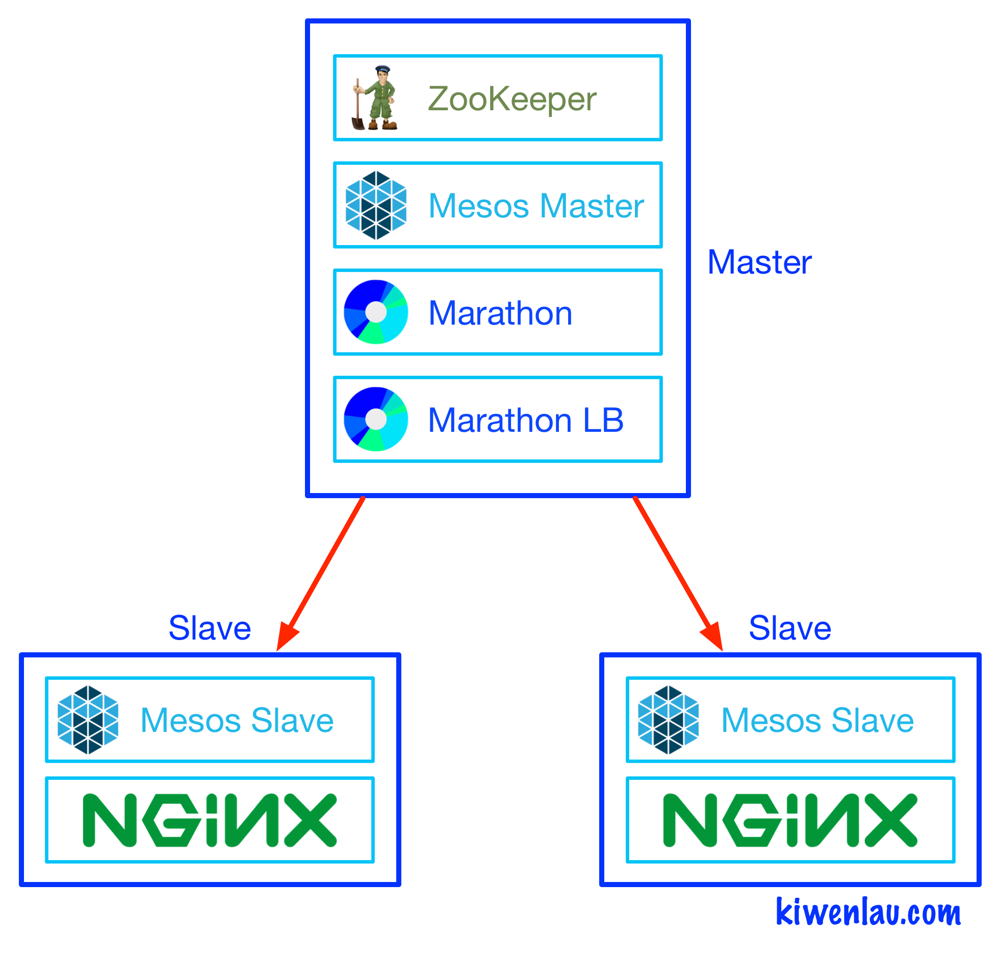

title: 基于Docker搭建多节点Mesos/Marathon

date: 2016-07-10 10:00

tags: [Docker, Mesos, Marathon]

---

**摘要:** 在之前的一篇博客中，我介绍了[基于Docker搭建单机版Mesos/Marathon](http://kiwenlau.com/2015/09/18/150918-single-mesos-docker/)，但是仅仅使用了单个节点。而在这篇博客中，我将介绍[基于Docker搭建多节点Mesos/Marathon](http://kiwenlau.com/2016/07/10/mesos-marathon-platform/)，开发者可以使用3个节点快速地搭建一个真正的分布式容器集群系统。**服务发现**和**负载均衡**是容器集群必不可少的功能，我选择了[Marathon LB](https://github.com/mesosphere/marathon-lb)来实现。

**GitHub地址:** [kiwenlau/mesos-marathon-platform](https://github.com/kiwenlau/mesos-marathon-platform)

<!-- more -->

- 作者: [KiwenLau](http://kiwenlau.com/)
- 日期: [2016-07-10](http://kiwenlau.com/2016/07/10/mesos-marathon-platform/)



## 一. Mesos/Marathon简介

#### **1. Mesos**

[Mesos](http://mesos.apache.org/)是**分布式集群资源管理系统**，负责调度集群内的CPU，内存以及磁盘等资源。Hadoop, Spark以及Storm等**分布式计算框架**很流行，但是为每一个计算框架搭建单独的集群非常地浪费资源，也无法实现数据共享，而Mesos的设计初衷就是让不同的**分布式计算框架**能够共享一个集群。

Mesos资源调度算法分为两个层次: Mesos监控集群的空余资源，并将空余资源按照一定规则分配给各个计算框架；而各个计算框架会根据需要选择接受或者拒绝所分配的资源。这时，Mesos与各个计算框架都参与了资源的调度: Mesos负责分配资源; 而计算框架接受或者拒绝资源。因此，Mesos的责任非常清晰而且：监控并分配集群资源。

#### **2. Marathon**

[Marathon](https://mesosphere.github.io/marathon/)是容器编排系统，用户可以通过Marathon提交，监控并调度容器应用，然后Mesos负责运行容器。因此，Marathon是运行于Mesos之上的众多计算框架之一。其中，[Aurora](http://aurora.apache.org/)与Marathon功能一致，同为容器编排系统。相比而言，Marathon的架构比Aurora更简单，没有从节点，且对Docker的支持更为完善。Marathon由Mesosphere公司负责开发，社区很活跃，文档也非常完善。

Marathon具有**容错功能**：当容器由于节点崩溃等原因意外停止运行时，Marathon会自动将容器调度到其他节点。这一点类似进程管理工具例如[Supervisor](http://supervisord.org/)：当进程意外退出时，supervisor会重启进程。然而，自动容错功能并不适合有状态服务，即带有数据卷(volume)的应用，例如MongoDB与MySQL。因为数据很难跨节点移动，目前的技术还不够成熟。因此，Marathon目前仅适合运行无状态的服务，而数据库等有状态服务应该单独部署。

#### **3. Marathon LB**

[Marathon LB](https://github.com/mesosphere/marathon-lb)是Marathon的**服务发现**与**负载均衡**系统。Marathon LB通过使用[Haproxy](http://www.haproxy.org/)实现了代理服务器的功能。

当使用Marathon部署容器时，容器运行的节点(IP)与使用的端口(PORT)是Mesos/Marathon平台负责调度的，无法事先确定。这样的话，每次访问服务时，需要手动去查询容器运行的IP与PORT。并且，容器出错时会发生重新调度，IP与PORT会变化。因此，访问服务非常不便。通过使用Marathon LB可以能够配置服务的固定端口，而服务的IP就是运行Marathon LB的节点IP。Marathon LB会监听Marathon的调度事件，获取容器运行的IP与PORT，然后更新代理服务器Haproxy的配置文件。因此，当部署新的容器或者容器发生变化时，仍然可以通过固定的IP与PORT访问该容器。这就是**服务发现**。

同一个服务往往对应多个容器，Marathon LB作为代理服务器，同时实现了**负载均衡**的功能。服务请求能够使用Round Robin方式发送给对应的容器。

                             
## 二. 搭建步骤

#### **1. 创建虚拟机**

按照[使用Vagrant创建多节点虚拟机集群](http://kiwenlau.com/2016/07/03/vagrant-vm-cluster/)介绍的方法，可以快速地在单个机器上创建Mesos/Marathon运行需要的3个虚拟机节点。

其中，node1为主机点(Master)，运行zookeeper, mesos_master, marathon以及marathon-lb容器; node2与node3为从节点(Slave)，运行mesos_slave容器；使用marathon部署nginx时，nginx容器运行在从节点上。

| 节点    | IP           | 运行的容器                                      |
|:------- |:-------------| :----------------------------------------------|
| node1  | 192.168.59.1 | zookeeper, mesos_master, marathon, marathon-lb |
| node2  | 192.168.59.2 | mesos_slave1, nginx                                   |
| node3  | 192.168.59.3 | mesos_slave2, nginx                                   |

#### **2. 开启Docker daemon的监听端口**

Master, Slave1 and Slave2:

```
sudo vim /etc/default/docker
```

修改**DOCKER_OPTS**

```
DOCKER_OPTS="-H tcp://0.0.0.0:2375 -H unix:///var/run/docker.sock"
```

重启Docker

```
sudo restart docker
```

#### **3. 下载Docker镜像** 

On Master:

```
sudo docker pull kiwenlau/zookeeper:3.4.8 
sudo docker pull kiwenlau/mesos:0.26.0 
sudo docker pull kiwenlau/marathon:1.1.1  
sudo docker pull kiwenlau/marathonlb:1.3.0
```

On Slave1 and Slave2:

```
sudo docker pull kiwenlau/mesos:0.26.0
```

#### **4. 下载GitHub仓库** 

On Master:

```
git clone https://github.com/kiwenlau/mesos-marathon-platform
```


#### **5. 运行容器** 

On Master:

```
cd mesos-marathon-platform
sudo ./start-containers.sh
```

网页管理:

- Mesos: [http://192.168.59.1:5050/](http://192.168.59.1:5050/)
- Marathon: [http://192.168.59.1:8080/](http://192.168.59.1:8080/)  


如果需要增加Slave节点，或者配置不同的节点IP，仅需修改start-contaniers.sh脚本中以下内容：

```
MASTER_IP=192.168.59.1
SLAVE_IP=(192.168.59.2 192.168.59.3)
```

#### **6. 运行Nginx:** 

下载nginx镜像(Slave1和Slave2):

```
sudo docker pull nginx:1.10
```

运行Nginx(Master):

```
sudo ./run-nginx.sh 
```

两个nginx容器运行在slave节点上，且端口是随机分配的，但是由于使用了Marathon LB，我们始终可以通过以下地址服务nginx：

- [http://192.168.59.1:10000/](http://192.168.59.1:10000/)


## 三. 参考

1. [Mesos: A Platform for Fine-Grained Resource Sharing in the Data Center](http://mesos.berkeley.edu/mesos_tech_report.pdf)
