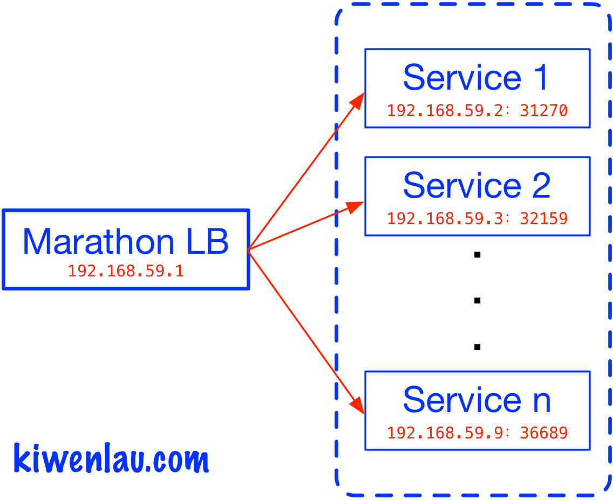

title: 什么是服务发现？

date: 2016-09-04 10:00

tags: [Docker]

---

**摘要:** 将容器应用部署到集群时，其服务地址，即**IP**和**端口**, 是由集群系统动态分配的。那么，当我们需要访问这个服务时，如何确定它的地址呢？这时，就需要**服务发现(Service Discovery)**了。本文将以Nginx的部署为例，介绍服务发现的原理与实践。

<!-- more -->

- 作者: [KiwenLau](http://kiwenlau.com/)
- 日期: [2016-09-04](http://kiwenlau.com/2016/09/04/what-is-service-discovery/)



## 一. 单机部署Nginx

[Nginx](https://nginx.org)作为网页服务器，功能与Apache一致。使用[Docker](https://www.docker.com/), 可以快速部署Nginx。

#### **1. 下载Nginx镜像**

```
sudo docker pull nginx:1.10
```

#### **2. 运行Nginx容器**

```
sudo docker run -d \
                -p 8080:80 \
                nginx:1.10
```

其中，**-d**选项表示Nginx容器在后台运行，**-p**选项表示主机的**8080**端口映射为容器的**80**端口。

#### **3. 访问Nginx服务**

使用浏览器服务Nginx

[http://192.168.59.1:8080](http://192.168.59.1:8080)

或者使用curl命令访问Nginx, 其返回结果为html文件。

```
curl 192.168.59.1:8080
```

Nginx的服务地址是192.168.59.1:8080，其中，**192.168.59.1**是运行Nginx容器的主机的IP，而**8080**是Nginx提供服务的端口。

可知，将容器应用部署到单个主机上时，服务的IP即为运行容器的主机IP，而服务的端口可以通过**-p**选项手动指定，这时服务地址相当于是静态分配的，因此不存在服务发现的问题。然而，当我们将容器应用部署到多个节点的集群时呢？

## 二. Mesos/Marathon集群中部署Nginx

首先，可以按照[基于Docker搭建多节点Mesos/Marathon](http://kiwenlau.com/2016/07/10/mesos-marathon-platform/)介绍的方法，快速搭建3个节点的Mesos/Marathon集群。部署Nginx时，可以不使用服务发现，也可以使用[Marathon LB](https://github.com/mesosphere/marathon-lb)提供服务发现。通过对比两种方式，可以更好地理解服务发现。

**1. 不使用服务发现**

Nginx定义(nginx1.json):

```
{
    "id": "nginx1",
    "cpus": 0.2,
    "mem": 20.0,
    "instances": 1,
    "healthChecks": [{
        "path": "/"
    }],
    "container": {
        "type": "DOCKER",
        "docker": {
            "image": "nginx:1.10",
            "network": "BRIDGE",
            "portMappings": [{ "containerPort": 80, "hostPort": 0, "protocol": "tcp" }]
        }
    }
}
```

其中，**instances**为1，表示仅部署单个Nginx容器; **hostPort**为0，表示Nginx容器绑定的主机端口由Marathon随机分配。

部署Nginx:

```
curl -Ss \
     -X POST \
     -H "Content-Type: application/json" \
     --data "@nginx1.json" \
     http://127.0.0.1:8080/v2/apps | python2.7 -mjson.tool
```

这时，Nginx容器可能运行node2(192.168.59.2)上，也可能运行在node3(192.168.59.3)上，因此Nginx服务的IP是无法事先确定的。而Nginx容器绑定的主机端口由Marathon随机分配，也不确定。

当然，服务端口可以通过**hostPort**指定，但是这样做并不合适，因为有可能会发生端口冲突。当集群中运行了非常多不同的服务时，**静态分配端口是不现实的，也限制了集群的灵活性与扩展性**。

在Slave节点上使用**docker ps**命令可以获取Nginx服务的IP与端口。

node2(192.168.59.2)

```
sudo docker ps | grep nginx
b863d407b880        nginx:1.10              "nginx -g 'daemon off"   15 minutes ago      Up 15 minutes       443/tcp, 0.0.0.0:31575->80/tcp   mesos-d34d0b5b-c3b1-4020-9bb2-bb8582252bf3-S0.d2de6d05-9751-4fbe-af10-d7e35e9e6c7b
```

node3(192.168.59.3)

```
sudo docker ps | grep nginx
```

可知Nginx服务的IP与端口分别为**192.168.59.2**和**31575**，即Nginx的服务地址为：[http://192.168.59.2:31575](http://192.168.59.2:31575)

每次重新部署Nginx时，其IP和端口会发生变化，这就意味着每次都要手动去查询服务地址，这很不方便，且无法将部署任务自动化。在容器集群中，通常需要运行非常多不同的应用，这就意味着**服务发现**是容器集群系统的必备功能。


**2. 使用[Marathon LB](https://github.com/mesosphere/marathon-lb)提供服务发现**

[Marathon LB](https://github.com/mesosphere/marathon-lb)是Marathon的**服务发现**系统。Marathon LB通过使用[Haproxy](http://www.haproxy.org/)实现了代理服务器的功能。

通过使用Marathon LB可以配置服务的固定端口，而服务的IP就是运行Marathon LB的节点IP。Marathon LB会监听Marathon的调度事件，获取容器实际运行的IP与端口，然后更新Haproxy的配置文件。因此，当重新部署Nginx时，我们仍然可以通过固定的IP与端口访问该服务。

Nginx定义(nginx2.json):

```
{
    "id": "nginx2",
    "labels": {
        "HAPROXY_GROUP": "external"
    },
    "cpus": 0.2,
    "mem": 20.0,
    "instances": 1,
    "healthChecks": [{
        "path": "/"
    }],
    "container": {
        "type": "DOCKER",
        "docker": {
            "image": "nginx:1.10",
            "network": "BRIDGE",
            "portMappings": [{ "containerPort": 80, "hostPort": 0, "servicePort": 10000, "protocol": "tcp" }]
        }
    }
}
```

其中，nginx2.json只有**HAPROXY_GROUP**与**servicePort**两处修改。**HAPROXY_GROUP**为external，表示Nginx将使用分组为external的**Marathon LB**做服务发现。**servicePort**为10000，表示Nginx将使用**Marathon LB**节点的10000端口提供服务。

部署Nginx:

```
curl -Ss \
     -X POST \
     -H "Content-Type: application/json" \
     --data "@nginx2.json" \
     http://127.0.0.1:8080/v2/apps | python2.7 -mjson.tool
```

这时，Nginx服务的IP为运行Marathon LB的节点IP，即**192.168.59.1**，而Nginx服务的端口为**servicePort**指定的端口，即10000。因此，Nginx的服务地址为：[http://192.168.59.1:10000](http://192.168.59.1:10000)。而Nginx容器的实际地址为[http://192.168.59.2:31270](http://192.168.59.2:31270)，Marathon LB使用Haproxy作为代理服务器转发的服务请求。Marathon LB会监听Marathon的调度事件，获取容器实际运行的IP与端口，然后更新Haproxy的配置文件。下面即为Marathon LB自动生成的Haproxy配置文件: 

```
frontend nginx2_10000
  bind *:10000
  mode http
  use_backend nginx2_10000

backend nginx2_10000
  balance roundrobin
  mode http
  option forwardfor
  http-request set-header X-Forwarded-Port %[dst_port]
  http-request add-header X-Forwarded-Proto https if { ssl_fc }
  option  httpchk GET /
  timeout check 20s
  server 192_168_59_2_31270 192.168.59.2:31270 check inter 60s fall 4
```

可知Haproxy中，niginx服务的前端(frontend)地址为: *:10000，而后端(backend)地址为: 192.168.59.2:31270。Haproxy负责将服务请求转发到Nginx容器。

当我们重新部署Nginx时，Nginx容器的IP和端口会发生变化，Marathon LB会更新Haproxy的配置文件，因此我们仍然可以通过[http://192.168.59.1:10000](http://192.168.59.1:10000)访问服务。

因此，Marathon LB的任务就是发现服务的地址(IP和端口)，然后用户就不用每次手动查询了。[bamboo](https://github.com/QubitProducts/bamboo)与[nixy](https://github.com/martensson/nixy)实现了同样的功能。

## 三. 参考

1. [Understanding Modern Service Discovery with Docker](http://progrium.com/blog/2014/07/29/understanding-modern-service-discovery-with-docker/)
2. [基于Docker技术构建PaaS云平台](http://www.eurekao.com/build-paas-platform-base-on-docker/)
3. [Youzan 服务发现概述](http://tech.youzan.com/haunt-youzan-service-discovery/)


