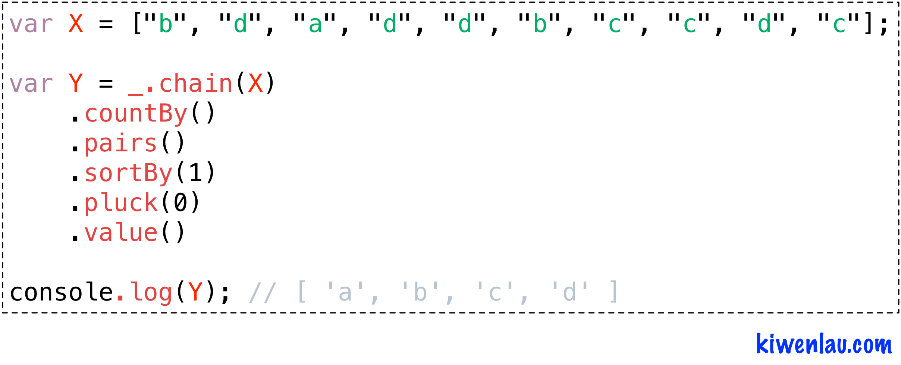

title: Underscore实例教程

date: 2016-09-18 10:00

tags: [NodeJS, Underscore]

---

**摘要:** [Underscore](http://underscorejs.org/)是一个轻量级的JavaScript工具库，提供了许多非常实用的函数。本文将通过一个简单的编程实例，介绍几个常用的Underscore函数。

**GitHub地址:**

- [kiwenlau/underscore-example](https://github.com/kiwenlau/underscore-example)

<!-- more -->

- 作者: [KiwenLau](http://kiwenlau.com/)
- 日期: [2016-09-18](http://kiwenlau.com/2016/09/18/underscore-example/)



## 一. 编程实例

输入数据是一个数组: 

```
["b", "d", "a", "d", "d", "b", "c", "c", "d", "c"];
```

其中，数组中存在重复的元素。例如，"c"重复了3次。

现在需要**根据元素在数组中的重复个数进行排序**。通过**观察**可知，"a"为1个，"b"为2个，"c"为3个，"d"为4个。

因此，输出结果是:

```
[ 'a', 'b', 'c', 'd' ]
```

当然，计算机暂时还没办法通过**观察**解决这个问题，所以还是得敲代码。

虽然问题很容易理解，但是代码却不是很好写。如果不使用underscore的话，程序应该是这样的:

```
var X = ["b", "d", "a", "d", "d", "b", "c", "c", "d", "c"];


// 对数组元素进行计数
var A = {};

for (var i = 0; i < X.length; i++)
{
    var x = X[i];
    if (A.hasOwnProperty(X[i]))
    {
        A[x]++;
    }
    else
    {
        A[x] = 1;
    }
}


// 将对象转化为二维数组
var B = [];

for (var a in A)
{
    B.push([a, A[a]]);
}


// 根据二维数组的第二列元素进行排序
B.sort(
    function(a, b)
    {
        return a[1] - b[1];
    }
);


// 提取二维数组的第一列元素
var Y = [];

for (var i = 0; i < B.length; i++)
{
    Y.push(B[i][0]);
}


console.log(Y); // [ 'a', 'b', 'c', 'd' ]
```

虽然我已经在代码中使用了一些JavasScript库函数例如sort，但是
