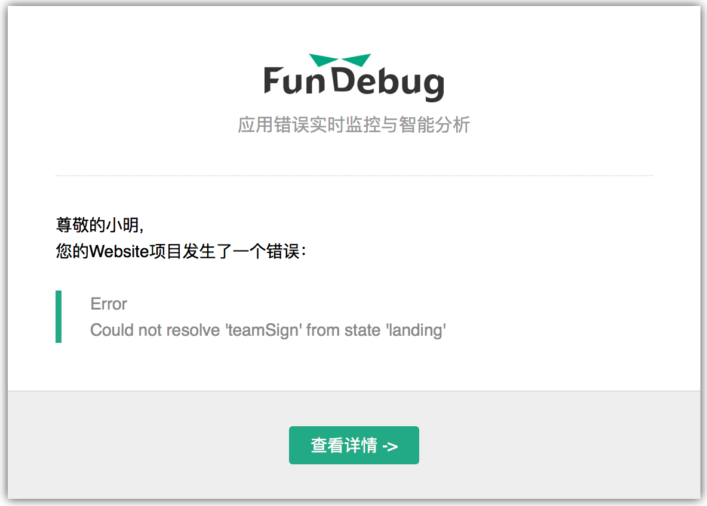

[Fundebug](https://fundebug.com)网站使用了我们自己的[JavaScript](https://docs.fundebug.com/notifier/javascript/)错误检测插件，这样代码一旦发生错误，程序员小明就会及时收到报警邮件。

<!-- more -->

我们的前端代码做过严格的单元测试和端到端测试，讲(xiang)道(dang)理(ran)不会出什么错误。

然而，现实是残酷的，总会有各种Bug出现：

- ``this.$parent.elctrl is undefined``, 
- `Attempted to redefine property 'authenticate'.`, 
- `Cannot read property 'language' of null`
- ...

乍一看这些错误也没什么，然而事实证明它们其实是一个个大写的Bug。得益于[Fundebug](https://fundebug.com)实时监测，小明及时修复了这些问题。(此处应有掌声^*^)

今天呢，我们来聊聊其中一个Bug。这个Bug是由于拼写失误造成的，它会导致网页无法正常显示，虽说刷新一下就好了，但是却会影响用户体验。然而，小明最初却忽略了Fundebug的报警。

> 每一次报错都是一个潜在的Bug，不容忽视。

### Bug回放

11月15日早上8:56，小明收到一封报警邮件：

Fundebug网站是基于`AngularJS`实现，这个错误与页面之间的跳转有关。由邮件可知，从`landing`状态跳转到`teamSign`状态时发生了错误。点击**查看详情**, 就能看到该错误的详细信息:

在错误面板中，小明可以查看错误栈，请求，设备和用户信息。这些信息可以帮助小明快速定位错误。

经过简单分析，小明断(xia)定(cai)网站的`landing`页面木有问题，这个错误应该是网络问题导致加载不完全而无法识别`teamSign`这个状态。如果网络好一点，加载成功了，就没问题了。然后他就将这个错误丢到一边去了。。。(Boss决定让小明跪键盘)

但是，问题不是这么简单，这个错误之后一共出现了85次，累计影响了24个用户。

小明意识到问题的严重性之后，查找了`teamSign`跳转相关的代码。他发现，在登录验证的中间件里面，如果用户登录token因为超时失效，那么就会跳转到`teamSign`页面要求用户重新登录。然而，跳转到`teamSign`为什么会失败呢？为什么呢？为什么呢？原来是小明把"teamSignin"写成了"teamSign"。(Boss决定让小明滚出去)

### 结论

一个小小的拼写失误，却会对用户造成不小的困扰。而事实上，测试无法保证产品100%没有问题。使用[Fundebug](https://fundebug.com)进行实时错误监测，则可以第一时间发现并解决问题。

<a href="https://fundebug.com/team/create" style="padding: 10px 20px; background: #22A985; color: #FFF; border-radius: 3px;">立即注册 ➔</a>

