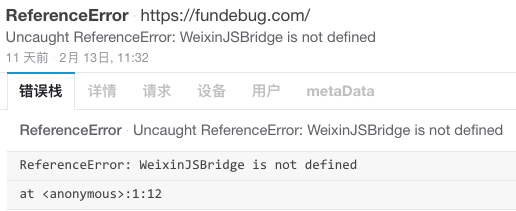

[Fundebug](https://fundebug.com)并没有使用[微信JS-SDK](http://mp.weixin.qq.com/wiki/7/aaa137b55fb2e0456bf8dd9148dd613f.html)，然而却收到了`WeixinJSBridge is not defined`的报错： 

<!-- more -->

<div style="text-align: left;">

</div>

我们的用户也收到了类似的错误报警，并且很多开发者都遇到类似的问题:

> - 我的微信项目，没有用到微信JS-SDK，但iphone部分手机点击某些功能无效，后来加了window.onerror监控，发现有Uncaught ReferenceError: WeixinJSBridge is not defined报错;
> - 从微信进入支付中心直接唤起微信支付时有时会抛出ReferenceError：weixinJSBridge is not defined的异常;
> - 使用AppCan生成Web/微信App版，调用微信JSAPI支付方式，提示WeixinJSBridge内置对象undefined;
> - ......


由此可见，这是一个非常普遍的问题。但是如果没有在测试阶段没有遇到过，然后又没有做线上错误监控的话，就很难发现这个问题。我们在这里将这个错误进行一些分析，让大家少走弯路。

### 什么是微信JS-SDK?

这里引用[官方文档](http://mp.weixin.qq.com/wiki/7/aaa137b55fb2e0456bf8dd9148dd613f.html): 

> 微信JS-SDK是微信公众平台面向网页开发者提供的基于微信内的网页开发工具包。通过使用微信JS-SDK，网页开发者可借助微信高效地使用拍照、选图、语音、位置等手机系统的能力，同时可以直接使用微信分享、扫一扫、卡券、支付等微信特有的能力，为微信用户提供更优质的网页体验。

### Q&A


#### **我没有使用微信JS-SDK, 为什么会报错呢？**

- 微信内置浏览器会有WeixinJSBridge，但是需要一定的加载时间。

#### **我使用了微信JS-SDK, 为什么会报错呢？**

- 微信webview注入钩子有时序问题：在`WeixinJSBridge`还未注入之前，就已经成功注入其它依赖于`WeixinJSBridge`的其它XX模块。在XX模块中调用`WeixinJSBridge`就会失败。


### 如何解决？

如果你开发一款移动应用，必不可少要考虑分享到微信的功能；如果你开发网页，那么用户之间的分享更多的也是通过微信。那么这个问题到底有多严重，如何解决也变得至关重要。


 - 如果网页中未使用微信JS-SDK, 用户在微信中打开网站可能会触发这个错误，目前看来只有忽略。因为是微信JS-SDK自身的问题，我们也无法控制。

 - 关于微信支付
   + 方法1: 监听ready事件之后再进行下一步操作 

   ```js
   if (typeof window.WeixinJSBridge == "undefined")
   {
       $(document).on('WeixinJSBridgeReady', function()
       {
           $('#weiXinPay').click();
       });
   }
   else
   {
       $('#weiXinPay').click();
   }
   ```

   + 方法2: 直接使用JS-SDK文档中的支付代码，不要使用公众号支付文档里面的代码。具体请参考[微信JS-SDK说明文档 - 微信支付](https://mp.weixin.qq.com/wiki/7/aaa137b55fb2e0456bf8dd9148dd613f.html#.E5.8F.91.E8.B5.B7.E4.B8.80.E4.B8.AA.E5.BE.AE.E4.BF.A1.E6.94.AF.E4.BB.98.E8.AF.B7.E6.B1.82)


PS: 关于这个问题的帖子从2014年开始就有了，然而问题依然存在，希望微信的同学能够给出官方的解决方案。

 ### 参考链接

   - [Uncaught ReferenceError: WeixinJSBridge is not defined](http://www.henkuai.com/forum.php?mod=viewthread&tid=7450)
   - [Uncaught ReferenceError: WeixinJSBridge is not defined问题](http://www.henkuai.com/thread-8365-1-1.html)   
   - [微信支付问题：Uncaught ReferenceError: WeixinJSBridge is not defined ](http://www.java-bbs.com/thread-14-1-1.html)
   - [传说中的WeixinJSBridge和微信rest接口](http://bbs.blueidea.com/thread-3103040-1-1.html)
   - [监听wxbridge加载后再唤起微信支付](https://github.com/whq731/mobile-problems/blob/master/%E7%9B%91%E5%90%ACwxbridge%E5%8A%A0%E8%BD%BD%E5%90%8E%E5%86%8D%E5%94%A4%E8%B5%B7%E5%BE%AE%E4%BF%A1%E6%94%AF%E4%BB%98.md)
