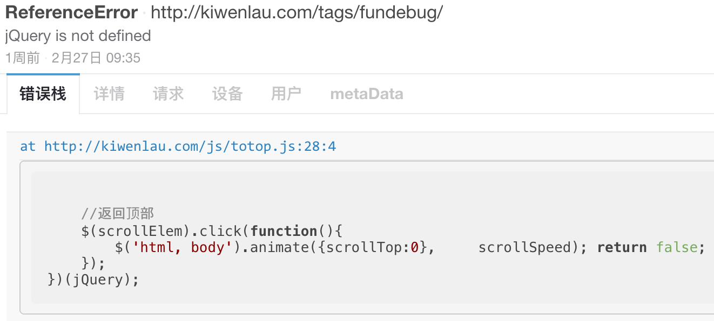

我的博客使用了[Fundebug](https://fundebug.com/)的[JavaScript错误监控插件](https://docs.fundebug.com/notifier/javascript/)，然后偶尔会收到**jQuery is not defined**这样的错误报警: 

<!-- more -->



<script src="https://kiwenlau.com/js/highcharts.js"></script>


<div style="text-align: left;">

</div>

由出错的代码块可知，博客中的『返回顶部』的功能是使用了jQuery实现，如果jQuery出错，意味着该功能失效，那么读者就不得不手动滑动到博客顶部，这样用户体验是非常糟糕的。根据统计，3个月时间内，这个错误已经累计出现了**399**次，已经相当严重了。

<div id="timeContainer" style="width: 550px; height: 400px; margin: 0 auto!important"></div>
<script language="JavaScript" src="/js/blog/20170306_time.js"></script>


我使用了[Staticfile CDN](https://staticfile.org/)提供的的jQuery:

```js
<script src="https://cdn.staticfile.org/jquery/3.1.1/jquery.min.js"></script>
```


而根据最新统计数据显示，jQuery依然是前端用得最多的JavaScript库，因此一旦jQuery出错，必定会影响很多功能，jQuery的重要性不言而喻。另一方面，不少[Fundebug](https://fundebug.com/)的用户都收到过"jQuery is not defined"的错误报警，许多前端开发者应该都遇到(也许只是你没有发现)，我们通过这篇博客帮助大家解决问题。

### 出错原因1: 加载CDN的jQuery失败或者超时

> 当提供jQuery的CDN出问题导致jQuery加载失败，或者由于网络问题浏览器加载jQuery文件超时，会出现jQuery未定义的错误。

**解决方案**: 将jQuery文件挂载在自己的网站上作为备用，如果CDN加载jQuery失败，则使用自己网站存托管的jQuery。这样的话，大部分用户依然可以通过CDN加快访问速度，而一旦CDN出问题时也可以避免出错。

```js
 <script src="https://cdn.staticfile.org/jquery/3.1.1/jquery.min.js"></script>
 <script> 
 window.jQuery || document.write('<script src="http://kiwenlau.com/js/jquery.min.js"><\/script>'))
 </script>
```

我的博客读者绝大部分来自国内，然而分析错误的IP地址后，我发现高达26.1%出错用户的来自国外。根据**幸存者偏差**，我们不能认定国内用户出错概率更高，而应该认定国外用户出错概率更高。那么这就不难理解了，国外用户请求国内CDN时速度太慢，导致jQuery出错。

<div id="ipContainer" style="width: 550px; height: 400px; margin: 0 auto!important"></div>
<script language="JavaScript" src="/js/blog/20170306_ip.js"></script>

因此，我将jQuery挂载在[http://kiwenlau.com/js/jquery.min.js](http://kiwenlau.com/js/jquery.min.js)作为备用，解决了问题。

### 出错原因2: 加载jQuery的顺序错误

> 依赖于jQuery的其它JavaScript脚本先于jQuery加载完成并执行。这时jQuery尚未加载，因此依赖于jQuery的代码调用jQuery的话就会出错。

**解决方案**: 将jQuery库放在依赖于jQuery的JavaScript脚本之前，并且将这些代码放入**document.ready**来确保DOM加载完毕。


```js
<script type="text/javascript" src="path/to/jquery.min.js"></script>
<script type="text/javascript">
  $(document).ready(function() {
    //依赖于jQuery的代码
  });
</script>
```

#### 参考链接
[The State of Front-End Tooling 2016 - Results](https://ashleynolan.co.uk/blog/frontend-tooling-survey-2016-results)
[幸存者偏差是什么意思？- 知乎](https://www.zhihu.com/question/36520358)


