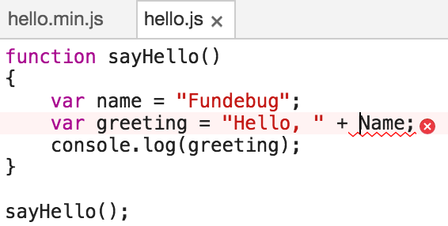

---

title: Source Map入门教程

date: 2017-03-13 10:00:00

tags: [JavaScript, 原创]

---

部署前端之前，开发者通常会对代码进行打包压缩，这样可以减少代码大小，从而有效提高访问速度。然而，压缩代码的报错信息是很难Debug的，因为它的行号和列号已经失真。这时就需要Source Map来还原真实的出错位置了。

<!-- more -->


<div style="text-align: center;">

</div>

### 为啥变换代码？

前端代码越来越复杂的情况下，开发者通常会使用[webpack](https://github.com/webpack/webpack)、[UglifyJS2](https://github.com/mishoo/UglifyJS2)等工具对代码进行打包变换，这样可以减少代码大小，有效提高访问速度。关于变换代码的原因，这里不妨引用一下大神[阮一峰](http://www.ruanyifeng.com/blog/)的[JavaScript Source Map 详解](http://www.ruanyifeng.com/blog/2013/01/javascript_source_map.html):

> - 压缩，减小体积。比如jQuery 1.9的源码，压缩前是252KB，压缩后是32KB。
> - 多个文件合并，减少HTTP请求数。
> - 其他语言编译成JavaScript。最常见的例子就是CoffeeScript。

### 如何变换代码？

下面是一个简单的“hello World”程序**hello.js**

```js
function sayHello()
{
    var name = "Fundebug";
    var greeting = "Hello, " + Name;
    console.log(greeting);
}

sayHello();
```

使用[UglifyJS2](https://github.com/mishoo/UglifyJS2)对源代码进行压缩变换:

```sh
uglifyjs hello.js \
         -m toplevel=true \
         -c unused=true,collapse_vars=true \
         -o hello.min.js
```

压缩后的代码**hello.min.js**

```js
function o(){var o="Hello, "+Name;console.log(o)}o();
```

### 为啥需要Source Map?

使用Firefox执行**hello.js**的报错信息是这样:

```js
ReferenceError: Name is not defined
	sayHello file:///Users/fundebug/sourcemap-tutorial/hello.js:4:9
	<匿名> file:///Users/fundebug/sourcemap-tutorial/hello.js:8:1
```

而**hello.min.js**的报错信息是这样:

```js
ReferenceError: Name is not defined
	o file:///Users/fundebug/sourcemap-tutorial/hello.min.js:1:18
	<匿名> file:///Users/fundebug/sourcemap-tutorial/hello.min.js:1:59
```

对比压缩前后的出错信息，我们会发现，错误行号和列号已经失真，且函数名也经过了变换。而对于真实的前端项目，开发者会将数十个源文件压缩为一个文件，这时，错误的列号可能多达数千，且出错的真实文件名也是很难确定的，这样的话，压缩代码的报错信息是很难Debug的。

**而Source Map则可以用于还原真实的出错位置**，帮助开发者更快的Debug。

### 什么是Source Map?

使用[UglifyJS2](https://github.com/mishoo/UglifyJS2)时指定source-map选项即可生成Source Map:

```sh
uglifyjs hello.js \
         -m toplevel=true \
         -c unused=true,collapse_vars=true \
         --source-map hello.min.js.map \
         --source-map-include-sources \
         --source-map-root \
         -o hello.min.js
```

各种主流前端任务管理工具，打包工具都支持生成Source Map，具体可以查看[生成Source Map - Fundebug文档](https://docs.fundebug.com/notifier/javascript/sourcemap/generate/)。


生成的**hello.min.js**多了sourceMappingURL，表示Source Map文件的位置。

```js
function o(){var o="Hello, "+Name;console.log(o)}o();
//# sourceMappingURL=hello.min.js.map
```


生成的Source Map为**hello.min.js.map**:

```js
{
    "version": 3,
    "sources": ["hello.js"],
    "names": ["sayHello", "greeting", "Name", "console", "log"],
    "mappings": "AAAA,QAASA,KAEL,GACIC,GAAW,UAAYC,IAC3BC,SAAQC,IAAIH,GAGhBD",
    "file": "hello.min.js",
    "sourceRoot": "",
    "sourcesContent": ["function sayHello()\n{\n    var name = \"Fundebug\";\n    var greeting = \"Hello, \" + Name;\n    console.log(greeting);\n}\n\nsayHello();\n"]
}
```

由**hello.min.js.map**可知，Source Map是一个JSON文件，而它**包含了代码转换前后的位置信息**。也就是说，给定一个转换之后的压缩代码的位置，就可以通过Source Map获取转换之前的代码位置，反过来也一样。Source Map各个属性的含义如下:

- version：Source Map的版本号。
- sources：转换前的文件列表。
- names：转换前的所有变量名和属性名。
- mappings：记录位置信息的字符串，经过编码。
- file：(可选)转换后的文件名。
- sourceRoot：(可选)转换前的文件所在的目录。如果与转换前的文件在同一目录，该项为空。
- sourcesContent:(可选)转换前的文件内容列表，与sources列表依次对应。

Source Map真正神奇之处在于mappings属性，它记录了位置是如何对应的。[JavaScript Source Map 详解](http://www.ruanyifeng.com/blog/2013/01/javascript_source_map.html)已经有很好的解释，这里不再赘述。

### 怎样使用Source Map?

主流浏览器均支持Source Map功能，不过Chrome与Firefox需要一些简单的配置，具体步骤请参考[How to enable source maps](https://gist.github.com/jakebellacera/336c4982194bcb02ef8a)。下面以MacBook上的Chrome浏览器为例，介绍一下配置方法:

#### 1. 开启**开发者工具**

使用快捷键**option + command + i**；或者在菜单栏选择**视图->开发者->开发者工具**

<div style="text-align: left;">

</div>

#### 2. 打开设置

使用快捷键**fn + F1**；或者点击右上角的三个点的图标，选择Settings

<div style="text-align: left;">

</div>


#### 3. 开启Source Map 

在Sources中，选中**Enable JavaScript source maps**

<div style="text-align: left;">

</div>

为了测试，我写了一个简单的HTML文件**hello.min.html**

```html
<head>
	<script type="text/javascript" src="hello.min.js"></script>
</head>
```

使用Chrome打开**hello.min.html**，在控制台看到的错误如下:

```js
Uncaught ReferenceError: Name is not defined
    at o (hello.min.js:1)
    at hello.min.js:1
```

报错的文件仍然为**hello.min.js**，需要刷新一下Source Map才有作用:

```js
Uncaught ReferenceError: Name is not defined
    at o (hello.js:4)
    at hello.js:8
```

注意，Chrome的报错信息没有列号，因此4为错误的行号。Chrome不仅可以通过Source Map还原真实的出错位置，还可以根据Source Map的sourcesContent还原出错的源代码。点击出错位置，即可跳转到源码，这样Debug将非常方便。


<div style="text-align: left;">

</div>


#### 参考链接
- [JavaScript Source Map 详解](http://www.ruanyifeng.com/blog/2013/01/javascript_source_map.html)
- [Source Map Revision 3 Proposal](https://docs.google.com/document/d/1U1RGAehQwRypUTovF1KRlpiOFze0b-_2gc6fAH0KY0k/edit)
- [How to enable source maps](https://gist.github.com/jakebellacera/336c4982194bcb02ef8a)


