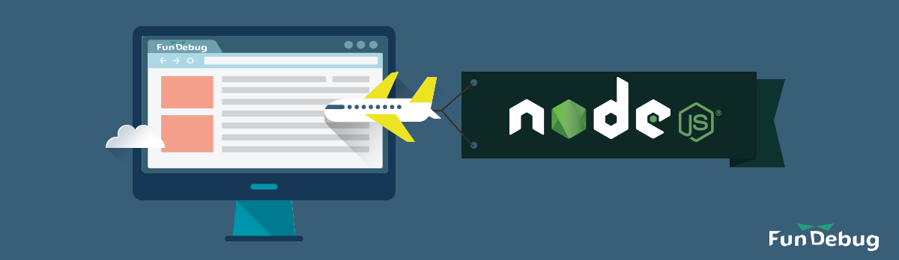

---

title: Fundebug上线Node.js错误监控啦

date: 2017-03-17 10:00:00

tags: [Node.js]

---


作为全栈JavaScript错误实时监测平台，[Fundebug](https://fundebug.com/)的**Node.js实时错误监测服务**上线啦，我们能够帮助开发者及时，高效地发现并且解决Node.js错误，从而提高开发效率，并提升用户体验。

<!-- more -->

<div style="text-align: center;">

</div>


#### Fundebug为什么监测Node.js？

程序员通常是比较自信的，他们坚持**自己写的代码没有问题**。然而，再追问一下自己：

- 我的代码真的100%没有问题吗？
- 我做了完整的单元测试吗？
- 难道我要花更多的时间没完没了的写单元测试？

**那么问题在哪？**

- 当Node.js后台程序在服务器上出错了，然而开发者并不知道；
- 在动辄上百MB的文本日志中分析错误，显然是非常低效的；
- 错误日志收集的不规范也不完整，开发者无从下手；

#### 为什么是Fundebug？

 * 两行代码搞定；
 * 插件仅4KB，且不依赖任何模块
 * 自动捕获未处理的错误；
 * 支持收集try/catch捕获的错误；
 * 兼容所有后端开发框架，例如[Express](https://docs.fundebug.com/notifier/nodejs/framework/express.html)、[Koa](https://docs.fundebug.com/notifier/nodejs/framework/koa.html)、[Hapi](https://docs.fundebug.com/notifier/nodejs/framework/hapi.html)等；

#### 如何使用Fundebug?

##### 1. 安装[fundebug-ndoejs](https://www.npmjs.com/package/fundebug-nodejs)模块

```bash
npm install fundebug-nodejs
```

若国外的NPM速度太慢的话，可以使用[淘宝NPM镜像](https://npm.taobao.org/)安装:

```bash
npm install fundebug-nodejs --registry=https://registry.npm.taobao.org
```

##### 2. 导入fundebug并配置apikey:

```js
var fundebug=require("fundebug-nodejs");
fundebug.apikey="YOUR-APIKEY"
```

- 其中，获取**apikey**需要[免费注册](https://fundebug.com/team/create)帐号并且[创建项目](https://fundebug.com/project/create)。

##### 3. 后端框架个性化配置:

**监测[Express](http://expressjs.com/zh-cn/)**

```js
app.use(fundebug.ExpressErrorHandler);
```

**监测[Koa](http://koajs.com/)**

```js
app.on("error", fundebug.KoaErrorHandler);
```

**监测[Hapi](https://hapijs.com/)**

```js
server.on("request-error", fundebug.HapiErrorHandler);
server.on("response", fundebug.HapiErrorHandler);
```

具体步骤请查看[Fundebug文档 - Node.js](https://docs.fundebug.com/notifier/nodejs/)


