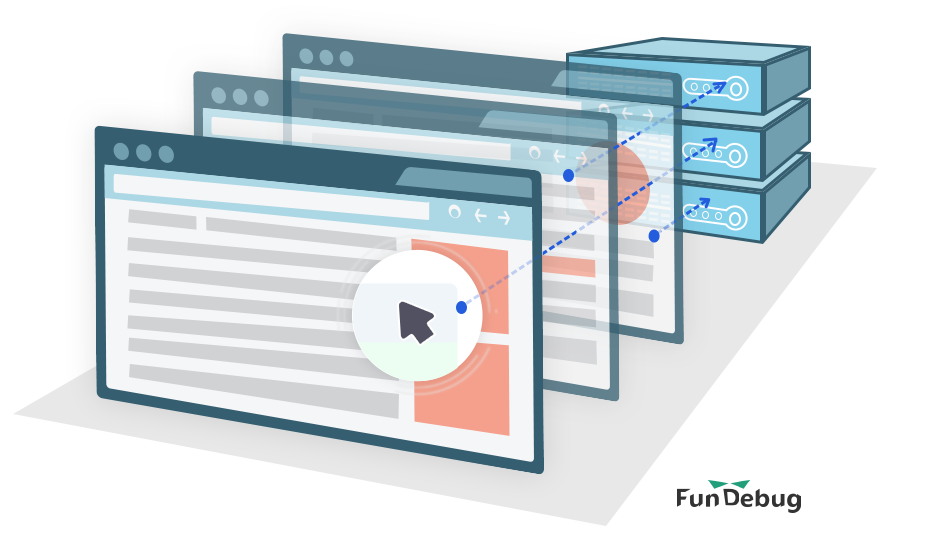

---

title: Fundebug支持用户行为回溯

date: 2017-03-29 21:00:00

tags: [Fundebug, JavaScript]

---

对于前端JavaScript的错误，Fundebug可以记录出错前的用户行为，比如**点击**、**页面跳转**、**网络请求**等，这些行为信息可以帮助您回溯错误出现的场景，从而更快地定位错误。

<!-- more -->

### 为什么记录用户行为？

一直以来，我们是从错误本身来帮助用户定位和分析错误的:

- 抓取详细的错误信息，包括文件名，行列号，错误栈...
- 兼容各种浏览器和框架
- 使用机器学习算法对错误进行智能聚合
- 通过Source Map还原真实的出错位置和出错代码

一般来讲，这些也足够了，因为开发者对错误信息以及自己的代码通常比较熟悉。

但是，错误本身的信息是不能直接给提供开发者一个**出错场景**，也就是说，开发者有时并不清楚**这个错误是什么情况下出现的**：

- 用户点击了哪些按钮？
- 用户访问哪些页面？
- 用户发起了哪些网络请求?

这些简单的行为信息往往可以帮助开发者从业务逻辑的角度理解出错的场景，从而快速定位错误。

### 如何记录用户行为？

Fundebug专注与应用错误监控，因此**只会记录出错前的用户行为**，我们无意于监控所有用户行为。

目前，Fundebug会记录这些用户行为:

- 点击
- 页面跳转
- 网络请求

我们收到的某个报错信息的**用户行为**如下:

可知，用户从主页跳转到控制台的时候出现了错误。

如果需要记录其他行为的话，欢迎与我们联系。

