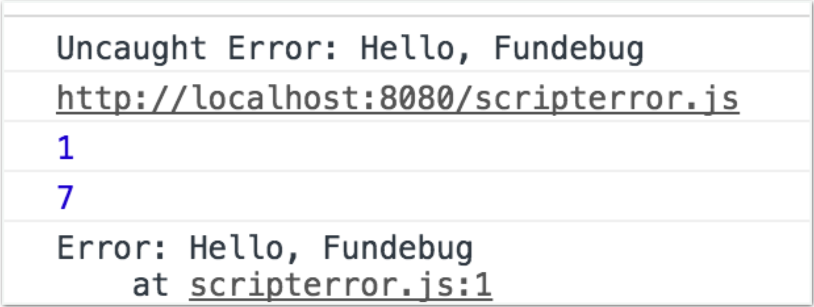
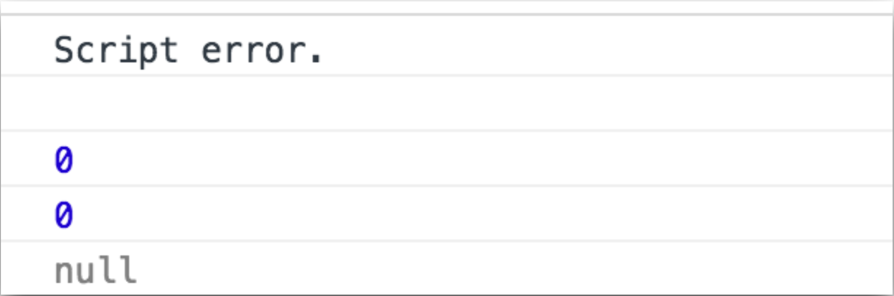

一些用户向我们反馈，[Fundebug](https://fundebug.com/)的[JavaScript](https://docs.fundebug.com/notifier/javascript/)监控插件抓到了很多**Script error.**，然后行号和列号都是0...这就很尴尬了。

<!-- more -->

<div style="text-align: left;">

</div>

今天，我们来详细地解析一下`Script error.`，后续我们还会深度测试并且提供解决方法。

### 同源策略 (Same origin policy)

解释`Script error.`之前，我们先简单聊聊同源策略。摘自[MDN - Same-origin policy](https://developer.mozilla.org/en-US/docs/Web/Security/Same-origin_policy):
> Two pages have the same origin if the protocol, port (if one is specified), and host are the same for both pages. 

所谓同源，就是指两个页面具有相同的协议、端口和主机(域名)。通过第三方加载的JavaScript脚本是不同源的。下面的表格简单列出了和`https://fundebug.com/app.js`是否同源的文件:

<style type="text/css">
	code {
		text-overflow:clip;/*文本裁切*/
            white-space:nowrap;/*强制不换行*/
            overflow:hidden;/*溢出隐藏*/
	}
</style>

| 网址                                  | 是否同源   |  原因  |
| ----------------------------------   | --------: | :----: |
| `https://fundebug.com/vendor.js`   | 是        |         |
| `http://fundebug.com/vendor.js`    | 否        | 协议不同  |
| `https://fundebug.com:8001/app.js` | 否        | 端口不同  |
| `https://docs.fundebug.com/nav.js`  | 否        | 子域名不同  |
| `https://kiwenlau.com/totop.js`     | 否        | 域名不同  |

没有同源策略的话，将会怎样？摘自[同源策略详解及绕过 - FreeBuf](http://www.freebuf.com/articles/web/65468.html)：

> 假设你已经成功登录Gmail服务器，同时在同一个浏览器访问恶意站点（另一个浏览器选项卡）。没有同源策略，攻击者可以通过JavaScript获取你的邮件以及其他敏感信息，比如说阅读你的私密邮件，发送虚假邮件，看你的聊天记录等等。 如果将Gmail替换为你的银行帐户，问题就大条了。

### 为啥出现Script error. ?

为了提升网站的访问速度，我们通常都会将静态资源文件(css, image, javascript)放在第三方CDN。当这些从第三方加载的JavaScript脚本执行出错，因为违背了**同源策略**, 为了保证用户信息不被泄露，错误信息不会显示出来，取而代之只会返回一个`Script error.`。

暴露错误信息会怎样呢？摘自([Cryptic “Script Error.” reported in Javascript in Chrome and Firefox](http://stackoverflow.com/questions/5913978/cryptic-script-error-reported-in-javascript-in-chrome-and-firefox))：

> 假想你不小心访问了一个恶意网站，网页里面偷偷放入了一段JavaScript脚本 `<script src="cbcc.com/index.html">`，这段脚本指向你使用的某银行网站首页。虽然脚本会执行失败，但是错误信息却有可能泄露你的信息。如果你已经登录过该银行网站并且处于登录状态，那么错误信息可能为`'欢迎你 ....' is undefined`；如果你没有登录，那么错误信息可能是`'请登录...' is undefined`。 然后黑客就可以根据这些信息确定你使用的银行网站，并且伪造一个钓鱼网站来骗取钱财。


### 源码

[webkit源码](http://trac.webkit.org/browser/branches/chromium/648/Source/WebCore/dom/ScriptExecutionContext.cpp)如下：

```c++
bool ScriptExecutionContext::dispatchErrorEvent(const String& errorMessage, 
    int lineNumber, 
    const String& sourceURL)
{
    EventTarget* target = errorEventTarget();
    if (!target)
        return false;
    ...
    if (securityOrigin()->canRequest(targetUrl)) {
        message = errorMessage;
        line = lineNumber;
        sourceName = sourceURL;
    } else {
        message = "Script error.";
        sourceName = String();
        line = 0;
    }
    ...
}
```

可知，浏览器会判断所加载的资源url是否同源(`securityOrigin()->canRequest(targetUrl)`)，如果不同源，则将错误消息隐藏，赋值为`Script error.`, 并且将行号设为0.

因此，如果我们从第三方CDN服务加载资源，如果出错的话，那么我们将只能看到`Script error.`。

### 错误复现

我们用一个简单的例子测试一下。下面是**index.html**，我们使用onerror来捕获错误。

```html
<!DOCTYPE html>
<html>
<head>
    <title>Test Script error</title>
    <script type="text/javascript">
      window.onerror = function(errorMessage, scriptURI, lineNumber, columnNumber, error){
        console.log(errorMessage);
        console.log(scriptURI);
        console.log(lineNumber);
        console.log(columnNumber);
        console.log(error);
      }
    </script>
    <script type="text/javascript" src="./scripterror.js"></script>
</head>
<body>
</body>
</html>
```

在**scripterror.js**中抛出一个Error对象：

```js
throw new Error('Hello, Fundebug');
```

使用的[`http-server`](https://www.npmjs.com/package/http-server)挂载文件，打开[http://localhost:8080/index.html](http://localhost:8080/index.html)，

在Chrome浏览器控制台下，可以看到详细的出错信息:

<div style="text-align: left;">

</div>


为了复现`Scrpt error.`， 将`scripterror.js`放到我在`coding.net`的个人项目下面:


```html
<!DOCTYPE html>
<html>
<head>
    <title>Test Script error</title>
    <script type="text/javascript">
      window.onerror = function(errorMessage, scriptURI, lineNumber, columnNumber, error){
        console.log(errorMessage);
        console.log(scriptURI);
        console.log(lineNumber);
        console.log(columnNumber);
        console.log(error);
      }
    </script>
    <script type="text/javascript" src="http://coding.net/u/stefanzan/p/stefanzan/git/raw/coding-pages/public/js/src/scripterror.js"></script>
</head>
<body>
</body>
</html>
```
运行`http-server`, 结果如下：

<div style="text-align: left;">

</div>

因为违背同源策略，这时只能拿到`Script error.`。

### 总结

本文介绍了`Script error.`的由来，并提供了一个简单的实例来演示什么情况下出现`Script error.`。接下来，我们将对**Script error**进行[深度测试](http://blog.fundebug.com/2017/04/06/test-script-error/)并提出[解决方法](http://blog.fundebug.com/2017/04/07/solve-script-error/)
