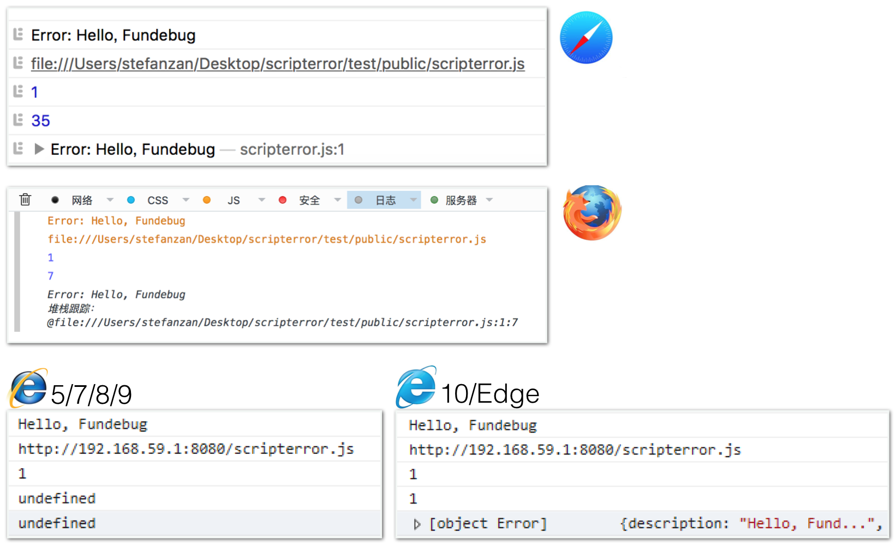
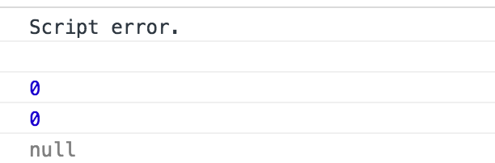
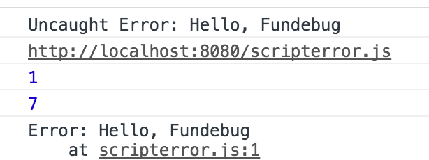
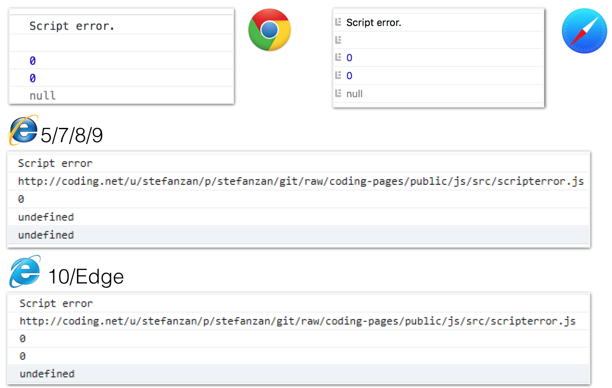
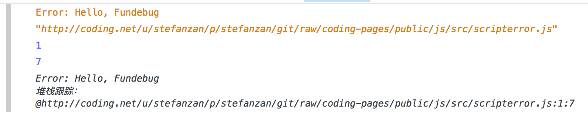
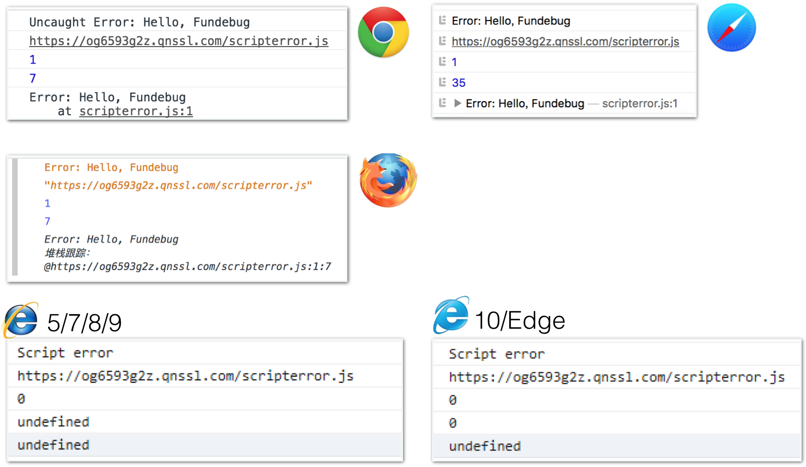
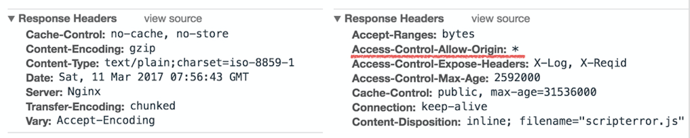

[Script error.全面解析](https://blog.fundebug.com/2017/04/05/understand-script-error/)中我们介绍了`Script error.`的由来。这篇博客，我们将各种情况（不同浏览器、本地远程托管JS文件）考虑进去，进行一个深度的测试，为读者带来一个全面的了解。

<!-- more -->

**GitHub仓库:** [Fundebug/script-error](https://github.com/Fundebug/script-error)

<div style="text-align: left;">

</div>

### 基本准备

**index.html**中使用onerror监控错误。

```html
<!DOCTYPE html>
<html>
<head>
    <title>Test Script error</title>
    <script type="text/javascript">
      window.onerror = function(errorMessage, scriptURI, lineNumber, columnNumber, error){
        console.log(errorMessage);
        console.log(scriptURI);
        console.log(lineNumber);
        console.log(columnNumber);
        console.log(error);
      }
    </script>
    <script type="text/javascript" src="./scripterror.js"></script>
</head>
<body>
</body>
</html>
```

**scripterror.js**中抛出一个Error对象：

```js
throw new Error('Hello, Fundebug');
```

该Error对象会被`window.onerror`捕获。


### 本地直接打开

如果我们直接在本地打开`index.html`, 可以看到Safari, Firefox, IE浏览器都能正确打印出错误信息。

<div style="text-align: left;">

</div>

唯独Chrome只显示`Script error.`

<div style="text-align: left;">

</div>

这是因为[Chrome浏览器默认不允许访问本地文件](http://stackoverflow.com/questions/20748630/load-local-javascript-file-in-chrome-for-testing)：

> To load local resources in Chrome when just using your local computer and not using a webserver you need to add the --allow-file-access-from-files flag.

如果一定要使用，需要开启访问本地文件的候选项，可以参考[chrome 等浏览器不支持本地ajax请求的问题](http://blog.csdn.net/u010874036/article/details/51728622)。

### 使用服务器挂载静态资源

我们将使用[`http-server`](https://www.npmjs.com/package/http-server)。

安装http-server:

```shell
npm install http-server -g
```

运行http-server:

```
http-server
Starting up http-server, serving ./
Available on:
  http://127.0.0.1:8080
  http://172.20.1.86:8080
  http://192.168.59.100:8080
Hit CTRL-C to stop the server
```

访问[http://localhost:8080/index.html](http://localhost:8080/index.html)

<div style="text-align: left;">

</div>


### 情况三：将`scripterror.js`托管

为了测试`Script error.`, 我将`scripterror.js`分别托管在了[Coding](https://coding.net)和[七牛](https://www.qiniu.com/)。

#### Coding

**index.html**

```html
<script type="text/javascript" src="http://coding.net/u/stefanzan/p/stefanzan/git/raw/coding-pages/public/js/src/scripterror.js"></script>
```

Chrome, Safari和IE浏览器都将错误信息隐藏，返回`Script error.`。

<div style="text-align: left;">

</div>

不过Firefox比较特别，依然将错误信息完整的打印出来，大概是为了方便开发者排错。

<div style="text-align: left;">

</div>


#### 七牛云

**index.html**

```html
<script type="text/javascript" src="https://og6593g2z.qnssl.com/scripterror.js"></script>
```

结果和托管在Coding上是一样的。

将引入脚本修改一下，加入`crossorigin="anaonymous"`:

```html
<script type="text/javascript" src="https://og6593g2z.qnssl.com/scripterror.js" crossorigin="anonymous"></script>
```

再次执行运行，在不同浏览器的表现如下：

<div style="text-align: left;">

</div>

Chrome, Safari可以获取详细的出错信息了，但是IE浏览器依然是Script error. 。这一点比较奇怪, 根据[MDN - CORS settings attributes](https://developer.mozilla.org/en-US/docs/Web/HTML/CORS_settings_attributes)，IE11应该是没有问题的。

在这里我将Coding和七牛对于`scripterror.js`的**Response Headers**对一下:

<div style="text-align: left;">

</div>

七牛的`Access-Control-Allow-Origin`允许来自所有域名的请求，而Coding没有。七牛是一个资源托管分发平台，因此特意配置了不同的返回头，方便开发者将脚本放在七牛云同时又可以拿到出错信息。

下一篇博客中，我们将提出**Script error**的[解决方法](http://blog.fundebug.com/2017/04/07/solve-script-error/)。
