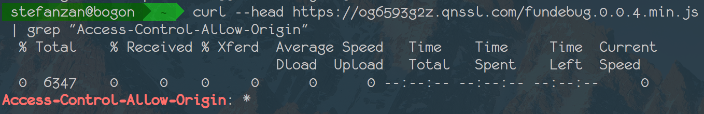

为了加快网站访问速度，我们不可避免要将静态资源放到第三方CDN上。然而，我们又需要在出错以后能够知道详细的报错信息，这篇博客将介绍如何避免出现`Script error.`


<!-- more -->

<div style="text-align: left;">

</div>


### 1. 添加 `crossorigin="anonymous"` 到script标签

 ```js
 <script src="https://xxx.com/xxx.js" crossorigin="anonymous"></script>
 ```
 
 `crossorigin`可以取枚举值`anonymous`或则`use-credentials`。
 
> The "anonymous" keyword means that there will be no exchange of user credentials via cookies, client-side SSL certificates or HTTP authentication

anonymous即不发送Cookie和HTTP认证信息，对于静态资源，我们使用`anonymous`就已经足够。 关于crossorigin详情可以参考: [CORS settings attributes](https://developer.mozilla.org/en-US/docs/Web/HTML/CORS_settings_attributes)

### 2. 添加支持跨域访问的设置

 ```js
 Access-Control-Allow-Origin: *
 ```

> Access-Control-Allow-Origin是HTML5中定义的一种解决资源跨域的策略。他是通过服务器端返回带有Access-Control-Allow-Origin标识的Response header，用来解决资源的跨域权限问题。


CDN服务商比如七牛默认已经配置好了Access-Control-Allow-Origin，使用`curl`命令获取头部：

```shell
curl --head https://og6593g2z.qnssl.com/fundebug.0.0.4.min.js | grep "Access-Control-Allow-Origin"
```
结果如下:

<div style="text-align: left;">

</div>


如果您有单独的子域名(子域名也会被认定为不同源)用来分发静态资源，那么需要在服务端做一点配置。针对不同语言和框架的配置方法我们不一一列出，Nodejs的Express框架下是这样配置的：

```
app.use(function(req, res, next)
{
    res.header("Access-Control-Allow-Origin", "*");
    res.header("Access-Control-Allow-Methods", "GET, POST, PUT, DELETE");
    next();
});
```

其它设置Access-Control-Allow-Origin请参考

- PHP: [ajax 设置Access-Control-Allow-Origin实现跨域访问](http://blog.csdn.net/fdipzone/article/details/46390573/)
- Java: [Java 无法跨域问题（No 'Access-Control-Allow-Origin'..）](http://blog.csdn.net/caixiajia/article/details/53648145)
- Nginx: [nginx Access-Control-Allow-Origin css跨域](http://www.cnblogs.com/wei-lai/p/6269639.html)


如果有任何疑问，可以联系我们，欢迎加入[Fundebug](https://fundebug.com)的QQ交流群：
 
<div style="text-align: center;">

</div>
