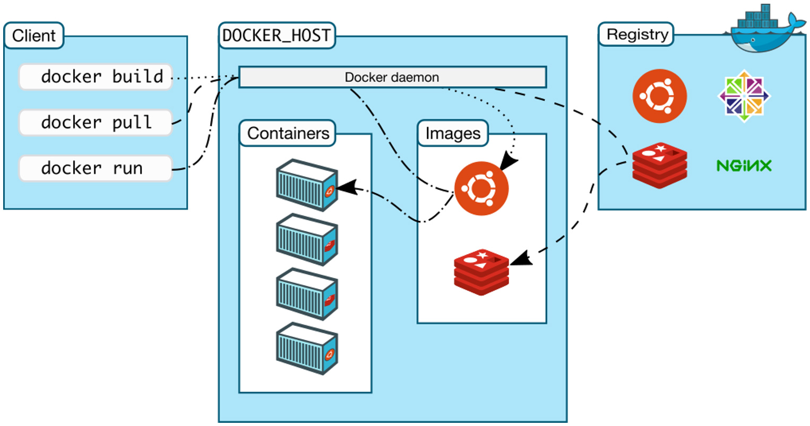

**译者按:** Docker是典型的C/S架构，其**守护进程(daemon)**与**命令行(CLI)**是通过**REST API**进行交互的。

<!-- more -->

原文: [Understanding how the Docker Daemon and Docker CLI Work Together](https://diveintodocker.com/blog/understanding-how-the-docker-daemon-and-docker-cli-work-together)

译者: [Fundebug](https://fundebug.com/)

**为了保证可读性，本文采用意译而非直译。另外，本文版权归原作者所有，翻译仅用于学习**。

Docker并非单体应用，它由多个组件构成。这篇博客将介绍**Docker守护进程(daemon)**与**Docker命令行(CLI)**。事实上，当我们在谈论安装或使用Docker时，所指的其实就是Docker**守护进程**与**命令行**。

### Docker架构图

#### 解释一下上图中的元素:

- **Docker守护进程(docker daemon)**是运行在你的操作系统上的一个服务。目前，它只能运行在Linux上，因为它依赖于一些Linux内核特性(比如Cgroup与Namespace)。 但是，也有一些特殊的办法让Docker运行在MacOS与Windows上(运行在Linux虚拟机中)。
- **Docker守护进程**提供了**REST API**。许多工具(Docker命令行，Docker Compose等)都可以通过**REST API**与**Docker守护进程**进行交互，例如创建容器，构建镜像等。
- **Docker命令行(docker CLI)**是与**Docker守护进程**进行交互的主要工具。

### Docker是C/S架构

Docker是**Client/Server架构**。其中**Docker守护进程**是服务端，**Docker命令行**是众多客户端之一。事实上，还有很多第三方的Docker客户端。

对于各种流行的编程语言，它们都有对应的Docker客户端。感兴趣的话，你也可以开发一个，使用REST API与**Docker守护进程**进行交互就好了。

通过客户端，你可以管理Docker的各种元素，包括镜像、容器、网络以及数据卷。对于Docker感兴趣的话，你不妨看看 [Dive Into Docker course](https://diveintodocker.com/courses/dive-into-docker)。

### Docker命令行与守护进程如何交互？

#### 从左至右理解上图:

- **最左侧是Docker客户端，即Docker命令行**。我们可以运行各种Docker命令，比如构建镜像(docker build)，下载镜像(docker pull)，运行容器(docker run)。Docker命令行可以安装在各种操作系统上，例如Windows，MacOS或者Linux服务器。
- **中间是Docker主机，Docker守护进程运行在上面**。Docker命令行可以轻松地连接远程的Docker主机(给定IP和端口即可)。而在MacOS与Windows上"运行"Docker时，Docker守护进程事实上运行在Linux虚拟机中。这里关键点在于，Docker守护进程和命令行可以运行在不同的主机上。
- **最右侧是Docker仓库**，它也是Docker生态系统中的一份子。它是我们下载、上传、存储以及分享Docker镜像的地方。Docker仓库的细节与本文无关，因此不再赘述。
