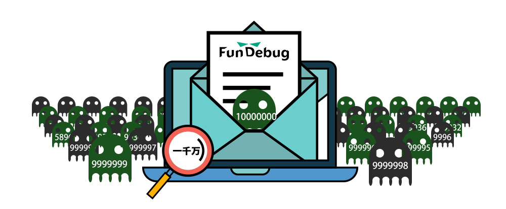

**摘要:** 上线半年时间，[Fundebug](https://fundebug.com/)累计处理1000万条错误事件。**10000000啊！**

<!-- more -->

自从去年双11[正式上线](https://blog.fundebug.com/2016/11/11/fundebug-is-online/)，[Fundebug](https://fundebug.com/)已稳定运行半年时间，为**600**余个开发团队提供**全栈JavaScript错误实时监控服务**。目前，我们已经累计处理了**1000万条错误事件**，依靠**自创的错误智能聚合算法**，我们将这1000万条错误事件聚合为约**1.9**万个不同的错误。

根据初步统计，这些错误事件的分布基本上符合**二八原理：**少数用户的**错误事件数**占了**错误事件总数**的大部分；每个用户的**少数错误重复出现的次数**占了该用户**所有错误事件数目**的大部分。

更重要一点在于，**借助于Fundebug，我们的用户几乎都发现了线上代码BUG**。也许很多程序员会感到奇怪，**我的代码怎么可能有BUG？**其实这并不奇怪，因为:

- 一些意想不到的边界条件（内存溢出，死循环，Null, Undefined）;
- 代码的运行环境（各种浏览器，各种手机）千变万化;
- 网络环境复杂(云服务商，网络运营商，CDN提供商...)
- 代码运行依赖的系统比如数据库(MySQL, Redis)偶尔抽风;
- 峰值情况下网络超时，CPU和内存超负荷;
- ……

其中一位Fundebug用户分享了一篇很有意思的博客 - [我是这样发现ISP劫持HTTP请求的](https://blog.fundebug.com/2017/05/10/isp-hijack-http/)，大家不妨参考一下。

还有一点，测试并不能完全消除这些问题。一方面，你不可能没完没了地写[单元测试](https://blog.fundebug.com/2017/03/20/nodejs-unit-test/)，另一方面，真实的代码运行环境是不可能完美复现的。

感兴趣的话，欢迎免费[注册Fundebug](https://fundebug.com/team/create)试用!





