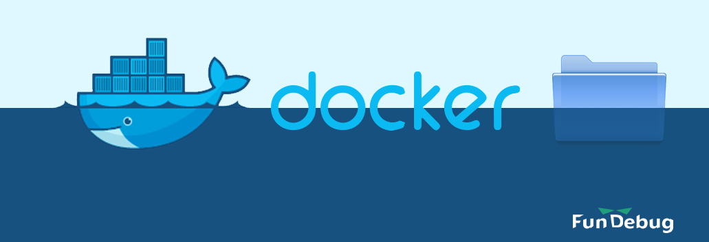

**摘要**：**Docker Volume**，通常翻译为**数据卷**，用于保存持久化数据。当我们将数据库例如MySQL运行在Docker容器中时，一般将数据通过**Docker Volume**保存在主机上，这样即使删除MySQL容器，数据依然保存在主机上，有效保证了数据的安全性。这篇博客将通过简单的实践帮助大家理解**什么是Docker Volume**。

<!-- more -->

<div style="text-align: center;">

</div>


本文所有命令都是在[play-with-docker](http://play-with-docker.com)的在线Docker实例上执行，Docker版本为**17.05.0-ce**。

### 1. 指定Docker Volume

使用[docker run](https://docs.docker.com/engine/reference/run/)命令，可以运行一个**Docker容器**

```bash
docker run -itd --volume /tmp/data1:/tmp/data2 --name test ubuntu bash
```

- 基于ubuntu镜像创建了一个Docker容器。
- 容器的名称为test，由**--name**选项指定。
- **Docker Volume**由**--volume**选项指定，主机的**/tmp/data1**目录与容器中的**/tmp/data2**目录一一对应。

### 2. 查看Docker Volume

使用[docker inspect](https://docs.docker.com/engine/reference/commandline/inspect/)命令，可以查看**Docker容器**的详细信息:

```bash
docker inspect --format='{{json .Mounts}}' test | python -m json.tool
[
    {
        "Destination": "/tmp/data2",
        "Mode": "",
        "Propagation": "",
        "RW": true,
        "Source": "/tmp/data1",
        "Type": "bind"
    }
]
```

- 使用**--format**选项，可以选择性查看需要的容器信息。**.Mount**为容器的**Docker Volume**信息。
- **python -m json.tool**可以将输出的json字符串格式化显示。
- **Source**表示主机上的目录，即**/tmp/data1**。
- **Destination**为容器中的目录，即**/tmp/data2**。

### 3. 本机文件可以同步到容器

#### 在本机/tmp/data1目录中新建hello.txt文件

```bash
touch /tmp/data1/hello.txt
ls /tmp/data1/
hello.txt
```

#### hello.txt文件在容器/tmp/data2/目录中可见

使用[docker exec](https://docs.docker.com/engine/reference/commandline/exec/)命令，可以在容器中执行命令。

```
docker exec test ls /tmp/data2/
hello.txt
```

可知，在本机目录**/tmp/data1/**的修改，可以同步到容器目录**/tmp/data2/**中。

### 4. 容器文件可以同步到主机

#### 在容器/tmp/data2目录中新建world.txt文件

```bash
docker exec test touch /tmp/data2/world.txt
docker exec test ls /tmp/data2/
hello.txt
world.txt
```

#### world.txt文件在主机/tmp/data1/目录中可见

```bash
ls /tmp/data1/
hello.txt  world.txt
```

可知，在容器目录**/tmp/data2/**的修改，可以同步到主机目录**/tmp/data1/**中。

### 5. 结论

**Docker Volume**本质上是容器与主机之间共享的目录或者文件，这样**Docker Volume**中的数据可以在主机和容器中实时同步。使用Virtualbox创建虚拟机时，也可以配置共享目录，这与**Docker Volume**非常相似。
