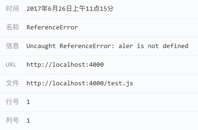
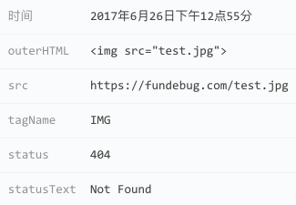
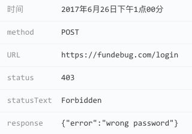

**摘要：**Fundebug的JavaScript监控插件更新至0.1.0，可以监控3种不同类型的前端BUG：**JavaScript执行错误**、**资源加载错误**、**HTTP请求错误**。


<!-- more -->


从简单的onerror开始，Fundebug的JavaScript错误监控插件经过了多次迭代，功能也更加丰富与成熟。之前版本的插件只能监控**JavaScript执行错误**，这次，我们正式发布0.1.0，它新增了对**资源加载错误**与**HTTP请求错误**的支持，努力让前端开发者**不放过每一个BUG**。

### JavaScript执行错误

由于拼写失误，测试不完善，或者是意外的边界条件，JavaScript代码在用户浏览器中执行时，有可能会出错。

下面的示例中，alert被写成了aler，因此会报ReferenceError：

```javascript
aler("hello");
```

Fundebug插件捕获的这个错误之后，开发者将受到报警邮件，然后可以在我们的控制台查看错误详情：

<div style="text-align: center;">

</div>


### 资源加载错误

对于一个复杂的大型网站，所依赖的静态文件(js, css, jpg...)成千上万，因此出现加载错误，比如404，也是很常见的一种错误。

下面的示例中，所引入的test.jpg并不存在，因此会报404错误：

```html

```

开发者可以在Fundebug控制台错误详情: 

<div style="text-align: center;">

</div>


### HTTP请求错误

前端通过大量的API与后端进行交互，这些API也有可能出错。

通常，后端会通过日志记录所有HTTP请求，但是查询起来非常不便，也不及时。Fundebug可以捕获所有HTTP请求错误，同时记录用户行为，并实时提醒开发者，且不需要修改后端，也不需要搭建复杂的日志系统。

下面的示例中，登陆账户时密码错误，因此会报403错误。

```javascript
var xhr = new XMLHttpRequest();
xhr.open("POST", "https://fundebug.com/login");
xhr.setRequestHeader('Content-Type', 'application/json');
xhr.send(JSON.stringify(
{
    email: "help@fundebug.com",
    password: "akhakfnak"
}));
```

开发者可以在Fundebug控制台错误详情: 

<div style="text-align: center;">

</div>

欢迎加入[我们Fundebug](https://fundebug.com/)的**全栈BUG监控交流群: 622902485**。

<div style="text-align: center;">

</div>


