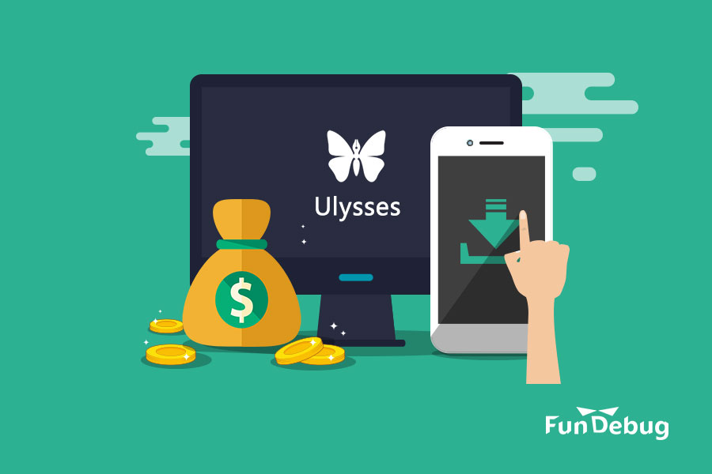

**摘要：** 也许未来某一天，我会开始用Ulysses写博客。

<!-- more -->

最近，写作软件[Ulysses](https://www.ulyssesapp.com/)由购买改为订阅。Ulysses之前的iOS版价格为163元，Mac版为283元；改为订阅之后，价格是26元/月，或者218元/年。这个改变有些突然，导致了一些用户的不满，也引发的大家对软件付费的讨论。

我不是Ulysses用户，但是用过不少付费软件，有的是一次性购买，有的是按时间订阅。很喜欢这些软件，所以我乐意付费。

同时，我也是一名程序员，用代码”改变世界”。敲代码本身痛并快乐着，而通过软件赚钱无可厚非，也可以鼓励程序员们创造更多、更好的软件，让这个世界变得更加美好。

更重要的是，我还是全栈JavaScript错误监控服务[Fundebug](https://fundebug.com/)的联合创始人，我们团队正在努力打造一款面向企业的SaaS软件。Fundebug免费服务近1年，预计双11的时候开始收费，采用订阅模式。为什么收费呢？因为梦想不能当饭吃，我们需要养活一个充满创造力的团队：产品经理、设计师、前端/后端工程师、运营、客服...

### 付费软件让生活更美好

大家热爱书、音乐和电影，它们让生活更美好，所以很多人愿意为之付费。或者说，人们喜欢作家、歌手、导演和演员，他们创造了伟大的艺术品，所以让他们赚钱是理所应当的。而在我看来，开发软件也是一门艺术，从确定功能，设计UI到编写代码，每一个步骤都需要非凡的创造力。因此，高质量的软件也是伟大的艺术品，由内到外都值得我们欣赏。

当然，软件不是拿来欣赏的，而是有一些实际的作用。它们可以在某个细节上，给我们莫大的帮助，让我们的生活更加美好。我用过不少优秀的付费软件，这里不妨分享一下。

MacBook付费软件

- 1Password：再也不用记住各种密码了
- Alfred: 便捷的搜索工具，可以替代Spotlight
- PDF Expert: 阅读PDF时，方便地进行标记和批注
- Evernote标准账户：提供1G同步流量，可以收藏更多的博客、PDF、图片等
- Todoist标准账户：制定工作任务，支持提醒和评论
- Momentum Plus: Chrome插件，每天推送一张很美的照片 
- Handy Break：定时休息，保持好的工作状态
- Dash: 用于查询各种技术文档，提高编程效率
- 马克飞象：用MarkDown写技术博客，同步到Evernote中

iOS付费软件

- 静雅思听：听书软件，提供大量高质量的历史、文学、经济等书籍的全文音频
- 微信读书：简洁的读书软件
- Productive: 帮助你养成一些好的习惯，比如健身、阅读等
- Forest：工作学习的时候避免玩手机
- 早安闹钟：记录睡眠质量
- 素记：偶尔写点日记

订阅软件按照一年费用来算的话，这些软件一共花了2000多，这大概是小县城的房价，不算太贵。发现优秀的软件，正如找到好的书、好的音乐、好的电影一样，是件让人开心的事，性价比其实挺高的。

### 为软件付费是一种投资

不难发现，我列举的付费软件，几乎都是关于工作或者学习的。我没有列举付费的生活软件，比如网易云音乐、腾讯视频等，是想强调付费软件有着更高的价值。它们可以帮助我们学习知识、帮助我们提高工作效率，这无疑是一种投资而不是消费。

所谓投资，就是花出去的钱可以帮你把钱赚回来。如果说，某个软件可以帮你提高工作效率，也就是说，你可以用更少的时间，更好地完成更多的工作，这是不是在帮助你赚钱呢？比如，如果你是程序员，使用Dash查文档比Google要方便很多，那么你就可以花更多时间用于敲代码。

学习软件，比如静雅思听、微信读书或者一些MOOC平台，则是一种长期投资。知识的价值短期内的效果也许并不明显，长远来看可以让我们受益匪浅。以前，前辈吴晓波说过贷款买房可以实现财务自由，后来房价太高，他也觉得这事不靠谱了。其实这些年，吴前辈靠写书赚了不少钱，而写作无疑是需要大量知识积累的。

顺便聊一句所谓的”知识付费”产品，最常见的比如听某人聊天，在我看来，只是一种娱乐方式，和听相声差不多，好像明白了什么，其实啥也不懂。与其陶醉于各种快餐式的”知识付费”，还不如静下心来一页一页地读书，一集一集地看在线课程。也许这是我的偏见，No Offense.

### 付费让软件更美好

似乎大多数常用软件都是”免费”的，比如微信、支付宝、百度地图等等。其实，这些软件只是靠着大量用户，采用了不同的商业模式，因此并没有直接向用户收费。它们既免费又好用，大家当然都喜欢。但是，如果大家以为软件就应该免费，这误会可就大了。

对于很多没有更好商业模式的软件，它们只能收费。开发一款软件，是需要很多人，用很多时间，然后花掉很多钱的。而且，软件的开发不是一蹴而就的，需要长期维护，比如修复BUG，增加新功能。然后，软件有很多长期支出，比如服务器、邮件，短信等第三方服务费用。你知道为什么很多软件会限制短信验证码的发送频率码？因为给用户发短信是需要花钱的，而且费用还不便宜！比如，用[SendCloud](https://sendcloud.sohu.com/)发送1万条短信的花费是523元。

如果开发者可以从软件得到稳定的收入，那么他们就可以持续改进产品，提高用户体验。相反，免费软件对用户来说，不一定有益。

比如，在使用Productive之前，我也用过某款免费的记录习惯的软件，以前感觉还行，只是现在它连登陆功能都不正常了。是的，一款不错的软件，就这样毁了，很可能是因为没有收费导致的。

我用的大多付费软件都是国外产品，这并非偶然。国外用户的付费习惯更好，这样促进了软件产业的繁荣，要知道，苹果的App Store目前累计收入超过1000亿美元，其中苹果赚了300亿美元的”苹果税”！假设国内用户的软件付费意愿更强，必定会出现大量优秀的国产软件，并且这些软件将更加符合国人的使用习惯。

回到Ulysses那个话题，我认同他们的决定。也许未来某一天，我会开始用Ulysses写博客。

### 参考

- [Why we’re switching Ulysses to Subscription](https://medium.com/building-ulysses/why-were-switching-ulysses-to-subscription-47f80b07a9cd)
- [为什么你如此努力还这么穷?](http://blog.sina.com.cn/s/blog_13840c99d0102uz3j.html)
- [90后就别买京沪深的房子了](http://finance.sina.com.cn/zl/lifestyle/2017-03-23/zl-ifycstww0684294.shtml)
- [App Store开发者收入突破700亿美元](https://www.apple.com/cn/newsroom/2017/06/developer-earnings-from-the-app-store-top-70-billion/)