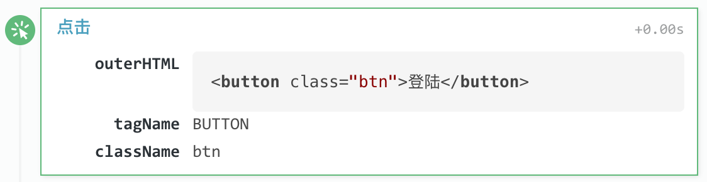
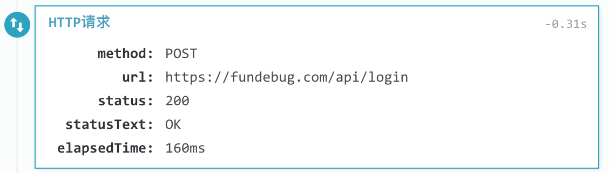
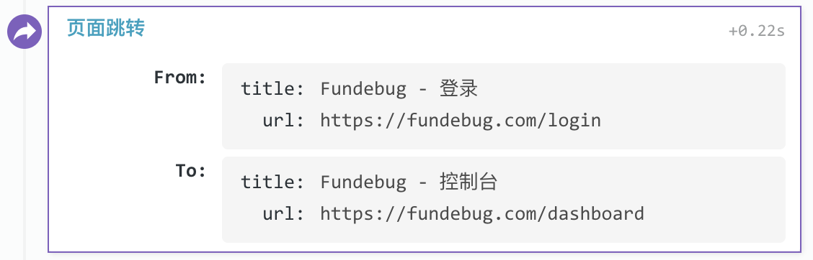
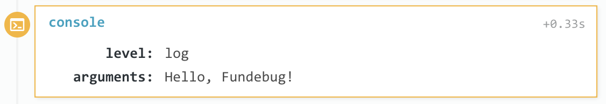
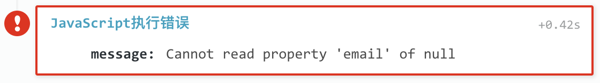
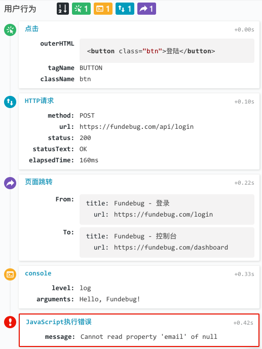

**摘要：**[Fundebug]()的JavaScript监控插件更新至**0.3.0**，对用户行为记录功能进行了优化，可以记录console输出，并且记录HTTP请求花费的时间。同时，我们还对**用户行为**的前端UI进行了重新设计。这样，可以帮助用户方便地复现BUG，从而解决问题。

<!-- more -->

目前，Fundebug支持记录4种不同的用户行为：

- 点击
- 页面跳转
- HTTP请求
- console输出

### BUG复现示例

这里，我们通过一个简单的示例，演示如果通过Fundebug记录的用户行为复现BUG。

#### 点击

首先，用户点击了**登陆按钮**：

#### HTTP请求

然后，前端向后端**登陆接口**发起了HTP请求：

#### 页面跳转

接着，前端从**登陆页面**跳转到了**控制台页面**

#### console输出

之后，**console**输出了欢迎信息："Hello, Fundebug!"

#### 出BUG了！

最后，由于前端代码有BUG，导致JavaScript执行出现了错误：

通过分析可知，从用户登陆，到跳转到控制台，代码中没有考虑一个边界条件，从而导致了错误。因此需要及时修复。

#### 用户行为UI

在Fundebug控制台，以上示例的用户行为完整UI如下：

点击上面带有颜色的按钮，可以对用户行为进行排序和过滤。这样，方便大家对用户行为进行深入分析，从而快速复现BUG。
