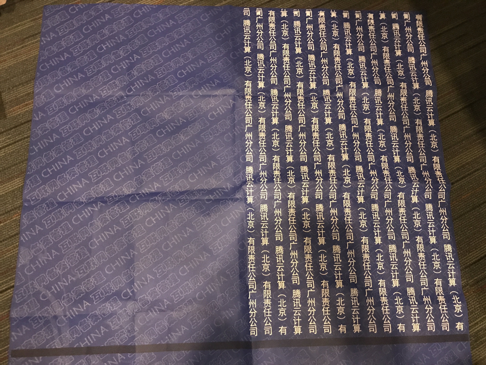
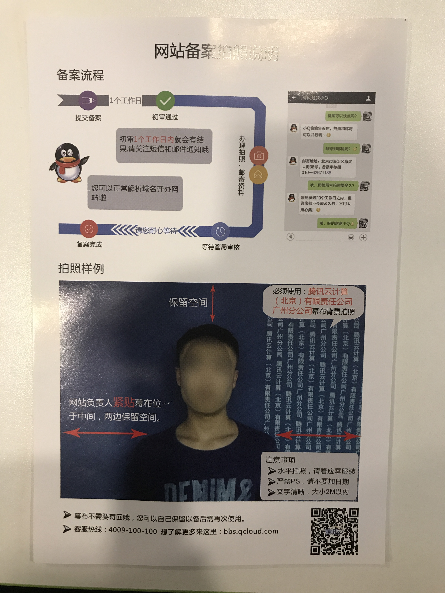

**摘要:** 备案不易，且行且珍惜！

<!-- more -->

我买了个腾讯云的服务器，1核1G，打算用于部署个人网站[kiwenalu.com](https://kiwenlau.com/)。根据规定，在国内部署网站，是需要为域名备案的...

备案是通过腾讯云申请的，一切都很顺利。根据腾讯云的备案记录，一共花了10天时间：

这里，我记录一下备案流程，给大家作为参考。

### 填写初审材料

这一步需要在网上填写一些基本资料，并上传身份证照片。如果是公司网站的话，则需要上传营业执照的照片。还有，如果备案地址是外地的话，会需要提供暂住证或者居住证。

填完之后，需要打印《网站备案信息真实性核验单》，签字之后上传。

### 拍摄幕布照片

初审通过之后，腾讯云给我寄来了它们的幕布：

幕布是顺丰寄来的，很快，没有收费。居然真的是布做的，质量很好。这个是不用寄回去的，可以留着下次用。

根据寄来的说明，拍摄幕布照片：

然后上传照片就好了。

### 关闭网站

幕布照片审核通过之后，**其实就没什么事了**。因为，腾讯云会把材料寄给对应省份的管局。

但是，首次备案，要求网站必须关闭。否则管局审核有可能失败！我将网站临时下线了**3天**，从**提交管局**到**审核通过**。

闭站时，可以通过[百度站长平台](http://zhanzhang.baidu.com/)申请**闭站保护**，这样可以避免因为闭站影响搜索排名。等到网站重新上线时，再申请**闭站恢复**。

### 总结

备案并不难，不过有点麻烦，需要花点时间。备案之后，[kiwenlau.com](kiwenlau.com)可以部署在腾讯云上，速度快了很多。并且，也可以使用CDN服务了，我将一些图片都放到了七牛云上，使用**image.kiwenlau.com**域名访问。

这里，需要为腾讯云点赞，整个备案服务的细节做得很好。比如：幕布没有收费，且免费用顺丰寄来，很快就收到了；备案材料直接帮忙寄给了管局，不需要自己来寄；每个步骤都很快，而且及时发送了短信和邮件提醒；UI非常简洁舒服...小马哥做为中国互联网最优秀的产品经理之一，非常注重产品细节，这使得众多腾讯系的产品体验都很好，不得不服!

