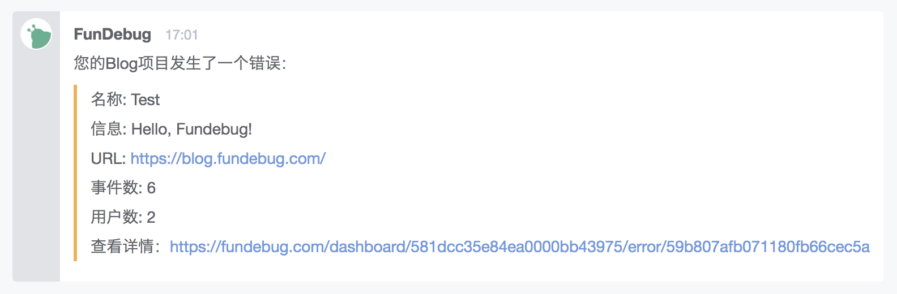

**摘要: ** 国内知名**团队聊天工具**[BearyChat](https://bearychat.com/)新增了**Fundebug机器人**，可以方便用户将**应用错误报警**接入到聊天窗口中，第一时间发现、讨论并修复线上BUG。

<!-- more -->

### 关于BearyChat

**BearyChat**，中文名为**倍洽**，是一款面向企业和团队的沟通工具，提供了许多非常强大的团队协作功能，比如**第三方服务集成**、**文件共享**、**一键收藏**等。BearyChat的客户包括[LeanCloud](https://leancloud.cn/)、[Keep](https://www.gotokeep.com/)等知名产品。2016年11月，[BearyChat获得了千万级的A轮融资](https://36kr.com/p/5056029.html)。

### 第三方报警

为了帮助用户方便、及时地发现问题，Fundebug支持BearyChat等各种第三方报警方式：

- [BearyChat](https://docs.fundebug.com/alert/bearychat/)
- [Slack](https://docs.fundebug.com/alert/slack/)
- [简聊](https://docs.fundebug.com/alert/jianliao/)
- [Worktile](https://docs.fundebug.com/alert/worktile/)
- [零信](https://docs.fundebug.com/alert/pubu/)
- [钉钉](https://docs.fundebug.com/alert/dingtalk/)
- [自定义Webhook](https://docs.fundebug.com/alert/outgoing/)

这就意味着，当用户的线上应用出现BUG时，您可以在各种工具中实时收到报警信息，这样可以帮助用户迅速发现并解决BUG。

### BearyChat新增Fundebug机器人

根据其[更新日志](https://bearychat.com/changelog)和[博客](http://bearyinnovative.com/fundebug/)，BearyChat新增了Fundebug机器人，这样让我们的用户集成BearyChat报警变得更加方便。

### 如何集成BearyChat报警？

在**机器人管理**页面，点击右上角的**添加机器人**。

在**数据监测**分类中，选择**FundDebug**:(其实，我们名字是Fundebug而不是FunDebug...)。

点击**添加**，选择对应的讨论组，点击**下一步**，然后**保存配置**。

复制Webhook的地址之后，在Fundebug的项目设置页面，添加Beaychat类型的报警方式就好了。

当您的应用发生错误时，对应的BearyChat讨论组将收到如下的报警信息：

最后，感谢BearyChat团队对Fundebug的支持！

### 参考

- [报错机器人上线，第一时间消灭 Bug](http://bearyinnovative.com/fundebug/)
- [Fundebug支持各种第三方报警](https://blog.fundebug.com/2017/08/01/fundebug-support-multiple-alerts/)
