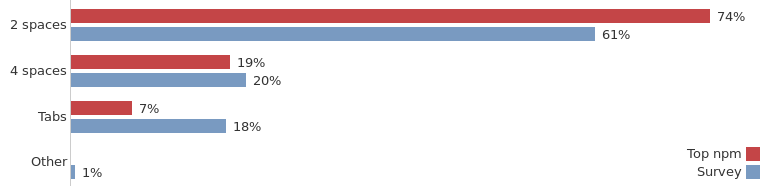
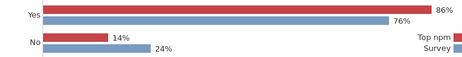
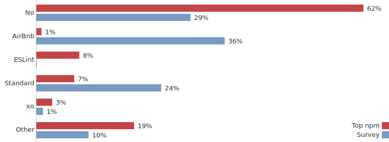
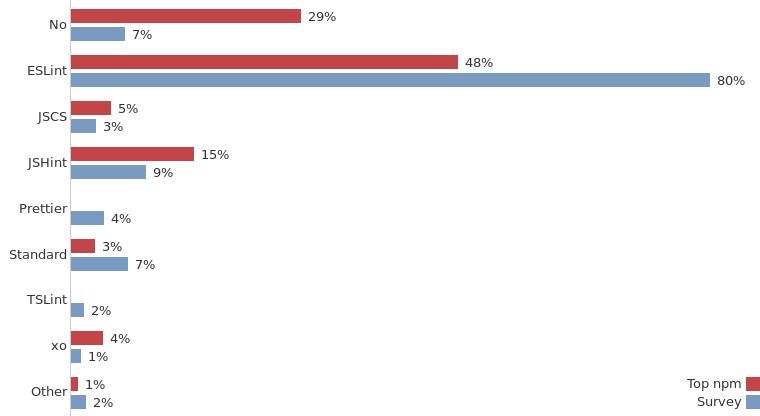

---

title: 哪种JavaScript编程风格最流行？

date: 2017-10-30 10:00:00

tags: [JavaScript, 翻译]

---

**译者按:** 关于代码风格，群众的选择应该是不错的选择。

<!-- more -->

- 原文: [What JavaScript code style is the most popular](http://blog.sapegin.me/all/javascript-code-styles)
- 译者: [Fundebug](https://fundebug.com/)

**为了保证可读性，本文采用意译而非直译。另外，本文版权归原作者所有，翻译仅用于学习。**

对于JavaScrript编程风格，有两个最大争议：缩进使用空格还是制表符？行尾是否需要使用分号？当然，还有更多其他争议，比如：定义多行数组时，逗号应该放在什么地方？

我在想，这些争议是否浪费了我们太多时间。如果我们不去做无谓的争论，而是采用最流行的编程风格，是不是更好？于是，我分析了100个最受信赖的npm模块，并且做了一个问卷调查(一共有1169个参与者)。

### 缩进使用空格还是制表符？

- 很显然，使用2个空格进行缩进是大多数，尤其对于流行的开源npm项目来说

### 行尾是否需要使用分号?

- 绝大多数JavaScript开发者在行尾写分号

### 预设Linter

#### npm模块调研:

- 绝大多数开源项目都不使用预设的linter
- 大型开源项目使用它们自定义的linter，比如： own presets: Babel, Gulp, PostCSS, Facebook
- Sindre Sorhus使用[xo](https://github.com/sindresorhus/xo)

#### 问卷调查:

- 问卷调查的结果与npm模块的调研结果非常不一样
- [AirBnb](https://github.com/airbnb/javascript)是最流行的
- [Standard](https://standardjs.com/)也很流行 (貌似行尾不用分号的开发者都使用**Standard**)

### Linters

#### npm模块调研:

- 大多数npm开源项目的的linter配置非常简单：不超过10条规则
- 一些项目有**.eslintrc**和**.jshintrc**，但是没有将它们加入测试
- 一些项目同时有**.eslintrc**和**.jshintrc**，其中甚至有一些相互冲突的规则

#### 问卷调查

- [Prettier](http://jlongster.com/A-Prettier-Formatter)在几个星期之前发布，但是已经被不少人使用了
- 并且，很多人非常看好[Prettier](http://jlongster.com/A-Prettier-Formatter)。“等待Prettier更加流行！”，"Prettier的主要BUG修复之后我就用它"。
- 有的开发者并不在乎这个，“代码风格真的重要吗？”

### 结论

对于前两个问题，我本来以为答案是五五开。但是，我却发现情况不是这样的：绝大多数开发者缩进使用空格键，tab键几乎没人用；很多人都在代码行尾使用分号，但是发Titter时他们几乎不用。

还有，npm项目的代码风格并没有想象中那么多差异：超过一半的项目缩进使用2个空格并在行尾写分号，并且它们大多数并不使用工具验证代码风格。

也许，这是是因为大多数流行的npm项目都很老了，而我在做问卷调查时，开发者谈论的都是它们最近开发的项目。

因此，如果你在新项目中采用[AirBnb](https://github.com/airbnb/javascript)风格 (2个空格, 行尾使用分号, etc.)，这是一个不错的选择，因为大多数开发者的代码风格与你一致。 

- 本文的数据都放在GitHub：[jscodestyle](https://github.com/sapegin/jscodestyle)
