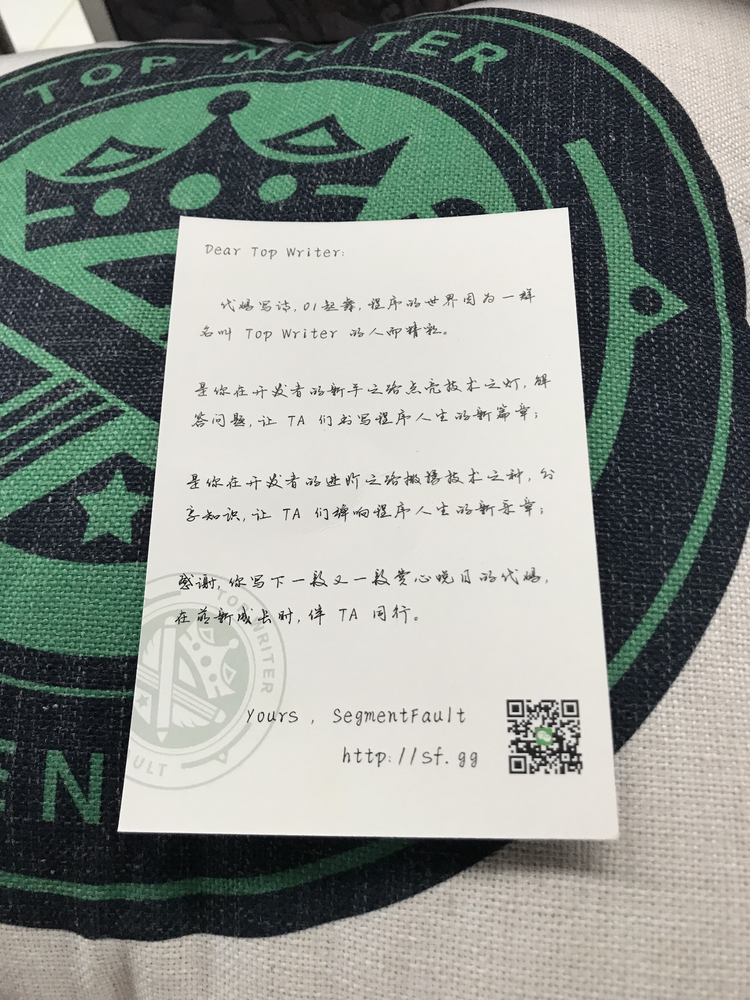

---

title: Fundebug获得SegmentFault的Top Writer

date: 2017-11-02 10:00:00

tags: [Fundebug]

---

坚持写了半年博客之后，我们获得了SegmentFault的Top Writer！

<!-- more -->

从5月份开始，我们[Fundebug](https://fundebug.com/)每周更新2篇技术[博客](https://blog.fundebug.com/)。由于我们是做JavaScript错误监控的，所以博客内容基本上都是关于JS。一方面，对于我们来说，写博客是一种很好的学习方式；另一方面，也希望能够帮助其他开发者。

同时，我们也会将博客分享到一些知名的技术站点，比如[SegmentFault](https://segmentfault.com/u/fundebug/posts)、[掘金](https://juejin.im/user/587d9f69b123db4d5e7ed9e3/share)、[开发者头条](https://toutiao.io/u/340684)等，受到很多开发者的欢迎。

### Top Writer

我们的坚持，获得了社区的肯定，Fundebug获得了[SegmentFault 2017 年第三季度 Top Writer](https://segmentfault.com/a/1190000011546440)。在**"优秀文章作者"**中，Fundebug排名**第7**，其中，最受欢迎的文章是[10个JavaScript难点](https://segmentfault.com/a/1190000010371988)。

我们还收到了一个可爱的抱枕，以及一个精致的卡片，感谢SegmentFault！我们会继续加油。

  

### 关于SegmentFault

[SegmentFault](https://segmentfault.com/)是国内最知名的技术问答站点，对于开发者来说，在搜索技术问题时，都能看到SegmentFault的身影。根据[Alexa](http://www.alexa.cn)，SegmentFault的日均PV高达数百万。还有，SegmentFault的网站和App的设计非常简洁美观，值得点赞。

### 关于Fundebug

[Fundebug](https://fundebug.com/)是全栈JavaScript错误监控平台，可以监控线上JS代码的错误，帮助开发者及时发现并修复代码中的BUG。Fundebug上线已经接近**1年**，服务**2000+团队**，累计处理错误数马上就会**突破1亿**。感兴趣的朋友，可以[免费使用](https://fundebug.com/team/create)我们的服务。

### 参考

- [SegmentFault 2017 年第三季度 Top Writer](https://segmentfault.com/a/1190000011546440)