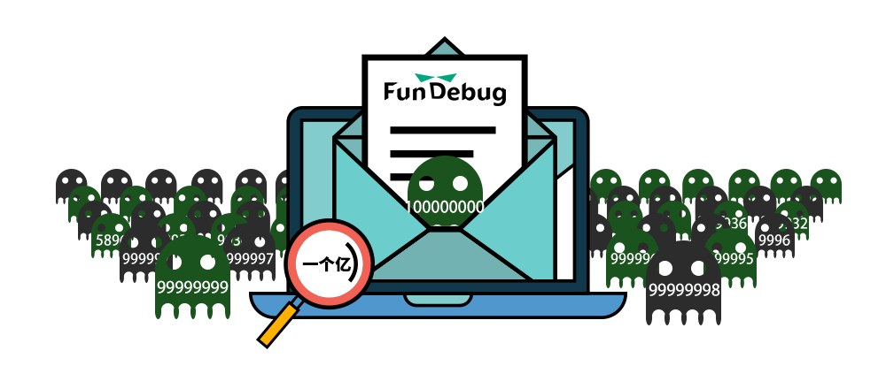
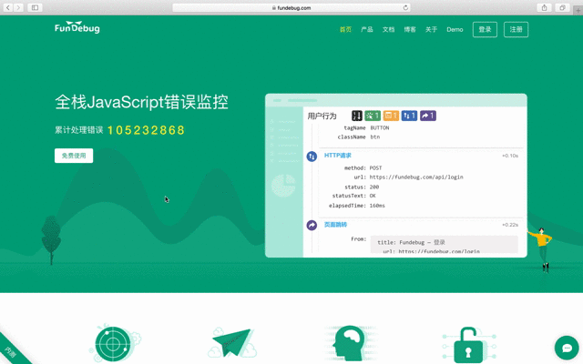

**摘要:** 到今年双11，[Fundebug](https://fundebug.com/)已经[上线](https://blog.fundebug.com/2016/11/11/fundebug-is-online/)1周年啦！现在，我们累计处理了1亿条错误事件。小目标完成，此处应该打Call!

<!-- more -->

自从去年双11[正式上线](https://blog.fundebug.com/2016/11/11/fundebug-is-online/)，[Fundebug](https://fundebug.com/)已稳定运行1年时间，为**3000**余个开发团队提供**全栈JavaScript错误实时监控服务**。目前，我们已经累计处理了**1亿条错误事件**。

可知，我们的错误增长速度非常稳定。目前，Fundebug每天错误事件大概是**100万**条。我们[首页](https://fundebug.com/)会实时更新累计处理的错误数，欢迎围观：

同时，在这半年时间内，我们Fundebug进行了大量产品迭代更新：

- 增加[搜索](https://blog.fundebug.com/2017/06/06/fundebug-support-search/)功能
- 支持监控3种不同前端错误：[JavaScript执行错误、资源加载错误、HTTP请求错误](https://blog.fundebug.com/2017/06/29/fundebug-javascript-0.1.0/)
- 支持各种第三方报警：[BearyChat、钉钉、Slack等](https://blog.fundebug.com/2017/08/01/fundebug-support-multiple-alerts/)
- JS插件支持[过滤BUG](https://blog.fundebug.com/2017/08/18/fundebug-javascript-0.2.0/)
- [使用fundebug-cli批量上传Source Map](https://blog.fundebug.com/2017/08/24/fundebug-cli-0.1.1/)
- 优化[用户行为回溯](https://blog.fundebug.com/2017/09/14/fundebug-can-recurrent-all-bug/)UI
- 支持收藏过滤条件
- 错误堆栈信息显示行号，并且可以高亮出错的行和列
- ...

另外，我们几乎每天都会部署新的版本，进行一些产品细节优化。我们自己也是Fundebug的用户，从而发现了不少问题，比如[这个](https://blog.fundebug.com/2017/09/06/fundebug-user-behavior-help-debug/)，这让我们可以更加及时的修复BUG。还有很多产品问题、需求是用户反馈的，大家一直在督促我们持续改进的，非常感谢！ 

各位老铁，感兴趣的话，欢迎免费[使用Fundebug](https://fundebug.com/team/create)咯!





