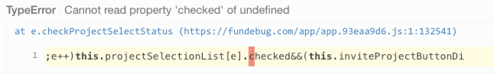
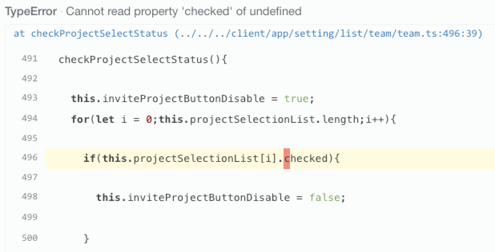

**摘要:** 当用户的代码出错时，我们能够捕获出错的代码片段，并且高亮出错的行和列，这样用户可以快速定位出错位置。

<!-- more -->

接入Fundebug的JavaScript错误监控插件之后，用户就可以第一时间发现线上代码的错误。并且，[Fundebug支持使用Source Map](https://blog.fundebug.com/2017/02/27/fundebug-support-sourcemap/)还原真正的出错位置，获取出错的代码块：

可知，我们**使用黄色和红色分别高亮代码块中出错的行和列**。这样，用户一目了然，可以迅速定位出错代码，并找到出错原因。

### Source Map按钮关闭时

默认情况下，Source Map按钮是关闭的，此时展示的是压缩代码的出错位置：

这种情况下，是比较难定位出错的源代码位置的，因为压缩代码的变量、函数名称都经过了变换。一个可行的办法是通过出错代码块中的特殊字符串进行搜索，这种方法并不是很好。因此，我们鼓励用户使用[Source Map](https://docs.fundebug.com/notifier/javascript/sourcemap/)功能。

### Source Map按钮开启时

开启Source Map之后，展示的是通过Source Map还原的出错代码：

### 参考

- [Source Map入门教程](https://blog.fundebug.com/2017/03/13/sourcemap-tutorial/)
- [Fundebug支持Source Map](https://blog.fundebug.com/2017/02/27/fundebug-support-sourcemap/)
- [Fundebug文档 - Source Map](https://docs.fundebug.com/notifier/javascript/sourcemap/)

