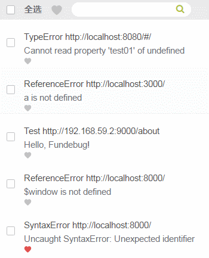

---

title: Fundebug支持收藏错误

date: 2017-12-21 10:00:00

tags: [产品]

---

**摘要：**对于感兴趣的错误，用户可以收藏它，这样可以方便查看。

<!-- more -->

有时候，开发者会对特定的错误比较感兴趣：

- 比较严重的错误，出现时要及时处理
- 正在处理的错误，需要经常查看
- 已经修复的错误，需要关注一段时间，防止复现
- ......

这个时候，就可以收藏它们。

收藏以及取消的操作都非常简单：

另外在错误详情页面也可以进行收藏操作。

这样，开发者就可以随时查看感兴趣的错误咯！

