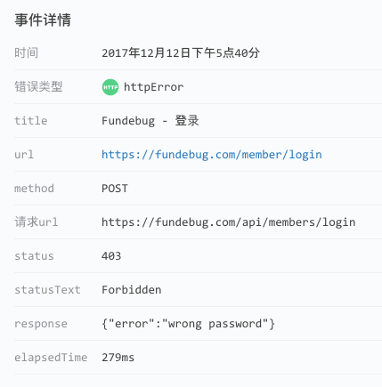
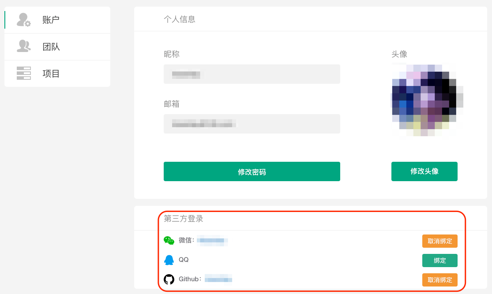
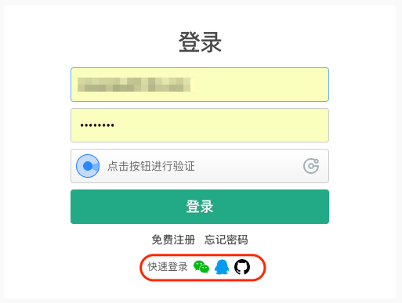

---

title: Fundebug支持微信/QQ/GitHub登录

date: 2017-12-22 10:00:00

tags: [Fundebug]

---

**摘要：** 有了微信/QQ/GitHub登录，再也不用担心忘记密码啦~

<!-- more -->

我们[Fundebug](https://fundebug.com)是做错误监控的，当然我们自己也是Fundebug的忠实用户...

于是，我们发现不少登陆失败的报错:

是的，老铁们忘记了Fundebug账号的密码:( 而且，这样的情况不在少数：

出错次数为493，一共有221个用户受到影响，换句话说，平均每个用户忘记了2次密码...

这是个很严重的BUG啊！！！

于是，我们决定，支持第三方登录，比如：微信、QQ、GitHub...

用户可以在账户设置页面绑定第三方账号：

这样就可以直接使用第三方账号登陆啦：

点击快速登陆图标时：
- 已经注册Fundebug账号，且绑定了第三方账号，可以直接登陆；
- 已经注册Fundebug账号，但是没有绑定第三方账号，需要绑定之后才能登陆；
- 未注册Fundebug账号，则需要注册账号之后才能登陆；

这个功能已经发布一段时间了，目前30%的活跃用户都绑定了第三方账号，说明大家还是很机智的~

后续我们会支持更多的登陆方式，敬请期待！

Fundebug, Debug with Fun~

