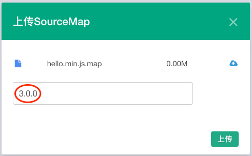

---

title: Fundebug支持区分Source Map版本

date: 2017-12-26 10:00:00

tags: [产品]

---

**摘要：** 想要区分Source Map版本的话，**在接入插件与上传Source Map时，都需要设置appversion哦！**

<!-- more -->

#### 神奇的Source Map

作为专业的错误监控服务，[Fundebug](https://fundebug.com)支持一个神奇的功能 - Source Map：

<div style="text-align: center;">

</div>

通常，出于性能和安全考虑，生产环境的代码是经过压缩混淆。这样的话，报错信息的位置以及代码都比较乱，难于定位真正的出错代码位置。使用Source Map，可以还原完整的堆栈信息，准确定位到出错源码，帮助您快速修复BUG。

#### 如何区分Source Map版本？ 

然而，机智的Fundebug用户发现了一个小小的问题：

> 当线上环境的代码与开发环境代码不同时，它们的Source Map内容不同而文件名相同，Fundebug如何区分？

我们之前的处理方式比较简单，采用最新的Source Map，这样会导致还原代码时使用了错误的Source Map。

#### 这样区分Source Map版本

为了解决用户提出的问题，我们现在已经支持了区分不同版本的Source Map。使用方法分为2步，缺1不可：

##### **1. 接入插件时设置应用版本**

应用版本可以通过[**appversion**](https://docs.fundebug.com/notifier/javascript/customize/appversion.html)属性来设定，有2种不同配置方式：

- 在HTML代码中配置`<script>`标签中配置appversion属性

```javascript
<script src="https://og6593g2z.qnssl.com/fundebug.0.3.3.min.js" 
        apikey="API-KEY" 
        appversion="3.2.5" ></script>
```

- 在JavaScript代码中配置appversion变量

```js
fundebug.appversion = "3.2.5";
```

##### **2. 上传Source Map时设置应用版本**

上传Source Map有3种不同方式：[前端UI上传](https://docs.fundebug.com/notifier/javascript/sourcemap/upload/ui.html)、[API上传](https://docs.fundebug.com/notifier/javascript/sourcemap/upload/api.html)、[fundebug-cli批量上传](https://docs.fundebug.com/notifier/javascript/sourcemap/upload/cli.html)。采用这3种方式上传Source Map时，均可以设置应用版本:

- [前端UI上传](https://docs.fundebug.com/notifier/javascript/sourcemap/upload/ui.html)

<div style="text-align: center;">

</div>

- [API上传](https://docs.fundebug.com/notifier/javascript/sourcemap/upload/api.html)

```bash
curl https://fundebug.com/javascript/sourcemap/upload \
     -X POST \
     -F apikey=API-KEY \
     -F appversion=1.0.0 \
     -F sourceMap=@dist/app.js.map
```

- [fundebug-cli批量上传](https://docs.fundebug.com/notifier/javascript/sourcemap/upload/cli.html)

```bash
fundebug-cli upload --apikey "API-KEY" --appversion 1.0.0 --directory dist/
```

当您**接入插件与上传Source Map均设置了应用版本**，则Fundebug就可以使用对应版本的Source Map文件来进行代码还原了~

#### 参考

- [Source Map入门教程](https://blog.fundebug.com/2017/03/13/sourcemap-tutorial/)
- [Fundebug支持Source Map](https://blog.fundebug.com/2017/02/27/fundebug-support-sourcemap/)
- [Fundebug支持高亮出错代码位置](https://blog.fundebug.com/2017/11/21/fundebug-highlight-error-code/)
- [Fundebug文档 - Source Map](https://docs.fundebug.com/notifier/javascript/sourcemap/)
- [Fundebug文档 - appversion](https://docs.fundebug.com/notifier/javascript/customize/appversion.html)


<div style="text-align: center;">

</div>