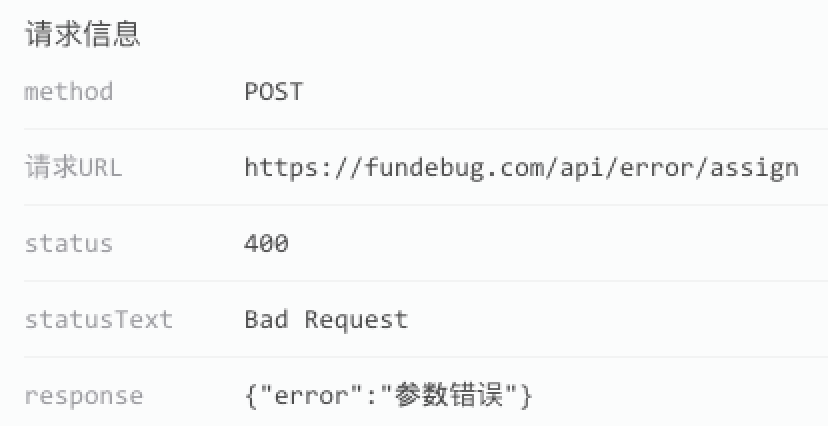

---

title: Git如何回滚代码？

date: 2018-01-24 10:00:00

tags: [Git]

---

**摘要：** 多年以后，你面对一个需要回滚的Git仓库，准会想起这篇博客。

<!-- more -->

<div style="text-align: center;">

</div>

某一天，用户跟我反馈，他不能分配任务了。我去看了一下[Fundebug](https://fundebug.com/)捕获的报错信息：

<div style="text-align: center;">

</div>

可知，出错原因是前端发送的请求参数有问题。这个悲伤的故事是这样的：后端同时修改了多个接口，但是前端没有及时修改对应的接口调用。

这个问题不难解决，回滚代码就好了，但是，Git如何回滚代码呢？我花了点时间研究了一下。

#### 测试仓库：[Fundebug/git-rollback](https://github.com/Fundebug/git-rollback)

我写了一个非常简单的[测试仓库](https://github.com/Fundebug/git-rollback)，master分支只有3个commit，每个commit只是添加一个文件，因此一共有3个文件：01.txt, 02.txt, 03.txt。

```bash
git log
commit b39476b9c730d312266fe9bc7f63e795f9ba856f
Author: kiwenlau <kiwenlau@126.com>
Date:   Thu Jan 18 14:58:06 2018 +0800

    3个文件

commit 3821210392184432de18b596cee58ab7924e39f9
Author: kiwenlau <kiwenlau@126.com>
Date:   Thu Jan 18 14:57:38 2018 +0800

    2个文件

commit 55d3012564e94a39f6686c0e532c0459ddc41ec4
Author: kiwenlau <kiwenlau@126.com>
Date:   Thu Jan 18 14:56:41 2018 +0800

    1个文件
```

本文介绍的所有回滚代码的命令，都会在一个新的分支执行，方便大家理解：

示例   | 分支   | 说明   |命令
------ | ------ | ------ | ----------------
1 | [test01](https://github.com/Fundebug/git-rollback/tree/test01) | 撤销最近1次commit | git revert HEAD 
2 | [test02](https://github.com/Fundebug/git-rollback/tree/test02) | 撤销某个commit | git revert 3821210392184432de18b596cee58ab7924e39f9
3 | [test03](https://github.com/Fundebug/git-rollback/tree/test03) | 撤销多个连续commit | git revert b39476b9c730d312266fe9bc7f63e795f9ba856f 3821210392184432de18b596cee58ab7924e39f9
4 | [test04](https://github.com/Fundebug/git-rollback/tree/test04) | 撤销多个非连续commit | git revert b39476b9c730d312266fe9bc7f63e795f9ba856f 3821210392184432de18b596cee58ab7924e39f9
5 | [test05](https://github.com/Fundebug/git-rollback/tree/test05) | 重置为某个commit(不保存代码) | git reset --hard 55d3012564e94a39f6686c0e532c0459ddc41ec4
6 | [test6](https://github.com/Fundebug/git-rollback/tree/test06) | 重置为某个commit(保存代码) | git reset --soft 55d3012564e94a39f6686c0e532c0459ddc41ec4

#### git revert : 撤销特定commit

Git的每一个commit都对应着某些代码改动，那万一改错了呢？这时可以使用**git reset**来撤销某一次commit的改动。所谓撤销，就是**把修改了的代码再改回来**。

**示例1**

最简单的一个场景，就是撤销最近的1次commit：

```bash
git revert HEAD 
```

最近1次commit是新增03.txt，撤销这个commit之后，[test01](https://github.com/Fundebug/git-rollback/tree/test01)分支就只剩下2个文件了：01.txt, 02.txt。

**示例2**

有时，可能需要撤销某个特定commit，比如，当我需要撤销第2个commit时，指定对应ID即可：

```bash
git revert 3821210392184432de18b596cee58ab7924e39f9
```

最近1次commit是新增02.txt，撤销这个commit之后，[test02](https://github.com/Fundebug/git-rollback/tree/test02)分支就只剩下2个文件了：01.txt, 03.txt。

由这个示例可知，使用git revert撤销commit时，仅仅针对所撤销的commit，**与任何其他commit无关**。

**示例3**

假设我们再做某个功能时，进行了多次commit，需要全部撤销。我们当然可以一个个commit依次revert，这样比较麻烦，其实可以一次性搞定：

```bash
git revert b39476b9c730d312266fe9bc7f63e795f9ba856f 3821210392184432de18b596cee58ab7924e39f9
```

撤销了后面2个commit，[test03](https://github.com/Fundebug/git-rollback/tree/test03)分支就只剩下1个文件了：01.txt。

**示例4**

示例3中所撤销的2个commit是连续的，其实，因为revert操作只与单个commit相关，我们也可以撤销多个非连续的commit：

```bash
git revert b39476b9c730d312266fe9bc7f63e795f9ba856f  55d3012564e94a39f6686c0e532c0459ddc41ec4
```

撤销了第1个和第3个commit，[test04](https://github.com/Fundebug/git-rollback/tree/test04)分支就只剩下1个文件了：02.txt。

#### git reset：重置为特定commit

**示例5**

在示例3中，撤销了两个连续的commit，这样做等价于将代码重置为第1个commit的状态：仅有01.txt这1个文件。使用**git revert**命令有些麻烦，我们可以直接使用**git reset**命令来实现：

```bash
git reset --hard 55d3012564e94a39f6686c0e532c0459ddc41ec4
```

将仓库强制重置为第1个commit，这样[test05](https://github.com/Fundebug/git-rollback/tree/test05)分支就只剩下1个文件了：01.txt。**git reset --hard**与**git revert**效果看起来一样，但是不同点在于，前者直接删除了后面2个commit及其代码，没有保存commi历史，因此**这个操作是不可逆的！**使用时应该特别小心。

如果你的本地仓库与远程仓库在reset之前是同步过的，reset之后，两者的commit不一致，本地仓库的commit落后与远程仓库，这样会导致push失败：

```bash
git push
To git@github.com:Fundebug/git-rollback.git
 ! [rejected]        test05 -> test05 (non-fast-forward)
error: failed to push some refs to 'git@github.com:Fundebug/git-rollback.git'
hint: Updates were rejected because the tip of your current branch is behind
hint: its remote counterpart. Integrate the remote changes (e.g.
hint: 'git pull ...') before pushing again.
hint: See the 'Note about fast-forwards' in 'git push --help' for details.
```

这是需要使用**--force**选项，这样远程仓库会被强制覆盖：

```bash
git push --force
```

**示例6**

reset时使用**--hard**选项是一个很危险的操作，因为它把commit以及代码全删了，没法恢复。如果你只希望删除commit，而保留修改过的代码的话，可以使用**--soft**选项。

```bash
git reset --soft 55d3012564e94a39f6686c0e532c0459ddc41ec4
```

这时，后面2个commit也被删除了，当前commit为第1个commit。但是，02.txt与03.txt并没有被删除。

```bash
git status
On branch test06
Changes to be committed:
  (use "git reset HEAD <file>..." to unstage)

	new file:   02.txt
	new file:   03.txt
```

这就意味着，当你的commit的代码有一些小问题时，可以重置commit，修改一下代码，如何重新commit即可。


#### 参考

- [git-revert - Revert some existing commits](https://git-scm.com/docs/git-revert)
- [git-reset - Reset current HEAD to the specified state](https://git-scm.com/docs/git-reset)
