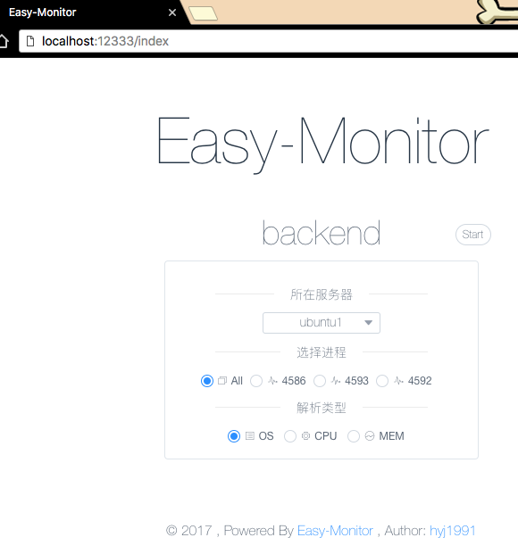
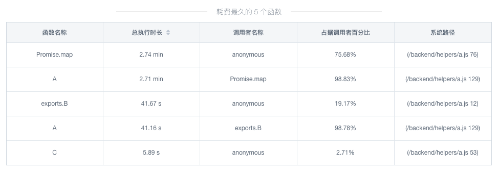

---

title: Node.js性能分析神器Easy-Monitor

date: 2018-02-29 10:00:00

tags: [Node.js,原创]

---

**摘要: ** 使用Easy-Monitor，可以准确定位Node.js应用的性能瓶颈，帮助我们优化代码性能。

<!-- more -->

当应用出现性能问题时，最大的问题在于：**如何准确定位造成性能瓶颈的代码呢？**对于Node.js开发者，这里推荐一下[Easy-Monitor](https://github.com/hyj1991/easy-monitor)，它应该是阿里巴巴某个90后程序员开发的。这个NPM模块可以帮助我们快速定位性能瓶颈。

### 问题

当负载较高时，某个后端模块的**响应时间慢**了很多，甚至出现**超时**错误"504 Gateway Time"。通过查看监控可知，这个模块在高峰期的CPU使用量是满负荷的，这有可能是问题所在。

### 接入[Easy-Monitor](https://github.com/hyj1991/easy-monitor)

接入Easy-Monitor非常简单，在入口js文件中导入即可：


```javascript
if (process.env.NODE_ENV === "development")
{
     const easyMonitor = require("easy-monitor");
     easyMonitor("backend");
}
```

启动应用，访问：[http://localhost:12333/index](http://localhost:12333/index)，即可查看Easy-Monitor的UI界面：

<div style="text-align: center;">

</div>

### 采集CPU数据

**[ab](https://httpd.apache.org/docs/2.4/programs/ab.html)**命令可以用于进行压力测试

```bash
ab -n 1000 -c 10  -T 'application/json' -p data.json http://localhost:3000/data/
```

运行ab测试的同时，在easy-monitor界面，选择cpu，然后start。easy-monitor就会默默地采集CPU数据，5分钟之后，就可以看到统计结果：

<div style="text-align: center;">

</div>

*使用[Fundebug](https://www.fundebug.com/)，阔以及时发现并修复应用错误，赶紧免费试用吧！！！*

### 修复性能问题

由Easy-Monitor的统计结果可知，**函数A是性能瓶颈**，消耗了最多的CPU时间。

那么，剩下的工作就非常简单了，对函数A进行性能优化即可。经过分析，函数A进行了大量重复计算，增加2行代码就可以大大地优化其性能。具体细节不再赘述，因为不是本文重点。

### 优化前后的性能比较

根据ab命令的测试结果，优化前平均每秒处理**5.36**个，优化后这个数字变成了**48.35**，是之前的**9倍**。将这个模块部署之后，服务器的CPU使用率大幅下降，接口的响应时间也恢复了正常。


### 总结

使用Easy-Monitor，可以将性能瓶颈准确定位到某些函数，然后进行针对性的优化，这样可以帮助我们快速修复性能问题。

### 参考

- [Easy-Monitor 2.0: 开启你的 Node.js 内核性能监控](https://cnodejs.org/topic/594f6e21642874f845d9fe0d)

