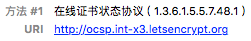

---

title: Nginx之OCSP stapling配置

date: 2018-03-07 10:00:00

tags: [Nginx, 原创]

---

**摘要：** 正确地配置OCSP stapling, 可以提高HTTPS性能。

<!-- more -->


<div style="text-align: center;">

</div>

### 什么是OCSP stapling?

OCSP的全称是Online Certificate Status Protocol，即**在线证书状态协议**。顾名思义，它是一个用于检查证书状态的协议，浏览器使用这个协议来检查证书是否被撤销。使用Chrome浏览器查看[https://www.fundebug.com](https://www.fundebug.com)的证书详情，可以看到OCSP的查询地址：

<div style="text-align: center;">

</div>

Fundebug使用的是[Let's Encrypt](https://letsencrypt.org/)的免费证书，其OCSP查询地址是**http://ocsp.int-x3.letsencrypt.org/**，浏览器需要发送请求到这个地址来验证证书状态。

OCSP存在**隐私**和**性能**问题。一方面，浏览器直接去请求第三方CA(Certificate Authority, 数字证书认证机构)，会暴露网站的访客(Let's Encrypt会知道哪些用户在访问Fundebug)；另一方面，浏览器进行OCSP查询会降低HTTPS性能(访问Fundebug会变慢)。

为了解决OCSP存在的2个问题，就有了OCSP stapling。由网站服务器去进行OCSP查询，缓存查询结果，然后在与浏览器进行TLS连接时返回给浏览器，这样浏览器就不需要再去查询了。这样解决了**隐私**和**性能**问题。


### 检测OCSP stapling

[SSL Labs](https://www.ssllabs.com/ssltest/index.html)能够对开启HTTPS的网站的SSL配置进行全面分析，可以检测OCSP stapling的状态。

对**www.fundebug.com**进行检查，会发现OCSP stapling是开启的：

<div style="text-align: center;">

</div>

对**kiwenlau.com**进行检查，会发现OCSP stapling是关闭的：

<div style="text-align: center;">

</div>


### 配置OCSP stapling

在查询Nginx日志时，我发现了这样的报错信息：

```bash
2018/02/27 02:58:11 [warn] 10#10: no resolver defined to resolve ocsp.int-x3.letsencrypt.org while requesting certificate status, responder: ocsp.int-x3.letsencrypt.org, certificate: "/etc/letsencrypt/live/www.fundebug.com/fullchain.pem"
```

可知，是[resolver](http://nginx.org/en/docs/http/ngx_http_core_module.html#resolver)属性木有配置导致的。resolver属性用于指定DNS服务器地址, OCSP查询地址ocsp.int-x3.letsencrypt.org需要解析为IP地址。

根据Nginx文档，最好使用本地DNS服务，可以防止DNS欺骗(DNS spoofing)。使用公共的DNS服务，例如Google Public DNS(8.8.8.8和8.8.4.4 )，都存在安全隐患。

> To prevent DNS spoofing, it is recommended configuring DNS servers in a properly secured trusted local network.

因此，resolver最好配置为127.0.0.1，即本地DNS服务：

```nginx
resolver 127.0.0.1;
```

由于本地并没有DNS服务，因此配置resolver之后Nginx会出现以下报错：

```bash
2018/02/28 15:35:47 [error] 8#8: send() failed (111: Connection refused) while resolving, resolver: 127.0.0.1:53
```

这时应该在本地运行一个DNS服务，例如dnsmasq。我们[Fundebug](https://www.fundebug.com/)所有服务包括Nginx都运行在Docker里面，因此dnsmasq直接运行在Docker里面就好了，这样省去了安装与配置的步骤：

```bash
sudo docker run -d --name=dnsmasq --net=host --cap-add=NET_ADMIN andyshinn/dnsmasq:2.75 --log-facility=-
```

Nginx的OCSP stapling完整配置如下：(此处省略了其他无关的配置选项)

```nginx
http
{
    resolver 127.0.0.1;

    server
    {
        ssl_stapling on;
        ssl_stapling_verify on;
        ssl_trusted_certificate /etc/letsencrypt/live/www.fundebug.com/chain.pem;
    }
}
```


### 参考

- [TLS 握手优化详解](https://imququ.com/post/optimize-tls-handshake.html#toc-4)
- [从无法开启 OCSP Stapling 说起](https://imququ.com/post/why-can-not-turn-on-ocsp-stapling.html)
- [How To Configure OCSP Stapling on Apache and Nginx](https://www.digitalocean.com/community/tutorials/how-to-configure-ocsp-stapling-on-apache-and-nginx)
- [No resolver defined to resolve ocsp.int-x3.letsen](https://community.letsencrypt.org/t/no-resolver-defined-to-resolve-ocsp-int-x3-letsencrypt-org-while-requesting-certificate-status-responder-ocsp-int-x3-letsencrypt-org/21427)
- [Nginx resolver vulnerabilities allow cache poisoning attack]()
