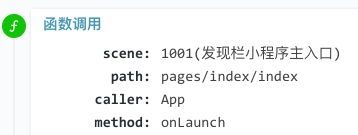

---

title: Fundebug：小程序错误监控支持用户行为回溯

date: 2018-04-10 10:00:00

tags: [Fundebug, 小程序]

---

**摘要：** [Fundebug](https://www.fundebug.com/)小程序错误监控插件更新至**0.1.0**，支持监控用户行为啦。

<!-- more -->

[2017年初](https://blog.fundebug.com/2017/01/23/fundebug-support-wxjs/)，小程序还刚上线，我们Fundebug就支持小程序错误监控了。做为最早的小程序错误监控服务的拓荒者，我们已经累计为数千个小程序提供**免费**服务，累计处理数千万小程序错误。

经过1年多时间的发展，小程序已经成为一种用户习惯，开发者对于小程序代码质量的要求也越来越高。我们决定对小程序错误监控服务进行系统性升级。

[Fundebug](https://www.fundebug.com/)小程序错误监控插件更新至**0.1.0**，支持监控用户行为啦。目前，我们可以监控小程序中的所有**函数调用**：

通过记录出错前的函数调用序列，可以帮助用户快速准确地复现BUG，提高Debug效率。

下一步，我们将对小程序错误监控服务进行一系列优化，包括但不限于：

- 支持页面跳转、控制台打印等用户行为
- 支持Source Map
- 提供fundebug.notify, fundebug.test接口

敬请新老用户期待，如果有意见或者建议的话，请随时与我们联系。

如有疑问，欢迎联系我们咨询。

- QQ: 475777587(Kevin)
- 邮箱: help@fundebug.com 

