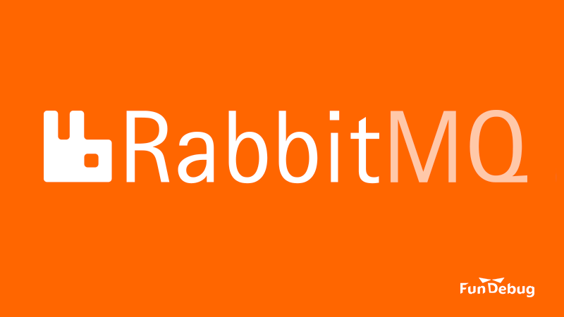

---

title: RabbitMQ入门教程

date: 2018-04-20 10:00:00

tags: [RabbitQ]

---

**摘要：** 使用RabbitMQ的消息队列，可以有效提高系统的峰值处理能力。


<!-- more -->


<div style="text-align: center;">

</div>

### RabbitMQ简介

[RabbitMQ](https://www.rabbitmq.com/)是**消息代理(Message Broker)**，它支持多种异步消息处理方式，最常见的有：

- [Work Queue](https://www.rabbitmq.com/tutorials/tutorial-two-javascript.html)：将消息缓存到一个队列，默认情况下，多个worker按照Round Robin的方式处理队列中的消息。每个消息只会分配给单个worker。
- [Publish/Subscribe](https://www.rabbitmq.com/tutorials/tutorial-three-javascript.html)：每个订阅消息的消费者都会收到消息，因此每个消息通常会分配给多个worker，每个worker对消息进行不同的处理。

RabbitMQ还支持[Routing](https://www.rabbitmq.com/tutorials/tutorial-four-javascript.html)、[Topics](https://www.rabbitmq.com/tutorials/tutorial-five-javascript.html)、以及[Remote procedure calls (RPC)](https://www.rabbitmq.com/tutorials/tutorial-six-javascript.html)等方式。

对于不同的消息处理方式，有一点是相同的，RabbitMQ是介于消息的生产者和消费者的中间节点，负责缓存和分发消息。RabbitMQ接收来自生产者的消息，缓存到内存中，按照不同的方式分发给消费者。RabbitMQ还可以将消息写入磁盘，保证持久化，这样即使RabbitMQ意外崩溃了，消息数据不至于完全丢失。

### 为什么使用RabbitMQ？

最简单的一点在于，它支持Work Queue等不同的消息处理方式，可以用于不同的业务场景。对于我们[Fundebug](https://www.fundebug.com/)来说，目前只用过RabbitMQ的Work Queue，即消息队列。

使用消息队列，可以将不算紧急、但是非常消耗资源的计算任务，以消息的方式插入到RabbitMQ的队列中，然后使用多个处理模块处理这些消息。

这样做最大的好处在于：**提高了系统峰值处理能力**。因为，来不及处理的消息缓存在RabbitMQ中，避免了同时进行大量计算导致系统因超负荷运行而崩溃。而那些来不及处理的消息，会在峰值过去之后慢慢处理掉。

另一个好处在于**解耦**。消息的生产者只需要将消息发送给RabbitMQ，这些消息什么时候处理完，不会影响生产者的响应性能。

*广告：欢迎免费试用[Fundebug](https://www.fundebug.com/)，为您监控线上代码的BUG，提高用户体验~*

### 安装并运行RabbitMQ

使用[Docker](https://www.docker.com/)运行RabbitMQ非常简单，只需要执行一条简单的命令：

```bash
sudo docker run -d --name rabbitmq -h rabbitmq -p 5672:5672 -v /var/lib/rabbitmq:/var/lib/rabbitmq registry.docker-cn.com/library/rabbitmq:3.7
```

对于不熟悉Docker的朋友，我解释一下docker的命令选项：

- **-d** : 后台运行容器
- **--name rabbitmq** : 将容器的名字设为rabbitmq
- **-h rabbitmq** : 将容器的主机名设为rabbitmq，希望RabbitMQ消息数据持久化保存到本地磁盘是需要设置主机名，因为RabbitMQ保存数据的目录为主机名
- **-p 5672:5672** : 将容器的5672端口映射为本地主机的5672端口，这样可以通过本地的5672端口访问rabbitmq
- **-v /var/lib/rabbitmq:/var/lib/rabbitmq**：将容器的/var/lib/rabbitmq目录映射为本地主机的/var/lib/rabbitmq目录，这样可以将RabbitMQ消息数据持久化保存到本地磁盘，即使RabbitMQ容器被删除，数据依然还在。

Docker为官方镜像提供了[加速服务](https://www.docker-cn.com/registry-mirror)，因此命令中Rabbit的Docker镜像名为**registry.docker-cn.com/library/rabbitmq:3.7**。

如果你不会Docker，建议你学习一下。如果你不想学，Ubuntu 14.04下安装RabbitMQ的命令是这样的：

```bash
sudo echo "deb http://www.rabbitmq.com/debian testing main" | sudo tee -a /etc/apt/sources.list
wget -O- https://www.rabbitmq.com/rabbitmq-release-signing-key.asc | sudo apt-key add -
sudo apt-get update
sudo apt-get install rabbitmq-server
```

启动RabbitMQ：

```bash
sudo service rabbitmq-server start
```

### 消息队列代码示例

下面，我们使用[Node.js](https://nodejs.org/zh-cn/)实现一个简单消息队列。

<div style="text-align: center;">

</div>

消息的生产者：[sender.js](https://github.com/Fundebug/rabbitmq-demo/blob/master/sender.js)

```javascript
const amqp = require("amqplib");

const queue = "demo";

async function sendMessage(message)
{
    const connection = await amqp.connect("amqp://localhost");
    const channel = await connection.createChannel();
    await channel.assertQueue(queue);
    await channel.sendToQueue(queue, new Buffer(message),
    {
        // RabbitMQ关闭时，消息会被保存到磁盘
        persistent: true
    });
}


setInterval(function()
{
    sendMessage("Hello, Fundebug!");
}, 1000)
```

- 在sender中，不断地往消息队列中发送"Hello, Fundebug!"。

消息的消费者：[receiver.js](https://github.com/Fundebug/rabbitmq-demo/blob/master/receiver.js)

```javascript
const amqp = require("amqplib");

const queue = "demo";

async function receiveMessage()
{
    const connection = await amqp.connect("amqp://localhost");
    const channel = await connection.createChannel();
    await channel.assertQueue(queue);
    await channel.consume(queue, function(message)
    {
        console.log(message.content.toString());
        channel.ack(message);
    });
}

receiveMessage();
```

- 在receiver中，从消息队列中读出message并打印。

我们用到了[amqplib](https://github.com/squaremo/amqp.node)模块，用于与RabbitMQ进行通信，对于具体接口的细节，可以查看[文档](http://squaremo.github.com/amqp.node/channel_api.html)。

在调用[sendToQueue](http://www.squaremobius.net/amqp.node/channel_api.html#channel_sendToQueue)时，将persistent属性设为true，这样RabbitMQ关闭时，消息会被保存到磁盘。测试这一点很简单：

- 关闭receiver
- 启动sender，发送消息给RabbitMQ
- 重启RabbitMQ(sudo docker restart rabbitmq)
- 启动receiver，会发现它可以接收sender在RabbitMQ重启之前发送的消息

由于RabbitMQ容器将保存数据的目录(/var/lib/rabbitmq)以数据卷的形式保存在本地主机，因此即使将RabbitMQ容器删除(sudo docker rm -f rabbitmq)后重新运行，效果也是一样的。

另外，这段代码采用了Node.js最新的异步代码编写方式：[Async/Await](https://blog.fundebug.com/2017/12/13/reconstruct-from-promise-to-async-await/)，因此非常简洁，感兴趣的同学可以了解一下。

这个Demo的运行方式非常简单：

- 运行RabbitMQ容器

```bash
sudo ./start_rabbitmq.sh
```

- 发送消息
```bash
node ./sender.js
```


- 接收消息
```bash
node ./receiver.js
```

在receiver端，可以看到不停地打印"Hello, Fundebug!"。

代码仓库地址为：[Fundebug/rabbitmq-demo](https://github.com/Fundebug/rabbitmq-demo)

### 自动重连代码示例

在生产环境中，RabbitMQ难免会出现重启的情况，比如更换磁盘或者服务器、负载过高导致崩溃。因为RabbitMQ可以将消息写入磁盘，所以数据是"安全"的。但是，代码中必须实现自动重连机制，否则RabbitMQ停止时会导致Node.js应用崩溃。这里提供一个自动重连的代码示例，给大家参考：

消息生产者：[sender_reconnect.js](https://github.com/Fundebug/rabbitmq-demo/blob/master/sender_reconnect.js)

```javascript
const amqp = require("amqplib");

const queue = "demo";

var connection;

// 连接RabbitMQ
async function connectRabbitMQ()
{
    try
    {
        connection = await amqp.connect("amqp://localhost");
        console.info("connect to RabbitMQ success");

        const channel = await connection.createChannel();
        await channel.assertQueue(queue);
        await channel.sendToQueue(queue, new Buffer("Hello, Fundebug!"),
        {
            // RabbitMQ重启时，消息会被保存到磁盘
            persistent: true
        });

        connection.on("error", function(err)
        {
            console.log(err);
            setTimeout(connectRabbitMQ, 10000);
        });

        connection.on("close", function()
        {
            console.error("connection to RabbitQM closed!");
            setTimeout(connectRabbitMQ, 10000);
        });

    }
    catch (err)
    {
        console.error(err);
        setTimeout(connectRabbitMQ, 10000);
    }
}


connectRabbitMQ();
```

消息消费者：[receiver_reconnect.js](https://github.com/Fundebug/rabbitmq-demo/blob/master/receiver_reconnect.js)

```javascript
const amqp = require("amqplib");

const queue = "demo";

var connection;

// 连接RabbitMQ
async function connectRabbitMQ()
{
    try
    {
        connection = await amqp.connect("amqp://localhost");
        console.info("connect to RabbitMQ success");

        const channel = await connection.createChannel();
        await channel.assertQueue(queue);
        await channel.consume(queue, async function(message)
        {
            console.log(message.content.toString());
            channel.ack(message);
        });

        connection.on("error", function(err)
        {
            console.log(err);
            setTimeout(connectRabbitMQ, 10000);
        });

        connection.on("close", function()
        {
            console.error("connection to RabbitQM closed!");
            setTimeout(connectRabbitMQ, 10000);
        });

    }
    catch (err)
    {
        console.error(err);
        setTimeout(connectRabbitMQ, 10000);
    }
}


connectRabbitMQ();
```

这样的话，即使RabbitMQ重启，sender和receiver也可以自动重新连接RabbitMQ。如果你希望监控RabbitMQ是否出错，不妨使用我们[Fundebug](https://www.fundebug.com/)的Node.js错误监控服务，在连接触发"error"或者"close"事件时，第一时间发送报警，这样开发者可以及时定位和处理BUG。


### 参考

- [AMQP library (RabbitMQ) - async/await](https://gist.github.com/yunghoy/a425f91824d26461bb2e3653bc56ebbf)
- [RbbitMQ文档：Work Queue(JavaScript)](https://www.rabbitmq.com/tutorials/tutorial-two-javascript.html)
- [Won't persist data](https://github.com/docker-library/rabbitmq/issues/106)
- [How to build reconnect logic for amqplib](https://gist.github.com/carlhoerberg/006b01ac17a0a94859ba)
