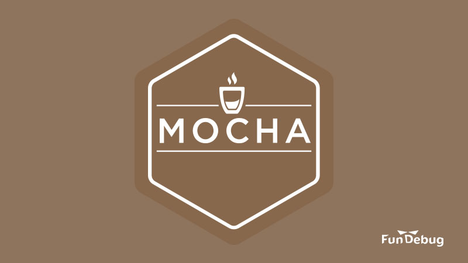

---

title: Mocha浏览器测试入门教程

date: 2018-05-11 10:00:00

tags: [JavaScript]

---

**摘要：** 如何使用Mocha在浏览器中测试JavaScript代码？

<!-- more -->

本文所有代码都在[Fundebug/mocha-browser-test](https://github.com/Fundebug/mocha-browser-test)仓库中。

<div style="text-align: center;">

</div>

在[玩转Node.js单元测试](https://blog.fundebug.com/2017/03/20/nodejs-unit-test/)博客中，我介绍了测试框架[Mocha](https://mochajs.org/)，对后端Node.js代码进行测试。在这篇博客，我将介绍如何使用Mocha在浏览器中测试JavaScript代码。

### mocha init：初始化测试代码

安装mocha(在国内使用cnpm比npm更快):

```bash
sudo cnpm install -g mocha
```

执行mocha init命令，可以自动生成浏览器端的测试文件：

```bash
mocha init test
```

mocha会自动创建一个test目录，其中有4个文件，分别是：

- **mocha.js**：Mocha源码
- **mocha.css**：Mocha源码
- **tests.js**：测试代码
- **index.html**：浏览器测试入口页面

mocha.js与mocha.css是Mocha模块自身的源代码，因为需要在浏览器中展示测试结果，因此需要Mocha的CSS文件；tests.js为测试代码，为空文件，需要我们编写；index.html为运行测试的入门页面，使用浏览器大概它就会运行测试，并且展示测试结果。

index.html是理解Mocha浏览器测试的关键：

```htmlbars
<!DOCTYPE html>
<html>
  <head>
    <title>Mocha</title>
    <meta http-equiv="Content-Type" content="text/html; charset=UTF-8">
    <meta name="viewport" content="width=device-width, initial-scale=1.0">
    <link rel="stylesheet" href="mocha.css" />
  </head>
  <body>
    <div id="mocha"></div>
    <script src="mocha.js"></script>
    <script>mocha.setup('bdd');</script>
    <script src="tests.js"></script>
    <script>
      mocha.run();
    </script>
  </body>
</html>
```

可知：

- index.html中导入了mocha.js, mocha.css和tests.js文件；
- id为mocha的div是空的，测试结果的元素会插入到这个div；
- mocha.setup('bdd')指定使用Mocha的BDD接口，mocha.run()表示运行测试，测试代码tests.js必须放在两者之间，否则不会运行测试；

### 运行测试案例

#### add.js

使用mocha init生成的测试代码中没有实际的测试案例，不妨添加一个简单的**add.js**：

```javascript
function add(a, b)
{
    return a + b;
}
```

可知，add是一个非常简单的加法函数。

#### tests.js

在**tests.js**添加针对add函数的测试代码：

```javascript
var should = chai.should();

describe("测试add函数", function()
{
	it("1加1等于2", function()
    {
        var sum = add(1, 2);
        should.equal(sum, 3);
    });

    it("1加2等于3", function()
    {
        var sum = add(1, 2);
        should.equal(sum, 3);
    });
});
```

在测试代码中，我使用了断言库[Chai](http://www.chaijs.com/)。

#### index.html

在**index.html**中，需要添加源代码**add.js**以及断言库**chai.js**：

```javascript
<!DOCTYPE html>
<html>
  <head>
    <title>Mocha</title>
    <meta http-equiv="Content-Type" content="text/html; charset=UTF-8">
    <meta name="viewport" content="width=device-width, initial-scale=1.0">
    <link rel="stylesheet" href="mocha.css" />
  </head>
  <body>
    <div id="mocha"></div>
    <script src="mocha.js"></script>
    <script>mocha.setup('bdd');</script>
    <script src="https://cdn.staticfile.org/chai/4.0.0-canary.1/chai.js"></script>
    <script src="../add.js"></script>
    <script src="tests.js"></script>
    <script>
      mocha.run();
    </script>

  </body>
</html>
```

#### 运行测试

使用浏览器打开index.html，就会运行测试，并且看到运行结果：

<div style="text-align: center;">

</div>

可知，测试通过:)


### mocha-phantomjs：使用命令行测试

对于习惯在终端敲命令行的程序员来说，用浏览器打开index.html去进行测试显得非常不合时宜。

还好，有所谓的headless的浏览器[PhantomJS](http://phantomjs.org/)，它没有图形界面，却可以运行前端代码，方便用来测试。

#### mocha-phantomjs命令

安装phantomjs和mocha-phantomjs(phantomjs模块更名为phantomjs-prebuilt)：

```bash
sudo cnpm install -g phantomjs-prebuilt mocha-phantomjs
```

将Mocha和PhontomJS结合起来的是[mocha-phantomjs](https://github.com/nathanboktae/mocha-phantomjs)，在终端执行mocha-phantomjs命令，它会在PhantomJS中执行Mocha测试代码，并将结果展示在终端，非常方便：

```bash
mocha-phantomjs --path /usr/local/bin/phantomjs ./test/index.html


  测试add函数
    ✓ 1加1等于2
    ✓ 1加2等于3


  2 passing (7ms)
```

**--path**选项指定了phantomjs的安装路径。这个必须指定，否则会报错"phantomjs terminated with signal SIGSEGV"。

另外，测试代码**tests.js**中必须有describe语句，否则使用mocha-phantomjs执行时会报错"mocha.run() was called with no tests"。

#### npm test命令

**mocha-phantomjs**的测试命令比较长，可以在package.json中配置npm的test脚本：

```json
 "scripts": {
    "test": "mocha-phantomjs --path /usr/local/bin/phantomjs ./test/index.html"
  },
```

这样，执行**npm test**命令就可以运行测试。
