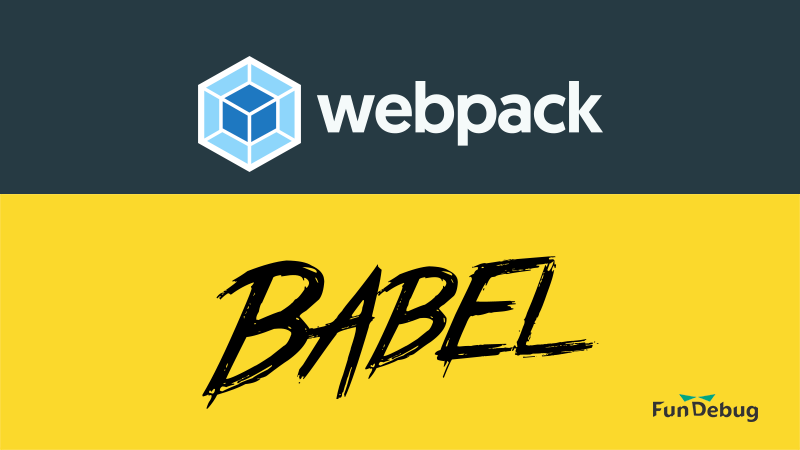
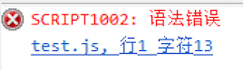

---

title: webpack运行Babel教程

date: 2018-06-13 10:00:00

tags: [JavaScript, 原创]

---

**摘要:** Babel是转码器，webpack是打包工具，它们应该如何一起使用呢?

- GitHub仓库：[Fundebug/webpack-babel-tutorial](https://github.com/Fundebug/webpack-babel-tutorial/blob/master/bundle.js)

<!-- more -->

<div style="text-align: center;">

</div>

### ES6 + IE10 = 语法错误!

[test.js](https://github.com/Fundebug/webpack-babel-tutorial/blob/master/test.js)使用了ES6的[箭头函数](https://developer.mozilla.org/zh-CN/docs/Web/JavaScript/Reference/Functions/Arrow_functions)：

```javascript
setTimeout(() =>
{
    console.log("Hello, Fundebug!");
}, 100)
```

由于低版本的浏览器没有支持ES6语法，这就意味着代码会出错。例如，在IE 10浏览器中，会出现"语法错误"：

<div style="text-align: center;">

</div>

如果你使用了[Fundebug](https://www.fundebug.com/)错误监控服务，则会收到这样的报错：

<div style="text-align: center;">

</div>

### 直接使用babel转码

当你使用更高版本的JavaScript语法时，比如ES7，低版本的浏览器将无法运行。为了兼容低版本的浏览器，比如万恶的IE，我们不得不使用[Babel](https://www.babeljs.cn/)，将ES6、ES7等高版本代码转换为ES5代码。

#### 安装[babel-cli](http://babeljs.io/docs/usage/cli/)

```bash
sudo npm install --global babel-cli
```

#### 使用babel命令转码

```bash
babel test.js --out-file compiled.js
```

转码之后生成的代码为[compiled.js](https://github.com/Fundebug/webpack-babel-tutorial/blob/master/compiled.js)：

```javascript
setTimeout(function () {
    console.log("Hello, Fundebug!");
}, 100);
```

可知，箭头函数转换成了function，这样就代码可以在IE 10等不支持ES6的浏览器上正确执行了。

*广告：欢迎免费试用[Fundebug](https://www.fundebug.com/)，助您第一时间发现代码BUG。*

### 使用webpack运行Babel 

一般项目中都会使用[webpack](https://webpack.js.org/)对代码进行打包，比如，将多个js文件打包成1个js文件，这样可以减少前端的资源请求。因此，我们需要将Babel也集成到webpack中。

#### 安装webpack

```bash
npm install --global webpack
```

我使用的webpack版本为4.10.0

```bash
webpack --version
4.10.0
```

#### 安装babel

```bash
npm install --save-dev babel-cli babel-preset-env
```

[babel-preset-env](https://www.babeljs.cn/docs/plugins/preset-env/)是Babel新版的preset，它可以让我们[灵活地设置代码目标执行环境](http://2ality.com/2017/02/babel-preset-env.html)，比如只支持各个浏览器最新的2个版本，支持IE8及其以上的IE浏览器。

#### 安装babel-loader

```bash
npm install --save-dev babel-loader
```

[babel-loader](https://github.com/babel/babel-loader)是webpack的babel插件，它让我们可以在wepback中运行Babel。

#### 配置babel

新增[.babelrc](https://github.com/Fundebug/webpack-babel-tutorial/blob/master/.babelrc)文件：

```leaf
{
    "presets": ["env"]
}
```

#### 配置webpack

新增[webpack.config.js](https://github.com/Fundebug/webpack-babel-tutorial/blob/master/webpack.config.js)文件：

```javascript
module.exports = {
    entry: './test.js',
    output:
    {
        path: __dirname,
        filename: 'bundle.js'
    },
    module:
    {
        rules: [
        {
            test: /\.js$/,
            exclude: /node_modules/,
            loader: 'babel-loader'
        }]
    }
};
```

可知，我们在webpack中使用了babel-loader插件来运行Babel，转换所有的.js代码(除了node_modules中的代码)。

#### 使用webpack运行babel

```bash
webpack --mode production
```

转换之后的代码为[bundle.js](https://github.com/Fundebug/webpack-babel-tutorial/blob/master/bundle.js)。bundle.js只有1行代码，这是因为为我们指定的mode为production，webpack为了压缩代码只生成了1行代码。


### 参考

- [webpack 配合babel 将es6转成es5 超简单实例](https://blog.csdn.net/qq_30100043/article/details/53402618)
- [Babel入门教程](http://www.ruanyifeng.com/blog/2016/01/babel.html)
- [babel-preset-env: a preset that configures Babel for you](http://2ality.com/2017/02/babel-preset-env.html)