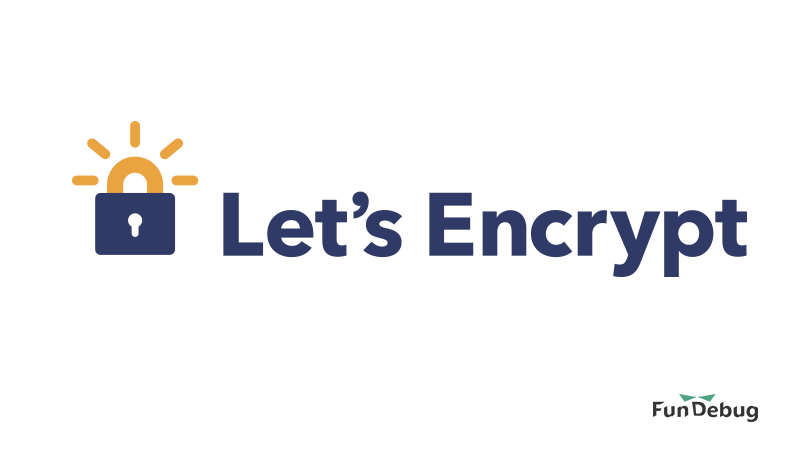
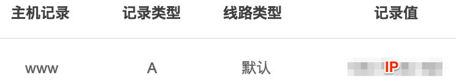

---

title: 教你快速撸一个免费HTTPS证书

date: 2018-07-06 10:00:00

tags: [HTTPS]

keywords: https

description: 免费HTTPS证书申请教程

---

**摘要：** 最受欢迎的免费HTTPS证书，了解一下？

<!-- more -->

<div style="text-align: center;">

</div>

HTTPS已成为业界标准，这篇博客将教你申请[Let's Encrypt](https://letsencrypt.org/)的免费HTTPS证书。

本文的操作是在Ubuntu 16.04下进行，使用nginx作为Web服务器。

### 1. 安装Certbot

[Certbot](https://certbot.eff.org/)可以用于管理(申请、更新、配置、撤销和删除等)Let's Encrypt证书。这里安装的是带nginx插件的certbot：

```bash
sudo apt-get update
sudo apt-get install software-properties-common
sudo add-apt-repository -y ppa:certbot/certbot
sudo apt-get update
sudo apt-get install -y python-certbot-nginx
```

### 2. 配置Nginx

```bash
vim /etc/nginx/conf.d/fundebug.conf
```

此时还没有HTTPS证书，因此域名只能使用80端口而非443端口，网站只能通过http协议而非https协议访问：[http://www.fundebug.com](http://www.fundebug.com)。

```nginx
server
{
    listen 80;
    server_name www.fundebug.com;
}
```

重启nginx:

```bash
systemctl restart nginx
```

### 3. 配置DNS

使域名[www.fundebug.com](https://www.fundebug.com/)指向nginx所在服务器的IP：

<div style="text-align: center;">

</div>

*如果你想发现代码中隐藏的BUG，欢迎免费试用最专业的BUG实时监控平台[Fundebug](https://www.fundebug.com/)!*

### 4. 申请证书

使用certbot命令为[www.fundebug.com](https://www.fundebug.com/)申请HTTPS证书。**--nginx**选项表示Web服务器为nginx，**-d**选项指定域名，**-n**选项表示非交互式运行命令。若去除**-n**选项，则终端会提醒你选择是否将http请求重定向为https请求。

```bash
certbot --nginx -d www.fundebug.com -n
```

证书申请成功之后，会看到以下信息。Let's Encrypt证书的有效期只有3个月，但是[Certbot会通过Cron和systemd timer自动更新证书](https://community.letsencrypt.org/t/cerbot-cron-job/23895/5?u=fundebug)，证书的时效性不用担心。

```
IMPORTANT NOTES:
 - Congratulations! Your certificate and chain have been saved at:
   /etc/letsencrypt/live/www.fundebug.com/fullchain.pem
   Your key file has been saved at:
   /etc/letsencrypt/live/www.fundebug.com/privkey.pem
   Your cert will expire on 2018-09-29. To obtain a new or tweaked
   version of this certificate in the future, simply run certbot again
   with the "certonly" option. To non-interactively renew *all* of
   your certificates, run "certbot renew"
 - If you like Certbot, please consider supporting our work by:

   Donating to ISRG / Let's Encrypt:   https://letsencrypt.org/donate
   Donating to EFF:                    https://eff.org/donate-le
```

HTTPS证书相关的文件在**/etc/letsencrypt/**目录中：

```bash
find /etc/letsencrypt/ -name "*www.fundebug.com*"
/etc/letsencrypt/renewal/www.fundebug.com.conf
/etc/letsencrypt/archive/www.fundebug.com
/etc/letsencrypt/live/www.fundebug.com
```

certbot会自动修改nginx配置文件：

```bash
cat /etc/nginx/conf.d/fundebug.conf
```

nginx监听了443端口并配置了HTTPS证书，这时我们可以通过HTTPS协议访问了！[https://www.fundebug.com](https://www.fundebug.com)

```nginx
server
{
    listen 80;
    server_name www.fundebug.com;

    listen 443 ssl; # managed by Certbot
    ssl_certificate /etc/letsencrypt/live/www.fundebug.com/fullchain.pem; # managed by Certbot
    ssl_certificate_key /etc/letsencrypt/live/www.fundebug.com/privkey.pem; # managed by Certbot
    include /etc/letsencrypt/options-ssl-nginx.conf; # managed by Certbot
    ssl_dhparam /etc/letsencrypt/ssl-dhparams.pem; # managed by Certbot
}
```

### 参考

- [Certbot文档：Nginx on Ubuntu 16.04 (xenial)](https://certbot.eff.org/lets-encrypt/ubuntuxenial-nginx)


### 关于Fundebug

[Fundebug](https://www.fundebug.com)专注于JavaScript、微信小程序、微信小游戏，Node.js和Java实时BUG监控。
自从2016年双十一正式上线，Fundebug累计处理了5亿+错误事件，得到了众多知名用户的认可。欢迎免费试用！

<div style="text-align: center;">

</div>

