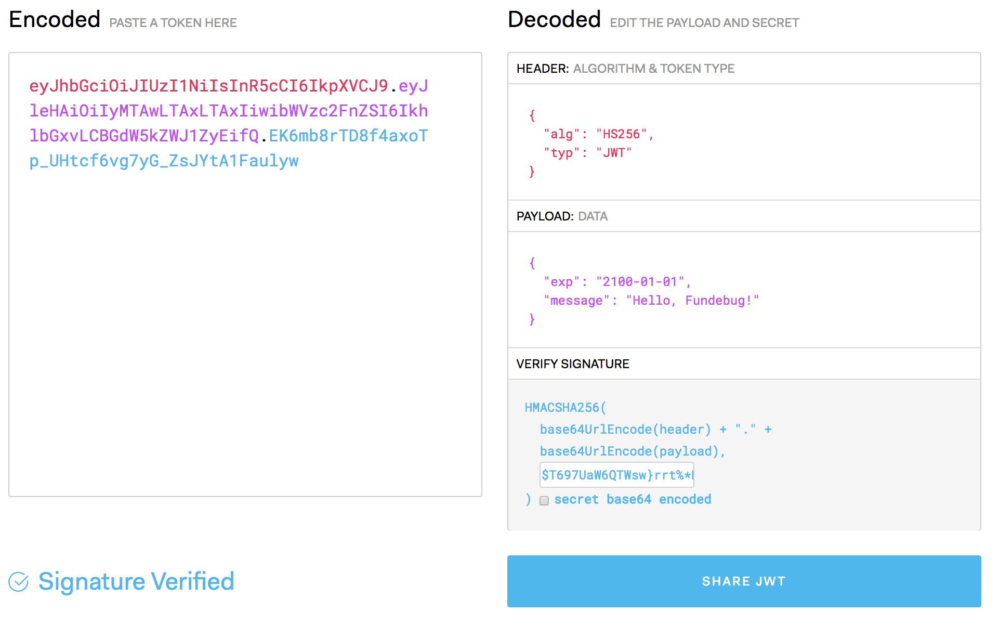

---

title: JWT究竟是什么呢?

date: 2018-07-12 10:00:00

tags: [JavaScript, 翻译]

keywords: https

description: JavaScript异步编程史：回调函数到Promise到Async/Await

---

**译者按**：如果你还在使用session验证用户的话，是时候了解一下JWT了！

<!-- more -->

- 原文：[What the heck is JWT anyway?](https://dev.to/siwalik/what-the-heck-is-jwt-anyway--47hg)
- 译者：[Fundebug](https://www.fundebug.com/)

**为了保证可读性，本文采用意译而非直译。另外，本文版权归原作者所有，翻译仅用于学习。**


**JWT（JSON Web Token）**究竟是什么呢？它有什么用？这篇文章将为你揭开谜底。

首先，我们不妨看一下**IETF(Internet Engineering Task Force)**对JWT的[权威定义](https://tools.ietf.org/html/rfc7519)：

> JSON Web Token (JWT) is a compact, URL-safe means of representing claims to be transferred between two parties.  The claims in a JWT are encoded as a JSON object that is used as the payload of a JSON Web Signature (JWS) structure or as the plaintext of a JSON Web Encryption (JWE) structure, enabling the claims to be digitally signed or integrity protected with a Message Authentication Code (MAC) and/or encrypted.

**啊！什么鬼?!** 水平有限，这样的定义我就不翻译了...

简单地说，JWT是一个字符串，我们在发起网络请求时，将其放在header或者url中，这样可以保证传递的数据被篡改时能被我们发现，保证安全性。

示例xxxxx.yyyyy.zzzzz即为JWT：

```plain
http://www.example.com/private/?token=xxxxx.yyyyy.zzzzz
```

小伙伴应该注意到了，JWT由3部分组成，使用两个点区分。如下：

```plain
header.payload.signature
```

那么，header, payload和signature分别指的是什么呢？

### Header

header所表示的JSON对象通常由2个部分组成：token的类型，即"JWT"; token所采用的hash算法，例如HMAC SHA256或者RSA。

```json
{
   "alg": "HS256",
   "typ": "JWT"
}
```

然后，这个JSON对象采用Base64Url编码变成字符串，作为JWT的第一部分。

```javascript
var header = {
    alg: 'HS256',
    typ: 'JWT'
};

// 将JSON对象使用base64编码为字符串
var encoded_header = Buffer.from(JSON.stringify(header)).toString('base64');
console.log(encoded_header); // 打印: eyJhbGciOiJIUzI1NiIsInR5cCI6IkpXVCJ9

// 将base64编码的字符串解析为JSON对象
var decoded_header = JSON.parse(Buffer.from(encoded_header, 'base64').toString());
console.log(decoded_header); // 打印: { alg: 'HS256', typ: 'JWT' }
```

可知，header只是进行了编码，而非加密，其过程是可逆的。

### Payload

payload为JWT的第二部分，其JSON对象包含一系列键值对(key/value)。其中，有些预定义键有特殊含义，比如iat、exp等，iat表示JWT生成的实际，而exp代表JWT过期的时间。开发者可以使用其他非预定义的键用于传输数据。

```javascript
{
   "exp": "2100-01-01",
   "message": "Hello, Fundebug!"
}
```


然后，这个JSON对象采用Base64Url编码变成字符串，作为JWT的第二部分。

```javascript
var payload = {
    exp: '2100-01-01',
    message: 'Hello, Fundebug!'
}

// 将JSON对象使用base64编码为字符串
var encoded_payload = Buffer.from(JSON.stringify(payload)).toString('base64');
console.log(encoded_payload); // 打印: eyJleHAiOiIyMTAwLTAxLTAxIiwibWVzc2FnZSI6IkhlbGxvLCBGdW5kZWJ1ZyEifQ==

// 将base64编码的字符串解析为JSON对象
var decoded_payload = JSON.parse(Buffer.from(encoded_payload, 'base64').toString());
console.log(decoded_payload); // 打印: { exp: '2100-01-01', message: 'Hello, Fundebug!' }
```

**特别注意**，payload只是进行了编码，而非加密，其过程是可逆的。因此，JWT绝不是用来进行加密通信的。

### Signature

signatrue，即签名，是JWT的第三部分。它由编码的header和payload，使用用户指定的密钥secret，采用header中指定的哈希算法生成。Node.js自带的[Crypto](https://nodejs.org/api/crypto.html)可以来演示signatrue是如何生成的：

```javascript
var header = {
    alg: 'HS256',
    typ: 'JWT'
};

// 使用base64编码header
var encoded_header = Buffer.from(JSON.stringify(header)).toString('base64');


var payload = {
    exp: '2100-01-01',
    message: 'Hello, Fundebug!'
}

// 使用base64编码pyload
var encoded_payload = Buffer.from(JSON.stringify(payload)).toString('base64');


const crypto = require('crypto');
var secret = '$T697UaW6QTWsw}rrt%*P6)ia';

// 生成签名signature
var signature = crypto.createHmac('sha256', secret).update(encoded_header + '.' + encoded_payload).digest('base64');
console.log(signature); // 打印: JiOyrHVgyTTSts6mYQpChRHO7J2/hNU4dOYkgeLthKE=
```

signature是根据payload生成的，两者是一一对应的，这样可以保证payload的数据不被篡改，除非密钥secret泄漏。

最终生成的JWT为：

```javascript
var token = `${encoded_header}.${encoded_payload}.${signature}`;
console.log(token) // 打印: eyJhbGciOiJIUzI1NiIsInR5cCI6IkpXVCJ9.eyJleHAiOiIyMTAwLTAxLTAxIiwibWVzc2FnZSI6IkhlbGxvLCBGdW5kZWJ1ZyEifQ==.JiOyrHVgyTTSts6mYQpChRHO7J2/hNU4dOYkgeLthKE=
```

当收到JWT时，可以采用同样的算法和密钥生成签名signature，如果一致，说明数据没有被篡改。

很重要一点在于，JWT是用于验证而非加密，任何人即使没有密钥secret，header与payload中的数据都是可以获取的。

使用[jwt.io](https://jwt.io)，可以进行JWT的编码、解码和验证：

<div style="text-align: center;">

</div>


### 关于Fundebug

[Fundebug](https://www.fundebug.com)专注于JavaScript、微信小程序、微信小游戏，Node.js和Java实时BUG监控。
自从2016年双十一正式上线，Fundebug累计处理了5亿+错误事件，得到了众多知名用户的认可。欢迎免费试用！

<div style="text-align: center;">

</div>

