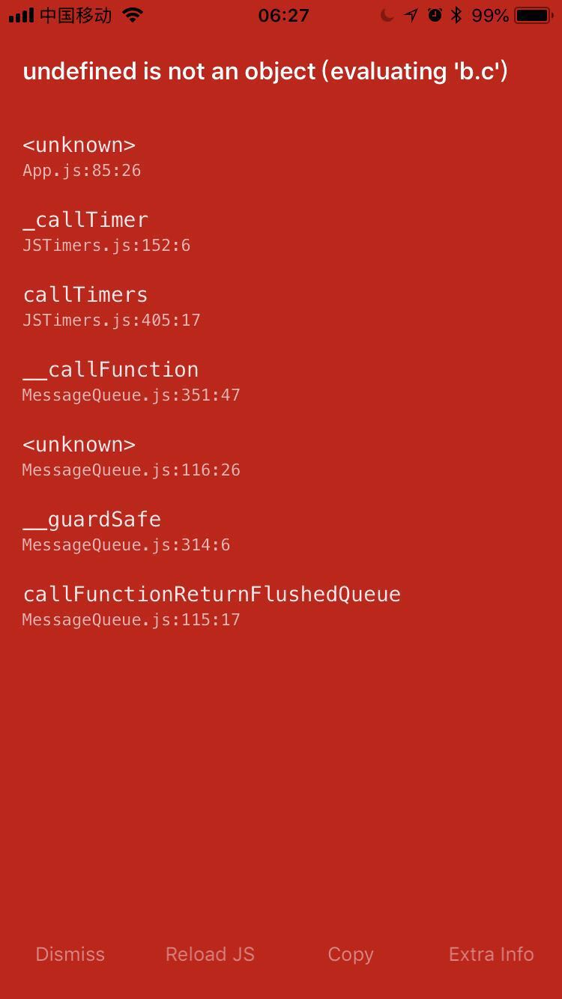

---

title: Fundebug上线React Native错误监控服务

date: 2018-07-27 10:00:00

tags: [Fundebug, React Native]

keywords: Fundebug, React Native

description: Fundebug上线React Native错误监控服务

---

**摘要：** [Fundebug](https://www.fundebug.com/)可以实时监控线上代码BUG，竭诚为您的React Native应用保驾护航。

<!-- more -->

<div style="text-align: center;">

</div>


StackOverflow的联合创始人[Jeff Atwood](https://en.wikipedia.org/wiki/Jeff_Atwood)早在2007年就提出了一个著名的Atwood定律：

> Any application that can be written in JavaScript, will eventually be written in JavaScript.

2007年，那时候ES6标准还还没有制定，大家还刚刚开始用上jQuery，Node.js也没有诞生，Atwood居然对JavaScript前景如此看好。而事实上，他的语言现在似乎也成为了现实，JavaScript可以写各种应用：网页、小程序、iOS、Andriod，还有后端...

使用JavaScript写应用，React Native将其编译为iOS和Andriod应用。这样做的话，只需要写一套代码，而运行到多个平台上，可以提高开发效率。但是，使用React Native也有其弊端，有时我们不得不使用原生代码，[最近Airbnb表示已经放弃了React Native](https://medium.com/airbnb-engineering/react-native-at-airbnb-the-technology-dafd0b43838)，所以是否使用React Native需要根据情况来看。

### 为什么监控React Native？

理论上来讲，BUG是无法避免的，实时监控阔以帮助开发者第一时间发现BUG，及时修复BUG，将BUG的影响降到最低。

开发者通常是比较自信的，他们坚持**我写的代码当然没问题**。然而，再拷问一下自己：

- 我的代码真的100%没有问题吗？
- 我做了完整的测试吗？
- 难道我要花更多的时间没完没了的写单元测试？

有时，用户打开某个页面是空白的，或者点击某个按钮没有反应，或者应用闪退了。然后，用户也许会反馈，但是更多用户默默离开了。

<div style="text-align: center;">

</div>

**那么问题在哪？**

- React Native在用户的手机上出错了，可是开发者完全不知道；
- 当有用户反馈问题的时候，其实意味着更多用户已经被坑了，他们属于沉默的大多数；
- 知道出问题了，然而开发者没有任何出错信息，无法复现问题，也无从下手；

### 为什么是Fundebug？

- 两行代码搞定;
- React Native在用户的手机上出错了，Fundebug第一时间通过邮件提醒开发者；
- Fundebug提供详细的出错信息和强大的错误管理面板，帮助开发者快速解决错误；
- 仅收集出错信息，保护用户隐私;

[Fundebug](https://www.fundebug.com/)自2016年双十一上线，以及累计处理**6亿+**错误，服务众多知名客户，欢迎免费试用。

### 如何使用Fundebug?

##### 1. 安装[fundebug-reactnative](https://www.npmjs.com/package/fundebug-reactnative)模块

```bash
npm install --save fundebug-reactnative
```


##### 2. 接入[fundebug-reactnative](https://www.npmjs.com/package/fundebug-reactnative)模块

```js
var fundebug = require('fundebug-reactnative')
fundebug.init(
{
    apikey: "API-KEY"
})
```

- 获取**apikey需要**[免费注册](https://www.fundebug.com/team/create)Fundebug帐号并且[创建项目](https://www.fundebug.com/project/create)。

具体使用细节请查看[Fundebug文档 - React Native](https://docs.fundebug.com/notifier/reactnative/)


### 关于Fundebug

[Fundebug](https://www.fundebug.com)专注于JavaScript、微信小程序、微信小游戏，Node.js和Java实时BUG监控。
自从2016年双十一正式上线，Fundebug累计处理了5亿+错误事件，得到了众多知名用户的认可。欢迎免费试用！

<div style="text-align: center;">

</div>

