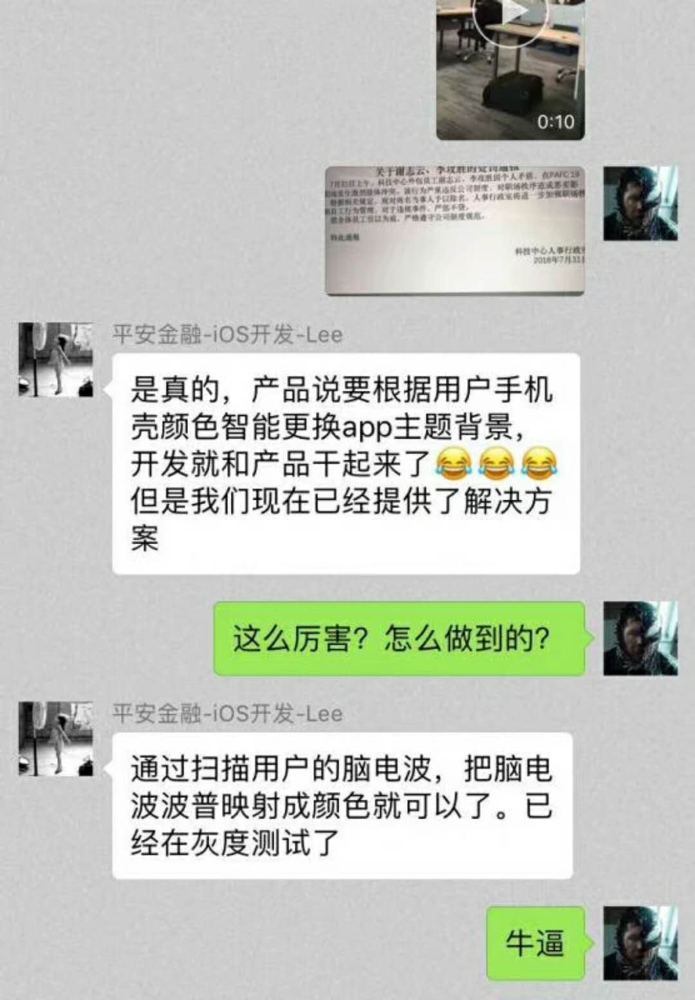

---

title: 如何同步手机壳与APP颜色？

date: 2018-08-03 10:00:00

tags: [原创,热点]

keywords: 产品经理,开发,打架

description: 如何同步手机壳与APP颜色？

---

**摘要：** 打什么架，好好聊产品和技术不好吗？ 

<!-- more -->

产品和开发撕逼也是常有的事，但是打架也是活久见了，这一点我已经在知乎[批评](https://www.zhihu.com/question/288027348/answer/458395471)过了。

现在，我们来严肃地讨论一下如何同步手机壳与APP的颜色。

### 1. 提供设置选项

> 此方案由Fundebug创始人Stefan博士提出

通常来说，大概没有人每天换手机壳，所以不妨在APP中提供一个配置选项，让用户去配置手机壳的颜色，然后APP就可以配置对应的主题色了。

这样的做法虽然简单粗暴，但是解决了用户需求，其实是最佳的解决方式之一。做产品是为了满足用户需求，并不是为了炫技。

### 2. 通过手机壳照片识别

> 此方案由Fundebug用户rexhang提出

请客户站在镜子前拍照，然后上传图片到服务器，分析图片就知道手机壳颜色了，然后APP就可以配置对应的主题色了。图像识别已经应用到门禁、手机解锁、高铁进站等各种场景了，识别一个手机壳，然后获取颜色显然不会太难，这种方式在技术上应该是可行的。

那这种方式与第1种方式有何区别呢？好像第一种方式更简单吧？通过照片识别的颜色更加准确，而配置选项提供的颜色是有限的，这样的话第2种方法可以让APP与手机壳的颜色更加一致。

### 3. NFC手机壳

> 此方案由Fundebug用户Ekct提出

手机壳加NFC，APP读取手机壳的颜色，然后配置APP的颜色。NFC，全称near field communication，即近场通信。通过NFC，手机可以给公交卡充值，那读取一下手机壳颜色应该是没有问题的。

NFC手机壳，自动识别颜色，满满的未来感，其实早在[2015年Google就曾想过开发这样的产品](http://tech.163.com/15/0521/08/AQ4I2GBQ000915BE.html)：

> 这款手机壳将会使用NFC近场通讯技术来与用户的手机相连，这样一来，每一款手机壳就有了一个独特的标识，它们可以向手机发送与自身搭配的一系列信息，比如与手机壳颜色很搭的壁纸。

这样做会增加手机壳的成本，但是也不至于太贵，应该会有人买单。

很多开发嘲笑打架的产品经理的需求莫名其妙，不假思索地觉得技术上不可行，这个想法是很危险的，很多事情不是技术上不可行，是你想不到或者做不到而已。想象力不够会制约我们的思维。

### 4. 通过眼角膜反射识别

> 来自网友

启动手机前置摄像头，对用户眼角膜手机倒影进行图像分析，得到手机的外壳颜色，然后配置APP的颜色。

这种方法与第2种方法相同，都是通过图像识别技术来实现。用户不需要拍照了，但是需要给予APP拍照权限。不过，因为无法获取手机壳背面的颜色且眼角膜倒影会比较模糊，因此识别的颜色可能不准确，可行性存疑，大概是网友编的段子。感兴趣的读者不妨测试一下。

### 5. 通过脑电波识别

> 来自网友

通过扫描用户的脑电波，把脑电波波普映射成颜色就可以了，据说已经在进行灰度测试。

这个想法更加科幻，现在大概还做不到，但是未来还是有可能的。通过脑电波来控制汽车或者飞机相关的研究、产品以及创业早已存在。不过这种方式并不可取，严重侵犯了用户隐私。

如果大家有新的思路，欢迎留言或者加入Fundebug的QQ技术交流群(723812301)讨论~

### 参考

- [如何看待这俩天根据手机壳改变软件主题色的产品和开发打架事件](https://www.zhihu.com/question/288027348/answer/458395471)
- [谷歌和Skrillex合作开发智能手机壳](http://tech.163.com/15/0521/08/AQ4I2GBQ000915BE.html)

