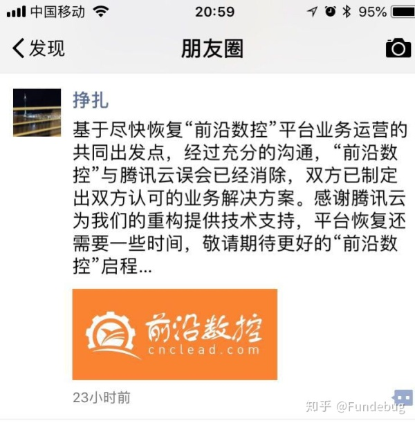

---

title: 复盘价值1000万的腾讯云硬盘固件"BUG"

date: 2018-08-07 10:00:00

tags: [原创, 热点]

keywords: 腾讯云,前沿数控,磁盘

description: 这次，我从纯技术角度分析腾讯云与前沿数控的磁盘数据丢失事件，不站队。

---

**摘要：** 除了吃瓜，还是得吸取教训啊同学们！

<!-- more -->

这次，我从纯技术角度分析腾讯云与前沿数控的磁盘数据丢失事件，不站队。

### 硬盘门

这里说的硬盘门不是10年前陈老师的那一次，而聊的是最近“腾讯云”用户“前沿数控”的磁盘数据丢失。

关于这次事件，腾讯云是这样说的：

> 近日，腾讯云用户北京清博数控科技有限公司所属“前沿数控”平台一块操作系统云盘，因受所在物理硬盘固件版本bug导致的静默错误（写入数据和读取出来的不一致）影响，文件系统元数据损坏。

腾讯云多少有点打官腔，而前沿数控的说法更加直白：

> 在使用腾讯云服务器8个月后，我们放在云服务器上的数据全部丢失，腾讯云所谓的三备份数据也全部离奇丢失！

套用一下《天下无贼》的经典台词：

> 21世纪什么最重要？数据！

一个产品的数据如果丢失或者破坏的话，所受的打击是毁灭性的，因为老用户的服务无法恢复...腾讯云提出了136469的赔偿方案，而前沿数控索赔1000万，双方没有达成一致，这个事件才得以曝光。也就是说，在前沿数控看来，腾讯云的这个所谓的“物理硬盘固件版本bug”，价值1000万！BUG原来这么值钱啊，看来大家还是少写点BUG吧...

我们Fundebug同为创业公司，也是腾讯云和阿里云等云计算公司的用户，并且从事BUG监控服务(此事也涉及到BUG)，因此会持续关注这个事件。

### 腾讯云真的是硬盘固件BUG吗？

腾讯云关于硬盘固件BUG的说明是这样的：

> 近日，腾讯云用户北京清博数控科技有限公司所属“前沿数控”平台一块操作系统云盘，因受所在物理硬盘固件版本bug导致的静默错误（写入数据和读取出来的不一致）影响，文件系统元数据损坏。

> 腾讯云监控到异常后，第一时间向用户告知故障状态，并立即组织文件系统专家并联合厂商技术专家尝试修复数据。遗憾的是，虽经多方努力，最终仍有部分数据完整性校验失败。经过分析，该硬盘静默错误是在极小概率下被触发。我们随即对固件版本有bug的硬盘全部进行下线处理，确保相关隐患全部排除。

由于腾讯云没有公布“物理硬盘固件版本bug”的任何技术细节，对于这件事的真相我有所疑问：

- 硬盘的什么固件有BUG?
- 硬盘固件的哪个版本有BUG?
- 所谓的极小概率触发是BUG什么意思？究竟什么情况下会出现这个BUG?
- 硬盘固件应该升级到哪个版本才能修复BUG?
- 如何升级该硬盘固件？对固件版本有bug的硬盘全部进行下线处理是如何做到的？这个似乎不可能不影响硬盘用户吧？
- 我们Fundebug的BUG监控插件使用了腾讯云的CDN进行分发，发现CDN服务并不稳定，北京、杭州和天津用户访问时都出现过加载失败的情况，是否与这个BUG有关？（此事我们有向腾讯云提交工单。）

2017年，国外的代码托管站点[Gitlab](https://about.gitlab.com/)的数据库被误删，他们在Youtube和Twitter上直播了整个修复过程，并且写了两篇博客详细公开了所有技术细节。这样做非常透明和公开，可以赢得用户的信任。

每个公司都会出现各种各样BUG或者故障，腾讯云也不能例外。用户对于云计算平台的要求非常高，因为涉及到能否正常提供服务，因此，作为腾讯云的用户，我们呼吁腾讯云公布这次事件的所有技术细节，这是厘清事件的最佳方式，也是对用户负责的一种表现。

**补充：** 腾讯云第2份声明[关于客户“前沿数控”数据完整性受损的技术复盘](https://mp.weixin.qq.com/s/8JSPY6vHPhg8pX0JwjqttQ)完全证明的我的猜测，这个问题不是什么莫名其妙的BUG导致的，而是人为原因导致的。他们还把第1份BUG声明[关于用户“前沿数控”数据完整性受损及腾讯云补偿措施的说明](https://mp.weixin.qq.com/s/9bP6abnvOpufN3fomB4weQ)删掉了！

> 当天上午11:57，我们的运维人员收到仓库Ⅰ空间使用率过高告警，准备发起搬迁扩容；在14:05时，运维人员从仓库Ⅰ选择了一批云盘搬迁至新仓库Ⅱ，为了加速搬迁，手动关闭了迁移过程中的数据校验；在20:27 搬迁完成之后，运维人员将客户的云盘访问切至仓库Ⅱ，同时为了释放空间，对仓库Ⅰ中的源数据发起了回收操作；到20:30 监控发现仓库Ⅱ部分云盘出现IO异常。

### 前沿数控难道没有备份数据？

不难推测，前沿数控完全没有备份数据，它们完全依赖于腾讯云的承若的"99.9999999%的数据可靠性，搭载了云硬盘提供三副本存储策略"。我不清楚腾讯云的这个99.9999999%的数据可靠性是怎么计算出来的，也不知道腾讯云的三副本存储策略是怎么回事，这一点需要腾讯云提供详细的说明。但是，对于每一个产品来说，备份数据，至少备份一下核心数据，这是最基本的常识。所以在这一点上，前沿数控显然存在失误。

所有的创业者和开发者都应该从这个事件吸取教训，不要偷懒，严格备份数据，否则数据一旦出问题，后果非常严重。这里简单介绍一下Fundebug是如何备份数据的，给大家提供参考，以后我会详细介绍我们的数据备份方案：

| 备份方案               | 时间粒度 | 细节 |
| --------------------- | -------- | ------------ |
| MongoDB复制集 | 实时     | 搭建3个节点(1个Primary和2个Secondary)的MongoDB复制集，实时同步数据 |
| 阿里云服务器磁盘快照  | 每天     | 设置每天凌晨自动快照所有磁盘，包括系统盘和数据盘       |
| mongodump导出核心数据 | 每天     | 每天凌晨将MongoDB核心数据导出到复制集之外的服务器磁盘(该磁盘会每天进行快照) |
| 阿里云对象存储        | 每天     | 每天凌晨将mongodup导出的数据使用gpg非对称加密之后，上传到阿里云深圳数据中心的对象存储，设置阿里云自动同步到杭州数据中心，每份数据保留1个月 |
| 本地硬盘备份        | 每周     | 每周六凌晨从阿里云对象存储下载加密的备份数据，存储到本地磁盘 |

对数据对多个粒度的备份，是非常必要的，无论你使用哪一家云计算平台，无论该平台给了你怎样的承若。如果依赖云计算平台，大概是靠不住的，而且他们的应急处理速度显然没有自己来的快，因为只有开发者自己最了解应用数据，知道如何备份如何恢复才能尽量降低损失。

### 他们和解了！

我加了前沿数控的负责人的微信，他在朋友圈已经声明和解了。另外，前沿数控所发的两篇微博也删掉了...

花钱能解决2个当事人的矛盾，但是不能解决技术问题，我们除了吃瓜，还是得从这件事中吸取教训。

### 参考

- [腾讯云 - 关于用户“前沿数控”数据完整性受损及腾讯云补偿措施的说明](https://mp.weixin.qq.com/s/9bP6abnvOpufN3fomB4weQ)
- [腾讯云 - 关于客户“前沿数控”数据完整性受损的技术复盘](https://mp.weixin.qq.com/s/8JSPY6vHPhg8pX0JwjqttQ)
- [前沿数控- 腾讯云给一家创业公司带来的灾难！](https://weibo.com/ttarticle/p/show?id=2309404269756587862904)
- [前沿数控- 对腾讯云官方回应“前沿数控平台数据丢失”事件的严重不满及声明](https://weibo.com/ttarticle/p/show?id=2309404269994329411732)
- [陈皓 - 从GITLAB误删除数据库想到的](https://coolshell.cn/articles/17680.html)
- [GitLab - GitLab.com database incident](https://about.gitlab.com/2017/02/01/gitlab-dot-com-database-incident/)
- [GitLab - Postmortem of database outage of January 31](https://about.gitlab.com/2017/02/10/postmortem-of-database-outage-of-january-31/)

