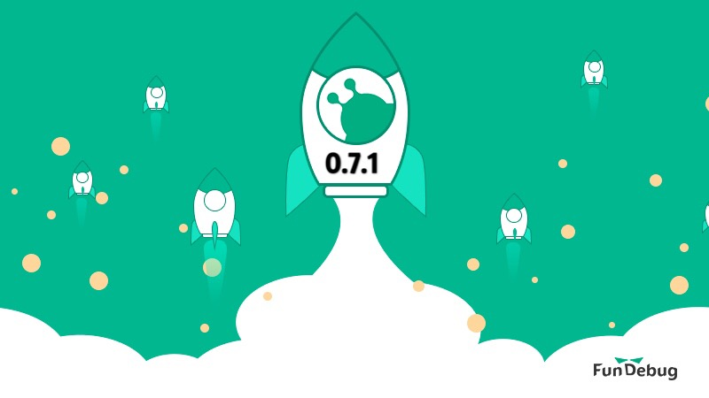
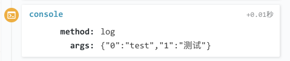

**摘要：** [Fundebug](https://www.fundebug.com/)的微信小程序错误监控插件更新至**[0.7.1](https://wxjs.fundebug.cn/fundebug.0.7.1.min.js)**，主要修复了2个BUG，请大家尽快更新。

<div style="text-align: center;">

</div>

<!-- more -->

### 修复打印cyclic object时的BUG

所谓cyclic object，指的是对象的子属性指向对象本身。

如果你使用的[Fundebug](https://www.fundebug.com/)微信小程序错误监控插件是**0.6.1**，并且在代码中打印了[cyclic object](https://developer.mozilla.org/en-US/docs/Web/JavaScript/Reference/Errors/Cyclic_object_value):

```javascript
 var a = {
     b: "b"
 };
 a.a = a;
 console.log(a);
```

这时，微信开发者工具的console会出现**TypeError: Converting circular structure to JSON**：

```javascript
TypeError: Converting circular structure to JSON
    at JSON.stringify (<anonymous>)
    at Object._.(anonymous function) [as sendToFundebug] (http://127.0.0.1:53468/appservice/release/fundebug.0.6.1.min.js:596:29)
    at http://127.0.0.1:53468/appservice/release/fundebug.0.6.1.min.js:1204:226
    at t.(anonymous function) (http://127.0.0.1:53468/appservice/release/fundebug.0.6.1.min.js:1210:24)
    at Function.function.u.(anonymous function) (http://127.0.0.1:53468/appservice/__dev__/WAService.js:5:26937)
    at Object.fail (http://127.0.0.1:53468/appservice/__dev__/WAService.js:5:3482)
    at s.<anonymous> (http://127.0.0.1:53468/appservice/__dev__/WAService.js:13:21877)
    at s.emit (http://127.0.0.1:53468/appservice/__dev__/WAService.js:7:14344)
    at Function.<anonymous> (http://127.0.0.1:53468/appservice/__dev__/WAService.js:13:23047)
    at http://127.0.0.1:53468/appservice/__dev__/WAService.js:6:17533
```

**这个BUG不会影响小程序的正常使用**，只是带有这条console记录的报错数据将无法发送到[Fundebug](https://www.fundebug.com/)。**0.7.0**已经修复了这个BUG，可以正常报错，且该条console打印可以记录到用户行为中(去除了cyclic属性):

<div style="text-align: center;">

</div>

### 修复wx.request返回undefined的BUG

由于在重写wx.request时没有return，导致wx.request返回undefined，0.7.1版本的插件已经修复了这个问题：

```js
// 修复wx.request()返回undefined的BUG
var requireTask = wx.request(
{
    url: "http://ip.taobao.com/service/getIpInfo.php",
    method: "GET",
    data:
    {
        ip: "45.79.109.13"
    }
});
console.log(typeof requireTask); // 0.7.1会打印object
```

### [silentConsole](https://docs.fundebug.com/notifier/wxjs/customize/silentconsole.html)

**0.7.0**插件新增了[silentConsole](https://docs.fundebug.com/notifier/wxjs/customize/silentconsole.html)配置选项。

如何你不希望在用户行为中记录console打印，可以将silentConsole属性设为true:

```js
fundebug.init(
{
    silentConsole : true
})
```

### [silentBehavior](https://docs.fundebug.com/notifier/wxjs/customize/silentbehavior.html)

**0.7.0**插件新增了[silentBehavior](https://docs.fundebug.com/notifier/wxjs/customize/silentbehavior.html)配置选项。

如何您不希望记录函数调用、console打印、HTTP请求等用户行为，可以将silentBehavior属性设为true:


```js
fundebug.init(
{
    silentBehavior : true
})
```

### [sampleRate](https://docs.fundebug.com/notifier/wxjs/customize/samplerate.html)

**0.7.0**插件新增了[sampleRate](https://docs.fundebug.com/notifier/wxjs/customize/samplerate.html)配置选项。

Fundebug的付费套餐主要是根据错误事件数制定的，这是因为每一个发送到我们服务器的事件，都会消耗一定的CPU、内存、磁盘以及带宽资源，尤其当错误事件数非常大时，会对我们的计算资源造成很大压力。

如果您希望采样收集错误，比如“只收集30%的错误”，可以将sampleRate属性设为0.3。这样的话，您可以选择更加合适套餐。注意，是否收集错误是完全随机的，因此理论上这样可能会导致一些错误不会被收集。

仅上报30%的错误：

```js
fundebug.init(
{
    sampleRate : 0.3
})
```