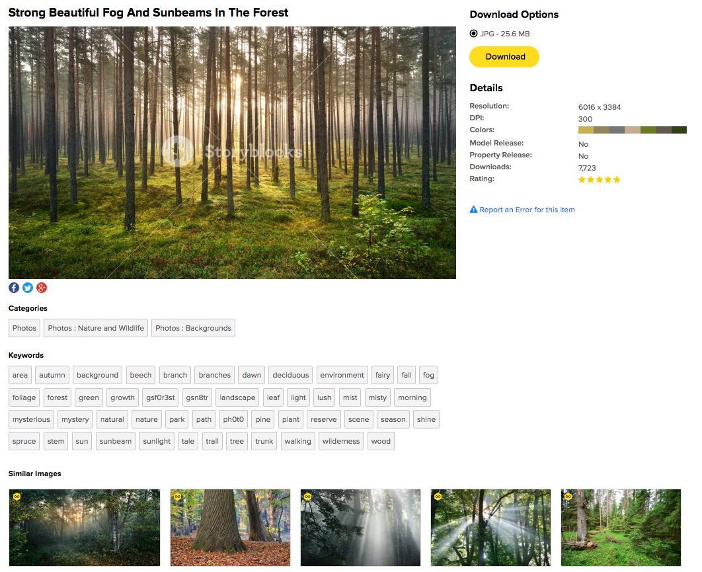
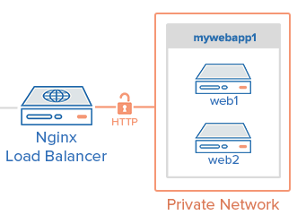
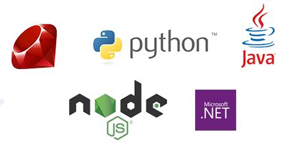
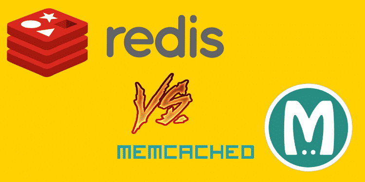
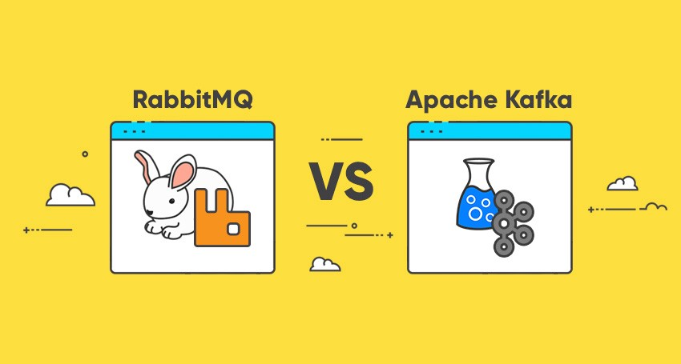

---

title: Web应用架构入门之11个基本要素

date: 2018-08-20 10:00:00

tags: [架构]

keywords: Web应用, 架构

description: Web应用架构入门之11个基本要素

---

**译者：** 读完这篇博客，你就可以回答一个经典的面试题：当你访问Google时，到底发生了什么？

<!-- more -->

- 原文：[Web Architecture 101](https://engineering.videoblocks.com/web-architecture-101-a3224e126947)
- 译者：[Fundebug](https://www.fundebug.com/)

**为了保证可读性，本文采用意译而非直译。另外，本文版权归原作者所有，翻译仅用于学习。**

当我还是小白的时候，如果知道Web应用架构就好了！

上图展示了我们[Storyblocks](https://www.storyblocks.com/)的架构，对于初学者来说，似乎有些复杂。

下面我通过用户访问[Strong Beautiful Fog And Sunbeams In The Forest](https://www.storyblocks.com/stock-image/strong-beautiful-fog-and-sunbeams-in-the-forest-bxxg0dvxdzj6gt9ini)页面的处理过程来简单说明各个架构要素的作用：

- 当用户点击[Strong Beautiful Fog And Sunbeams In The Forest](https://www.storyblocks.com/stock-image/strong-beautiful-fog-and-sunbeams-in-the-forest-bxxg0dvxdzj6gt9ini)访问我们的图片服务时，浏览器会先给**DNS(域名解析服务)**服务器发送请求，获取IP地址，然后再给Storyblocks服务器发送请求。
- 用户的请求会到达我们的**Load Balancer(负载均衡服务)**，Load Balancer会随机选择我们10个**Web Application Server(网页应用服务)**中的一个来处理这个请求。
- Web Application Server会先在**Caching Service(缓存服务)**读取图片信息，然后再从**Database(数据库)**中读取其他数据。
- 当Web Application Server发现图片的color profile(颜色分析)还没有计算时，会给**Job Queue(任务队列)**发送一个color profile任务。
- **Job Server(任务服务)**会从Job Queue中获取corlor profile任务进行异步计算，计算结束之后再更新数据库。
- Web Application Server会给**search service(搜索服务)**发送搜索请求，以图片的名字作为关键词，来查找类似的图片。
- 如果用户恰好是登录状态，Web Application Server会去访问**Account Service(账号服务器)**来获取账号信息。
- Web Application Server会给**data firehose(数据加载服务)**发送一个**Page View(网页浏览)**事件，并把它记录到我们的**Cloud Storage System(存储云)**，最终加载到我们的**Data Warehouse(数据仓库)**中。数据分析师会通过Data Warehouse中的数据来分析我们的运行情况，辅助我们的商业决策。
- Web Application Server会渲染出HTML，并把它通过Load Balancer发送给用户的浏览器。页面中的JavaScript和CSS文件存储在我们的**Cloud Storage System(存储云)**中，并通过CDN进行分发。因此，用户的浏览器会直接访问CDN来获取JavaScript和CSS文件。
- 最后，浏览器再渲染整个页面给用户看。

我们的[Strong Beautiful Fog And Sunbeams In The Forest](https://www.storyblocks.com/stock-image/strong-beautiful-fog-and-sunbeams-in-the-forest-bxxg0dvxdzj6gt9ini)页面有一张非常漂亮的森林图片，网页截图如下：

接下来，我会依次介绍每一个要素。

### 1. DNS

DNS全称为Domain Name Server，即域名解析服务，它是互联网的基础。提供域名(比如google.com)，DNS可以返回其IP地址(比如85.129.83.120)。有了IP地址，用户的计算机才知道应该访问哪个服务器。这一点类似于手机号码，域名与IP的区别等价于"给马云打电话"和"给201-867–5309打电话"。以前你需要通过电话本查找马云的手机号码，那DNS就类似于互联网的电话本，你需要它来查询某个域名的IP。

### 2. Load Balancer

[图片来源](https://www.digitalocean.com/community/tutorials/how-to-set-up-nginx-load-balancing-with-ssl-termination)

Load Balancer(负载均衡服务器)是我们对应用进行横向扩展的关键。它会把请求分发到多个**Web Application Server(网页应用服务)**中的一个，这些Application Server运行的程序是一样的，对同一个请求的处理方式完全相同，它们会把请求返回给客户端。Load Balancer的作用就是分发请求，这样，当某个服务器宕机时，仍然可以保证服务。

目前，业界最受欢迎的Load Balancer是[Nginx](https://www.nginx.com/)，[Fundebug](https://www.fundebug.com/)用的也是[Nginx](https://www.nginx.com/)。

### 3. Web Application Servers

[图片来源](https://blog.takipi.com/java-vs-net-vs-python-vs-ruby-vs-node-js-who-reigns-the-job-market/)

Web Application Server，即网页应用服务，理解起来相对简单一些。它们负责执行核心的业务逻辑，处理用户的请求，并返回HTML给用户浏览器。为了完成工作，它们通常需要访问多种后端服务，比如数据库、缓存、任务队列、搜索服务等。在Load Balancer中提到过了，Web Application Server通常有多个副本，它们从Load Balancer获取用户请求。

Web Application Server需要使用特定的编程语言(Java, Node.js, Ruby, PHP, Scala, Java, C# .NET等) 和MVC框架(Node.js有Express, Ruby有Rails, Scala有Play, PHP有Laravel等)来实现。[Fundebug](https://www.fundebug.com/)后端语言用的是[Node.js](https://nodejs.org/en/)，框架用的是[Express](https://expressjs.com/)。

### 4. Database

[图片来源](https://www.novelucent.com/services/database-services)

现代应用基本上都需要使用1个或者多个**Dabase(数据库)**来存储数据。利用数据库，我们可以方便地对数据进行各种处理，比如定义数据结构、插入数据、查找数据、更新数据、删除数据、对数据进行计算等。一般来说，Web Application Servers会直接访问数据库，Job Server也一样。另外，每一种后端服务都有可能会需要独立的数据库。

目前，业界最受欢迎的开源数据库技术有[MySQL](https://www.mysql.com/)、[MongoDB](https://www.mongodb.com/)等。[Fundebug](https://www.fundebug.com/)用的是[MongoDB](https://www.mongodb.com/)。

### 5. Caching Service

[图片来源](https://www.freelancinggig.com/blog/2018/06/08/memcached-vs-redis-comparison/)

**Caching Service**，即缓存服务，提供简单的键值对存储和读取服务，它可以让数据的存储和读取的时间复杂度接近于O(1)。对于复杂的计算，我们会将计算结果存储到缓存中，这样下次需要结果时，就不需要重新计算了，可以从缓存中直接读取结果。Web Application Servers会将数据库查询、外部调用结果、某个URL对应的HTML文件等存储到缓存中。

下面是一些真实的缓存实例：

- Google会缓存常见查询的结果，比如"dog"或者"Taylor Swift"，而不是每次去重新计算。
- Facebook会缓存你登陆时看到的数据，比如动态、朋友等，细节可以阅读[Scaling Memcache at Facebook](http://www.cs.utah.edu/~stutsman/cs6963/public/papers/memcached.pdf)。
- 我们Storyblocks会缓存React服务端渲染的HTML，搜索结果等。

目前，业界最受欢迎的缓存技术是[Redis](https://redis.io/)和[Memcache](https://memcached.org/)。[Fundebug](https://www.fundebug.com/)用的是[Redis](https://redis.io/)。

*如何你希望实时监控线上应用的BUG，欢迎免费试用[Fundebug](https://www.fundebug.com/)!*

### 6. Job Queue & Servers

[图片来源](https://blog.mavenhive.in/which-one-to-use-and-when-rabbitmq-vs-apache-kafka-7d5423301b58)

大多数网页应用都需要在后台进行一些异步计算，这些计算并非直接与响应用户请求有关。比如，Google需要爬取整个互联网的网页，并为其建立索引，这个计算不是在你搜索的时候进行，而是异步进行，他们一直在更新网页索引。

异步计算有多种不同的方式，最普遍的方式就是Job Queue，即任务队列。它由两部分组成，一个保存任务的队列，以及一个或者多个运行任务的服务。

Job Queue中保存了需要进行异步计算的任务。最简单的任务队列是first-in-first-out (FIFO)，即先进先出，而更为复杂的队列会有优先级机制。对于 Web Application Servers来说，当需要计算某个任务时，将这个任务加入队列就可以了。

在Storyblocks，我们利用Job Queue运行非常多的后台任务，比如编码视频和图片、为CSV加标签、统计用户数据、发送密码重置的邮件等。刚开始我们用的是FIFO队列，后来我们增加了优先级机制来保证响应时间要求高的任务(比如发送密码重置邮件)可以尽快处理。

Job server(任务服务)负责运行任务，它们不断从队列中获取任务然后执行。Job Server也可以使用各种后端语言编写，[Fundebug](https://www.fundebug.com/)用的是[Node.js](https://nodejs.org/)。

目前，业界流行的Job Queue技术有[RabbitMQ](https://www.rabbitmq.com/)、[ActiveMQ](http://activemq.apache.org/)、[Kafka](https://kafka.apache.org/)等，[Fundebug](https://www.fundebug.com/)用的是[RabbitMQ](https://blog.fundebug.com/2018/04/20/rabbitmq_tutorial/)。

### 7. Full-text Search Service

大多Web应用都会支持搜索功能，用户输入关键词，应用返回相关结果。搜索技术也被称作[full-text search](https://en.wikipedia.org/wiki/Full-text_search)，即全文检索，是通过**[inverted index](https://en.wikipedia.org/wiki/Inverted_index)(倒排索引)**来是的。如下图所示：

事实上，数据库比如[MySQL](https://dev.mysql.com/doc/refman/5.7/en/fulltext-search.html)会支持全文检索功能，但是一般来说我们会采用独立的**Search Service(搜索服务)**来计算和保存倒排索引，并提供搜索接口。目前最受欢迎的全文检索技术是[Elasticsearch](https://www.elastic.co/products/elasticsearch)，当然还有其他选择，比如 [Sphinx](http://sphinxsearch.com/)和[Apache Solr](http://lucene.apache.org/solr/features.html)，[Fundebug](https://www.fundebug.com/)用的是[Elasticsearch](https://www.elastic.co/products/elasticsearch)。

### 8. Services

当应用规模足够大时，很可能需要将一些服务拆分出来。这些服务并不向外部提供，而是提供给Web Application Servers以及其他内部服务。在Storyblocks，我们有很多这样的服务：

- **Account service(账号服务)**：管理我们所有站点的用户账号数据，提供统一的账号系统。 
- **Content service(内容服务)**：管理我们所有视频、音频和图片的元数据，它会提供下载内容和查看历史的接口。
- **Payment service(支付服务)**：提供接口来结算用户的信用卡。
- **HTML → PDF service(HTML转PDF服务)**：提供HTML转PDF的接口。

Services也可以使用各种后端语言编写，[Fundebug](https://www.fundebug.com/)用的是[Node.js](https://nodejs.org/)。

### 9. Data

[图片来源](https://activewizards.com/blog/hadoop-3-comparison-with-hadoop-2-and-spark/)

AI时代，一个公司的成败取决于它如何利用数据。一个典型的数据处理处理流程有3个主要步骤：

- Web Application Servers负责收集数据，通常是一些用户行为记录，将数据发送给**Data Firhose(数据加载服务)**，Data Firhose负责将流数据可靠地加载到数据存储和分析工具。[AWS Kinesis](https://aws.amazon.com/cn/kinesis/)和[Kafka](https://kafka.apache.org/)可以作为Data Firhose。
- Data Firhose将收集的原始数据以及初步处理过的数据存储到数据云中。[AWS Kinesis Data Firehose](https://aws.amazon.com/cn/kinesis/data-firehose/)可以方便地将数据存储到[AWS 云存储](https://aws.amazon.com/cn/products/storage/)(S3)中。
- 初步处理过的数据可以加载到**Data Warehouse(数据仓库)**进行处理。我们使用的是[AWS Redshift](https://aws.amazon.com/cn/redshift/)，大型公司有些使用Oracle的[Data Warehouse](https://www.oracle.com/database/data-warehouse.html)。如果数据非常大的话，可能需要使用[Hadoop](http://hadoop.apache.org/)。

还有，我们Storyblocks会每天晚上将Web Application Servers和各种Services的运行数据加载到Redshift中。这样，我们的数据分析师可以结合所有数据进行综合分析。

[Fundebug](https://www.fundebug.com/)使用[Kafka](https://kafka.apache.org/)作为Data Firhose，使用阿里云的[对象存储 OSS](https://www.alibabacloud.com/zh/product/oss)作为数据仓库，使用[Hadoop](http://hadoop.apache.org/)进行离线数据分析。

### 10. Cloud storage

Cloud storage即数据存储云，可以通过安全、可扩展的数据存储服务，可以存储任意数据，并可以通过HTTP接口进行操作和管理。亚马逊的[AWS 云存储](https://aws.amazon.com/cn/products/storage/)(S3)是当前最受欢迎的数据存储云，我们Storyblocks依赖它来存储视频、音频、图片、JavaScript、CSS以及前文提到过的用户行为数据等。

[Fundebug](https://www.fundebug.com/)使用阿里云的[对象存储 OSS](https://www.alibabacloud.com/zh/product/oss)以及腾讯云的[对象存储 COS](https://cloud.tencent.com/product/cos)作为数据存储云。

### 11. CDN

CDN，全称为Content Delivery Network，即内容分发网络，它可以利用更靠近用户的服务器分发HTML、CSS、JavaScript和图片等静态资源，有效降低页面加载时间。不再使用单个源服务器提供服务，而是利用全球各地的服务器作为缓存服务器分发静态资源，用户可以直接从更加靠近他们的缓存服务器下载资源，而不需要去访问源服务器。

如下图所示，当西班牙的用户给纽约的网站请求某个页面时，静态资源可以从英国的缓存服务器直接下载，而不再需要进行速度很慢的跨大西洋访问：

[图片来源](https://www.creative-artworks.eu/why-use-a-content-delivery-network-cdn/)

[这篇博客](https://www.creative-artworks.eu/why-use-a-content-delivery-network-cdn/)详细介绍了CDN技术。一般来说，网页应用会使用CDN来分发CSS，JavaScript，图片以及视频等静态资源。[Fundebug](https://www.fundebug.com/)使用腾讯云以及七牛云的CDN服务。

### 参考

- [RabbitMQ入门教程](https://blog.fundebug.com/2018/04/20/rabbitmq_tutorial/)
- [不要争了！技术选择没那么重要](https://blog.fundebug.com/2018/07/19/technology-selection-is-not-critical/)
- [MongoDB之compact操作详解](https://blog.fundebug.com/2018/04/11/mongodb_compact_tutorial/)
- [MongoDB复合索引详解](https://blog.fundebug.com/2018/03/15/mongdb_compound_index_detail/)
- [当Node.js遇见Docker](https://blog.fundebug.com/2017/03/27/nodejs-docker/)