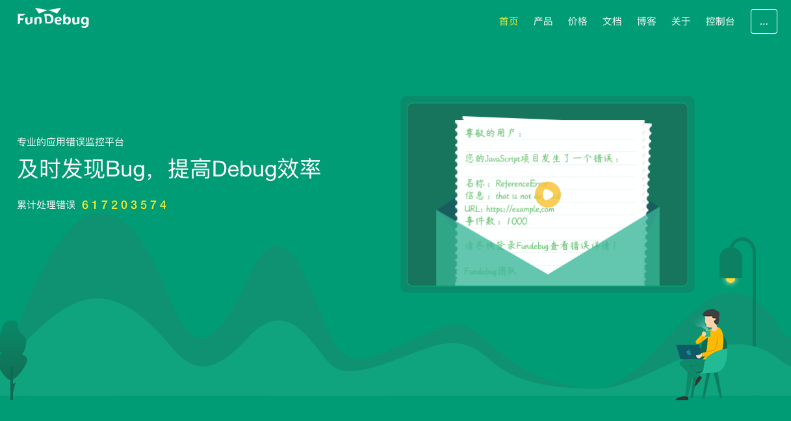
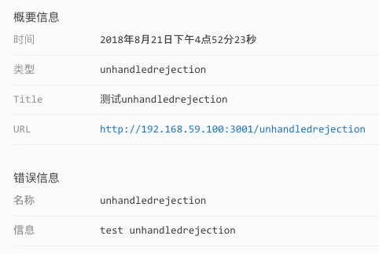

---

title: Fundebug前端JavaScript插件更新至1.2.0

date: 2018-08-21 10:00:00

tags: [JavaScript, Fundebug]

keywords: Fundebug, JavaScript, 网页, 前端, H5

description: Fundebug前端JavaScript插件更新至1.2.0

---

**摘要:** Fundebug的前端JavaScript错误监控插件更新至**[1.2.0](https://js.fundebug.cn/fundebug.1.2.0.min.js)**：支持监控WebSocket连接错误；修复了监控unhandledrejection错误的BUG，即未用catch处理的Promise错误；以及一些其他优化。请各位用户及时更新插件！

<!-- more -->


### 监控WebSocket连接错误

现在，WebSockect的应用场景越来越多。比如，Fundebug的首页有展示**累计处理错误**的数量，目前是**6亿+**。这个数据是后台实时计算，然后通过WebSocket返回给前端的。顺便吐槽一下，某友商的统计方式比较诡异，**断网之后数字居然还在更新！**我想原因大家都懂的:)



假设正确的WebSocket地址是**wss://api.fundebug.com/api/events/count**，若地址不小心弄错了，

```js
 var ws = new WebSocket("wss://ap.fundebug.com/api/events/count");
 ws.onerror = function(event)
 {
     console.log("WebSocket onerror")
 }
```

则WebSocket连接显然会出错：

```js
WebSocket connection to 'wss://ap.fundebug.com/api/events/count' failed: Error in connection establishment: net::ERR_SOCKS_CONNECTION_FAILED
```

Fundebug插件可以自动捕获这样的报错，发送到我们的后台服务器，并且第一时间给开发者发送报警。另外，Fundebug的报错并不影响WebSocket的错误处理回调函数onerror的执行。

### 修复监控unhandledrejection错误的BUG

unhandledrejection错误，即未使用catch处理的Promise错误。Fundebug很早就支持监控unhandledrejection错误，但是由于插件BUG，全部unhandledrejection错误都显示为**caught error**。对此，我们非常抱歉，这次我们修复了这个BUG，感谢Fundebug用户**-zWing**的反馈！

测试代码：

```js
Promise.reject("test unhandledrejection")
```

浏览器控制台会出现报错：

```js
Uncaught (in promise) test unhandledrejection
```

Fundebug插件可以自动捕获这样的报错，发送到我们的后台服务器，并且第一时间给开发者发送报警。Fundebug控制台截图如下:



### 新增silentDev配置属性

如果您不需要收集开发环境中的错误，则可以将silentDev属性设为true。这样的话，Fundebug不会收集开发环境的错误，生产环境的错误仍然会正常收集。注意，我们是通过页面的URL来区分生产环境和开发环境的，当URL中含有localhost或者IP时，判断为开发环境，否则判断为生产环境。

 1. 在HTML中配置`<script>`标签中配置silentDev属性

 ```
 <script src="https://js.fundebug.cn/fundebug.1.2.0.min.js" 
            apikey="API-KEY" 
            silentDev=true></script>
 ```

 2. 在JavaScript中配置silentDev变量

 ```js
 fundebug.silentDev = true;
 ```
 
 当silentDev设为true时，**Fundebug不再收集开发环境的错误**。

### 修复silentVideo配置属性BUG

Fundebug插件支持[录屏](https://blog.fundebug.com/2018/05/21/fundebug_release_black_tech_replay/)功能，可以帮助开发者更加形象地复现BUG，这个功能**领先所有国内外同类产品**！但是，由于该功能实现非常复杂，还有2个不大不小的BUG尚未修复：

- DOM操作过多的话录屏功能会影响页面性能，造成卡顿。
- 图片验证码会重复加载，导致验证一直失败。

这2个BUG正在修复，因此，我们暂时注释了录屏功能。将[silentVideo](https://docs.fundebug.com/notifier/javascript/customize/silentvideo.html)属性设为false即可启用录屏功能。

但是，将fundebug.silentVideo设为false时，会发现没有效果，这是我们插件的BUG，1.2.0版本已经修复。

如果希望体验录屏功能的话，将silentVideo属性设为false即可。如果，你需要在生产环境中使用录屏，请评估一下2个BUG是否会对您的应用造成影响。对此如果您还有疑问，欢迎联系Fundebug客服！

另外，我们还对插件代码进行了一些其他优化，此处不再赘述。
 
### 参考

- [Fundebug文档 - JavaScript插件版本](https://docs.fundebug.com/notifier/javascript/version.html)
- [Fundebug文档 - JavaScript插件配置属性silentDev](https://docs.fundebug.com/notifier/javascript/customize/silentdev.html)
- [Fundebug文档 - JavaScript插件配置属性silentVideo](https://docs.fundebug.com/notifier/javascript/customize/silentvideo.html)
- [Fundebug博客 - 黑科技！Fundebug支持可视化重现出错场景](https://blog.fundebug.com/2018/05/21/fundebug_release_black_tech_replay/)

