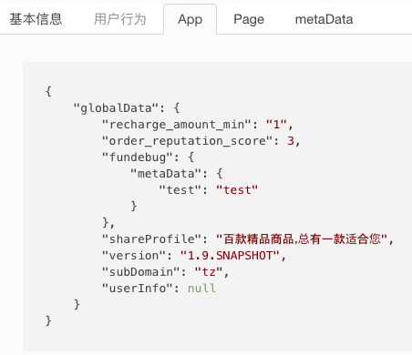
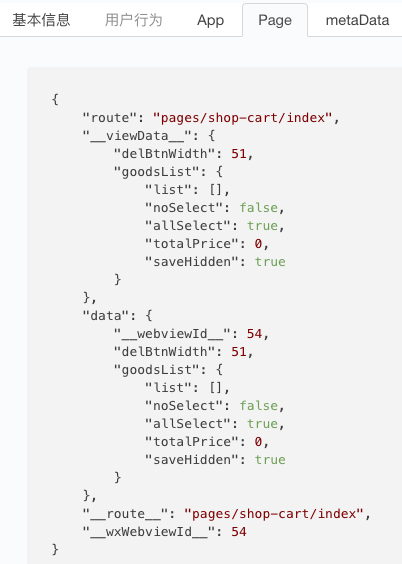

---

title: Fundebug微信小程序插件更新至0.8.0

date: 2018-08-23 10:00:00

tags: [微信小程序, Fundebug]

keywords: Fundebug, 微信小程序

description: Fundebug的微信小程序错误监控插件更新至0.8.0，新增了App和Page数据，可以帮助大家更快Debug，请及时更新！

---

**摘要：**Fundebug的微信小程序错误监控插件更新至**[0.8.0](https://wxjs.fundebug.cn/fundebug.0.8.0.min.js)**，新增了App和Page数据，可以帮助大家更快Debug，请及时更新！

<!-- more -->

### App

通过getApp方法获取，数据示例如下：

```javascript
{
    "globalData": {
        "recharge_amount_min": "1",
        "order_reputation_score": 3,
        "fundebug": {
            "metaData": {
                "test": "test"
            }
        },
        "shareProfile": "百款精品商品，总有一款适合您",
        "version": "1.9.SNAPSHOT",
        "subDomain": "tz",
        "userInfo": null
    }
}
```

Fundebug控制台截图如下：



如果你不需要收集App数据，则可以将[silentApp](https://docs.fundebug.com/notifier/wxjs/customize/silentapp.html)属性设为true：

```javascript
fundebug.init(
{
    silentApp : true
})
```

### Page

通过getCurrentPages获取，数据示例：

```javascript
{
    "route": "pages/shop-cart/index",
    "__viewData__": {
        "delBtnWidth": 51,
        "goodsList": {
            "list": [],
            "noSelect": false,
            "allSelect": true,
            "totalPrice": 0,
            "saveHidden": true
        }
    },
    "data": {
        "__webviewId__": 54,
        "delBtnWidth": 51,
        "goodsList": {
            "list": [],
            "noSelect": false,
            "allSelect": true,
            "totalPrice": 0,
            "saveHidden": true
        }
    },
    "__route__": "pages/shop-cart/index",
    "__wxWebviewId__": 54
}
```

Fundebug控制台截图如下：


如果你不需要收集Page数据，则可以将[silentPage](https://docs.fundebug.com/notifier/wxjs/customize/silentpage.html)属性设为true：

```javascript
fundebug.init(
{
    silentPage : true
})
```

### 参考

- [Fundebug文档 - 微信小程序siletApp](https://docs.fundebug.com/notifier/wxjs/customize/silentapp.html)
- [Fundebug文档 - 微信小程序silentPage](https://docs.fundebug.com/notifier/wxjs/customize/silentpage.html)
- [Fundebug文档 - 微信小程序插件版本](https://docs.fundebug.com/notifier/wxjs/version.html)

