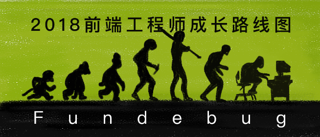
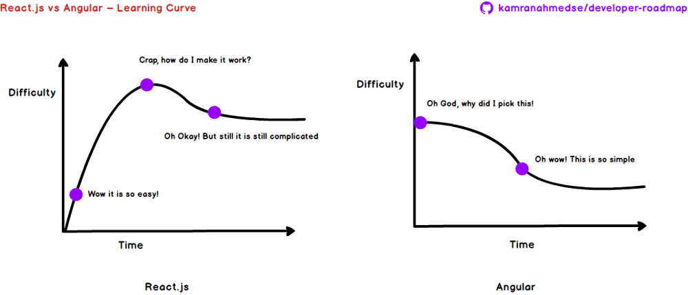

---

title: 2018前端工程师成长路线图

date: 2018-09-04 10:00:00

tags: [前端]

keywords: Vue, React, Angular, 前端

description: 2018前端工程师成长路线图

---

**译者按：** 上王者算什么？有本事刷一下你的前端技术！

 

<!-- more -->

- **原文**：[Modern Frontend Developer in 2018](https://medium.com/tech-tajawal/modern-frontend-developer-in-2018-4c2072fa2b9c)
- **译者**：[Fundebug](https://www.fundebug.com/)

**为了保证可读性，本文采用意译而非直译。另外，本文版权归原作者所有，翻译仅用于学习。**

过去5年，[我](https://twitter.com/kamranahmedse)一直作为一枚**全栈工程师**，经常会有小朋友问我应该学什么，于是我写了这篇博客，希望可以帮助大家。本文的所有图表都在我的GitHub仓库[kamranahmedse/developer-roadmap](https://github.com/kamranahmedse/developer-roadmap)。

下图是我给前端工程师制定的成长路线图(由[Fundebug](https://www.fundebug.com/)翻译)，希望对大家有所帮助：

成为前端工程师，第一步应该是学习**HTML/CSS/JavaScript**，这是基础。

### 1. HTML

HTML用于**定义网页的结构**。你的第一步是学习HTML的语法，学会如何把页面拆分为多个部分。

**任务：** 至少撸5个纯HTML页面，你可以实现任意网站的页面，比如GitHub的profile页面或者Twitter的登陆页面。纯HTML会有点丑，但是不用担心，专注于网页的结构。

### 2. CSS

CSS，全称Cascading stylesheets，是用来**美化HTML页面的**。

- 学习CSS语法，并且熟悉CSS的常用属性。
- 学习Box Model，学会使用Grid和Flexbox布局。
- 学会使用Media Queries来实现响应式布局。

**任务：** 使用CSS美化第1步中实现的HTML页面。如果你实现的HTML是GitHub的profile页面，那你现在就可以使用CSS让它看起来更像实际页面。

### 3. JavaScript

JavaScript**为静态页面添加交互性**。比如网站的所有弹框、提醒，以及更新页面的部分内容，都是由JavaScript实现的。

- 学习JavaScript的基本语法。
- 学习如何使用JavaScript操作DOM元素。比如，如何删除、添加页面元素等。
- 理解作用域、闭包、变量提升等JavaScript难点。
- 学习使用XHR和Ajax发起HTTP请求。
- 学习JavaScript最新标准ES6。

#### 是否需要学习JQuery? No!

很久以前，大家热爱JQuery，因为它封装了JavaScript的接口，让我们可以不用考虑浏览器兼容性。但是，JQuery的时代已经过去了，新的项目已经很少用它了。因此，**你不需要学习JQuery了！**。要知道，GitHub已经完全移除jQuery了！但是，仍然有人在使用JQuery，它很简单，了解一下就好了。

### 4. 使用HTTM/CSS/JavaScript写一个网站

学习编程的最佳方式是敲代码。既然你已经学会了HTTM/CSS/JavaScript，那你就可以写一个简单的网站了，比如**个人博客**。记住，你可以去复制他人的代码，但是你需要尽量使用你所学到的所有知识点。前端工程师都应该有个人网站，至少有个静态网站！

#### 5. 为GitHub项目提PR

是时候做一些正真的事情了！到[GitHub](https://github.com/)找一些前端项目，提一些PR。下面我提供一些思路：

- 优化UI
- 解决issue
- 重构代码

GitHub是一个非常好的学习和交流的平台，试着为开源社区做一点点贡献吧！现在已经有人开始花钱在GitHub买账号，买项目，买Star，这是一件很无聊的事情，严重败坏了社区风气，请大家一起抵制！

### 6. 包管理器

如果你不使用包管理工具的话，当你需要使用第三方插件时，需要手动下载JavaScript或者CSS文件，将它们放进你的项目；这些插件更新时，你又得重新下载文件，这非常麻烦。

如果你使用包管理工具，比如**npm**或者**yarn**时，一切就方便很多了。它们可以帮助第管理所有第三方库，更新也很方便。另外，NPM和YARN基本没什么区别，你可以选择任意一个。

### 7. 使用NPM或者YARN模块

不要重复造轮子，第三方模块极大丰富了前端开发的生态系统，我们应该学会好好利用。你可以为第4步中开发的网站添加一些第三方模块，比如使用[moment](https://www.npmjs.com/package/moment)处理时间，使用[echarts](https://www.npmjs.com/package/echarts)画图表。

### 8. CSS预处理器

**CSS预处理器**，例如Sass，Less和Stylus，可以增强CSS的功能，比如支持变量、计算以及函数等。如果让我选择的话，我会选择Sass。最近，PostCSS开始变得流行起来，它确实还不错，相当于CSS的Bable。你可以单独使用PostCSS或者基于Sass使用。我建议你先学习Sass，有时间再了解一下PostCSS。

### 9. CSS框架

目前，最流行的CSS框架是Bootstrap、Materialize和Bulma。如果非要选一个最流行的，那我觉得是Bootstrap。

*各位前端大侠，欢迎免费试用[Fundebug](https://www.fundebug.com/)的实时BUG监控服务，阔以帮你快速发现线上BUG哈！*

### 10. CSS规范

对于大型前端项目，CSS会变得非常混乱，难以维护，需要使用规范。我们有多种方式来组织CSS，比如OOCSS、SMACSS、SUITCSS、Atomic和BEM。你应该了解一下它们之间的不同，个人更加偏好[BEM](http://getbem.com/)。

### 11. 构建工具

构建工具指的是开发前端项目用到的**代码校验工具(linter)**、**任务管理工具(task runner)**、**打包工具(bundlers)**。

代码校验工具有ESLint、JSLint、JSHint和JSCS。目前ESLint是最受欢迎的。

任务管理工具有npm script、gulp和Grunt等。现在，webpack可以完成任务管理工具的大部分工作，因此我们可以结合npm script和webpack一起使用就好了。

打包工具有Webpack、Rollup、Browserify。我推荐大家使用Webpack。Rollup也很常见，不过通常用于打包第三方库。

### 12. 开发一个NPM模块

恭喜！你已经是个75%的前端工程师了！现在，你要做的事情是开发一个真正有用的东西。比如，你可以写一个NPM模块，把它开源到GitHub并发布到NPM。编程过程中难免遇到一些问题，需要自己造一些轮子，你要做的就是把轮子造好一点，发布出来就好了。优秀的工程师不仅要参与开源项目，还应该创造并维护自己的开源项目，哪怕是一个小小的工具。还是那句话，不要去花钱买项目，那是骗自己玩的。

### 13. 前端框架

在其他人的学习计划中，会把前端框架放在HTML/CSS/JavaScript之后。但是，我觉得你需要先了解一下Sass、构建工具和包管理工具，这些在框架中都会用到，如果你知道他们，大概会被吓到...

目前，最流行的前端框架有React、Vue和Angular，你可以选择任意一个，都没啥毛病。如果是我的话，我会选择React或者Angular。

如果你是初学者，你也许会发现Angular更简单，它把所有需要的东西都给你弄好了，比如路由功能(支持懒加载)、HTTP客户端(支持拦截器)、依赖注入等，这样你就不需要去使用第三方库了。对于React，你就需要使用很多第三方库。两者各有优劣吧。

框架对比是个很大的话题，这里我就不多说了。我们可以简单对比一下Angular和React的学习曲线：

如果你选择了一个框架，意味着你必须学习一些特定的技术。对于React，你需要学习Redux或者Mobx来进行状态管理。至于选择Redux还是Mobx，取决于应用的大小。Mobx适合中小型应用，而Redux适于大型项目。对于Angular，你需要学习TypeScript和Rx.js。而对于Vue.js，你需要学习Vuex，相当于Redux。

### 14. 使用框架开发一个网站

现在，你已经掌握了现代前端开发所需要的所有技术。那就使用你选择的框架开发一个应用吧！当然，现在前端项目基本上都是框架开发的...

当你开发完之后，学习一下如何衡量和优化性能，比如你可以关注一下Interactivity Time, Page Speed Index和Lighthouse Score。

### 15. 测试

对于前端测试，有很多不同的工具，比如Jest、Mocha、Karma和Enzyme，在你学习测试工具之前，请先理解测试的价值，并了解一下测试的分类。推荐读一下这些博客：

- [An Overview of JavaScript Testing in 2018](https://medium.com/welldone-software/an-overview-of-javascript-testing-in-2018-f68950900bc3)
- [Fundebug博客 - Mocha浏览器测试入门教程](https://blog.fundebug.com/2018/05/11/mocha-browser-tutorial/)
- [Fundebug博客 - NPM测试模块之rewire教程](https://blog.fundebug.com/2017/12/27/npm-rewire-tutorial/)
- [Fundebug博客 - 重新思考单元测试](https://blog.fundebug.com/2017/12/20/rethinking-unit-test/)
- [Fundebug博客 - JavaScript有这几种测试分类](https://blog.fundebug.com/2017/06/26/javascript-test-type/)
- [Fundebug博客 - 玩转Node.js单元测试](https://blog.fundebug.com/2017/03/20/nodejs-unit-test/)

### 16. Progressive Web Apps

学习一下[Service Worker](https://developer.mozilla.org/zh-CN/docs/Web/API/Service_Worker_API)和[Progressive Web Apps](https://developers.google.com/web/progressive-web-apps/)。

### 17. 静态类型检查

为JavaScript添加静态类型检查，可以让代码更加严谨，避免很多错误。你只要学习数个小时，就可以一直受益。TypeScript和Flow是两种不同的JavaScript静态类型检查技术。

TypeScript重新制定一套支持类型检查的语言，编译为JavaScript代码来运行。

Flow是一种静态类型检查工具，可以在编码时检查到类型错误并做出提示。

因此，TypeScript更强大，难度更大，尤其是重构成本很高；而Flow功能和使用都很简单，基本上基本上够用。你可以根据需要进行选择。

### 18. 服务端渲染

服务端渲染，即Server Side Rendering，又称为后端渲染。其实就是服务端先把HTML页面填充数据之后，再返回给前端。这样做可以提升首屏性能，有助于SEO，减少客户端用电。

对于不同的前端框架，有不同的服务端渲染技术。React有[Next.js](https://github.com/zeit/next.js/)和[After.js](https://github.com/jaredpalmer/after.js)，Angular有[Universal](https://github.com/angular/universal)，Vue.js有[Nuxt.js](https://github.com/nuxt/nuxt.js)。

但是，是否采用服务端渲染其实还有争议，了解一下可以，是否根据需要决定是否使用。

### 19. 其他技术

作为一个专业的前端工程师，学习一下canvas、HTML5、SVG、Source Map、函数式编程、TC39等技术还是非常有必要的！

### 参考博客

- [Fundebug博客 - 写给前端工程师的10条实用原则](https://blog.fundebug.com/2018/08/29/10-things-you-will-eventually-learn-about-js-projects/)
- [Fundebug博客 - Source Map入门教程](https://blog.fundebug.com/2017/03/13/sourcemap-tutorial/)
- [Flow - JS静态类型检查工具](https://segmentfault.com/a/1190000008088489)
- [精读前后端渲染之争](https://github.com/camsong/blog/issues/8)
- [GitHub 改版，重构页面移除了 jQuery 真的有必要吗？](http://www.cocoachina.com/industry/20180727/24347.html)

