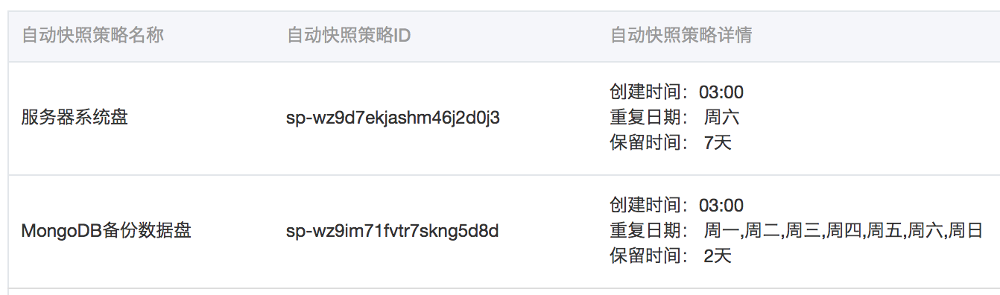

---

title: Fundebug是这样备份数据的

date: 2018-09-27 10:00:00

tags: [Fundebug]

keywords: 数据, 备份, 对象存储, 阿里云

description: 数据备份教程


---

**摘要：** 数据还是要备份的，万一删库了呢？


<!-- more -->

- **本文代码仓库：** [fundebug-mongodb-backup](https://github.com/Fundebug/fundebug-mongodb-backup)

### 引言

今年8月，腾讯云竟然把客户前沿数据的数据弄没了，[Fundebug](https://www.fundebug.com/)在第一时间进行了一些简单的[技术分析](https://blog.fundebug.com/2018/08/07/tencent-cloud-disck-incident/)：

> 一方面，腾讯云对这件事负有不可推卸的责任，他们刚开始说是什么[硬盘固件版本bug](https://mp.weixin.qq.com/s/9bP6abnvOpufN3fomB4weQ)(该声明已删)，后来承认是[人为操作失误](https://mp.weixin.qq.com/s/8JSPY6vHPhg8pX0JwjqttQ)导致的。
> 另一方面，前沿数据没有备份业务数据，也是一种非常不专业的行为，导致业务无法恢复，必须完全重新开始。

因此，所有的开发者都应该从这个事件吸取教训，不要偷懒，严格备份业务数据，否则数据一旦出问题，损失将无法挽回。

### Fundebug数据备份方案

我们还分享了Fundebug的数据备份方案，供大家参考：

| 备份方案               | 时间粒度 | 细节 |
| --------------------- | -------- | ------------ |
| MongoDB复制集 | 实时     | 搭建3个节点(1个Primary和2个Secondary)的MongoDB复制集，实时同步数据。 |
| 阿里云磁盘快照  | 每天     | 每天凌晨自动快照所有磁盘，包括系统盘和备份数据盘。       |
| mongodump导出核心数据 | 每天     | 每天凌晨将MongoDB核心数据导出到复制集之外的服务器磁盘(该磁盘会每天进行快照)。 |
| 阿里云对象存储        | 每天     | 每天凌晨将mongodump导出的数据使用gpg非对称加密之后，上传到阿里云深圳数据中心的对象存储，设置跨区域复制，自动同步到杭州数据中心，每份数据保留1个月。 |
| 本地硬盘备份        | 每周     | 每周六中午从阿里云对象存储下载加密的备份数据，存储到本地磁盘。 |

大概是因为我们没有公布备份方案的技术细节，我们受到了[质疑](https://www.v2ex.com/t/486974)：

> 要么多重备份是假的

对于这种指责，我的原则是必须怼回去。那么，这篇博客我来详细介绍一下我们数据备份方案吧~所有源代码都在GitHub仓库[Fundebug/fundebug-mongodb-backup](https://github.com/Fundebug/fundebug-mongodb-backup)，欢迎star。


### MongoDB复制集

生产环境使用单节点的MongoDB数据库，除非访问量非常低或者不在乎服务可用性，否则**基本上是不可能的，这辈子都不可能**。单节点MongoDB存在**单点故障(single point of failure)**，一旦挂了，整个应用就挂了。更糟糕的是，如果数据损坏，恢复将非常麻烦。

MongoDB有多种可能性会挂掉，最常见的就是高峰期内存使用量飙升，导致Linux的Out of Memory (OOM) killer将mongod进程杀死，这种情况[Fundebug](https://www.fundebug.com/)遇见过不少次，那我们是如何安全渡过的呢？答案是**[复制集(replica set)](https://docs.mongodb.com/manual/replication/)**。

复制集由多个MongoDB节点构成，它们的数据是实时同步的，因此数据几乎完全相同。当某个节点挂掉时，应用可以自动切换到其他节点，这样保证了服务的可用性。

Fundebug的MongoDB都运行在Docker容器中，其Docker Compose配置文件如下：

```yml
version: '2.2'

services:

  mongo:
    image: mongo:3.2
    network_mode: "host"
    restart: always
    cpus: 7
    mem_limit: 30g
    command: --replSet rs0  --oplogSize 25600
    volumes:
      - /mongodb/data:/data/db
    logging:
      driver: "json-file"
      options:
        max-size: "5g"
```

#### oplog

复制集一个**非常重要**的参数是**oplog**的大小，使用**--oplogSize**选项可以指定。我们设定的值是25600MB，即25GB。oplog(operation log)是复制集节点同步数据的关键，Primary节点将数据库写操作记录到oplog中，Secondary节点从Primary节点处复制oplog并应用到本地数据库中。因此，oplog大小决定了Primary和Secondary节点可以接受的数据最大"时间差"。使用[rs.printReplicationInfo()](https://docs.mongodb.com/manual/reference/method/db.printReplicationInfo/)可以查看oplog信息：

```javascript
rs.printReplicationInfo()
configured oplog size:   25600MB
log length start to end: 11409secs (3.17hrs)
oplog first event time:  Sat Sep 22 2018 12:02:04 GMT+0800 (CST)
oplog last event time:   Sat Sep 22 2018 15:12:13 GMT+0800 (CST)
now:                     Sat Sep 22 2018 15:12:13 GMT+0800 (CST)
```

可知oplog中记录了最近3.17小时的数据库写操作，假设复制集中某个节点由于宕机有4个小时没有同步数据，则重启该节点也无法与其他节点同步了！这时会出现["too stale to catch up -- entering maintenance mode"](https://dba.stackexchange.com/questions/154464/mongodb-replication-going-into-maintenance-mode-with-10333-other-maintenance-mo)的错误，只能手动同步数据。

因此，我们建议oplog的值应该尽量设大一些，否则以后[修改oplog](https://docs.mongodb.com/manual/tutorial/change-oplog-size/)的步骤挺麻烦的。事实上，25GB的oplog大小对于[Fundebug](https://www.fundebug.com/)的MongoDB复制集来说已经不够了，我们需要修改。

Fundebug的MongoDB复制集由1个Primary节点和2个Secondary节点构成，为保证我们服务可用性发挥了非常关键的作用！我之后所介绍的备份方案都是冗余措施，我们从来没有真正使用过那些备份数据，而复制集**"拯救"**了我们不少次，强烈建议大家都配置一下。

关于MongoDB复制集的更多技术细节，以后我再单独详述，欢迎关注[Fundebug微信公众号](https://image.fundebug.com/weixin.png)。

### 阿里云磁盘快照

快照能够保留某一时间点的磁盘数据状态，因此可以作为一种数据备份方式。很简单，配置一下**自动快照策略**就好了：



我备份了系统盘，万一数据丢失比如被删库，至少还能回滚磁盘。每周快照1次，保存7天。因为服务全部运行在Docker里面，服务器本身基本上没有什么配置，备份的需求不大，实际上我们也从来没有回滚过磁盘。

另外，我没有对MongoDB数据盘直接进行快照，因为发现快照后的数据无法恢复(这一点有待进一步确认)。

我只是将mongodump导出的核心数据所在磁盘进行了快照。每天快照1次，保存两天。这样做可以确保核心数据的安全性。

### mongodump导出核心数据

使用[mongodump](https://docs.mongodb.com/manual/reference/program/mongodump/)命令，可以全量导出MongoDB数据。对应的，之后可以使用[mongorestore](https://docs.mongodb.com/manual/reference/program/mongorestore/#bin.mongorestore)命令将备份数据导入MongoDB。

导出数据的脚本[dump-data.sh](https://github.com/Fundebug/fundebug-mongodb-backup/blob/master/dump-data.sh)如下：

```bash
#!/bin/sh

# 删除前一天导出的数据
rm -rf /data/mongodb_backup

DIR=`date +%Y%m%d%H%M`
OUT=/data/mongodb_backup/$DIR
mkdir -p $DEST

# 全量导出MongoDB数据(排除部分集合)
mongodump --host "rs0/192.168.59.11:27017,192.168.59.12:27017,192.168.59.13:27017" \
          --db fundebug-production \
          --excludeCollection events \
          --out $OUT
```

使用**--excludeCollection**选项，可以排除部分不需要备份的集合。例如，[Fundebug](https://www.fundebug.com/)累计处理了**6亿+**的错误事件，存在event集合中，因为我们已经聚合过了，所以没有必要备份，而且数据量太大，备份也不现实。

使用crontab脚本定期执行[dump-data.sh](https://github.com/Fundebug/fundebug-mongodb-backup/blob/master/dump-data.sh)脚本：

```
# 每天凌晨4点导出数据
0 4 * * * /root/fundebug-mongodb-backup/dump-data.sh
```

### 阿里云对象存储

使用mongodump导出的数据保存在测试服务器的数据磁盘上，从地域层面上来说都在同一个地方，即阿里云深圳数据中心。如果要做到异地备份，可以借助阿里云的对象存储服务的**跨区域复制**功能，将备份数据自动同步到阿里云杭州数据中心。

在上传备份数据之前，使用gpg命令进行非对称加密，可以保证数据安全性。加密导出数据的脚本[encrypt-data.sh](https://github.com/Fundebug/fundebug-mongodb-backup/blob/master/encrypt-data.sh)脚本如下：

```bash
#!/bin/bash

DIR=`find /data/mongodb_backup/ -maxdepth 1 -type d ! -path /data/mongodb_backup/`
source=$DIR/fundebug-production
cd $source

# 将导出数据加密
for file in * ; do
    gpg --batch --yes -v -e -r fundebug --output $source/$file.gpg --always-trust $file
done ;
```

除了加密，gpg还有一定的压缩效果，这样可以减少备份数据量，一举两得。关于gpg命令的细节，可以查看参考博客。

使用阿里云提供的Node.js客户端[ali-oss](https://github.com/ali-sdk/ali-oss)，可以将加密之后的.gpg文件上传到阿里云的对象存储服务中。使用[multipartUpload](https://github.com/ali-sdk/ali-oss#multipartuploadname-file-options)方法即可，[upload.js](https://github.com/Fundebug/fundebug-mongodb-backup/blob/master/controllers/upload.js)部分代码如下：

```javascript
// 上传单个文件
async function uploadFile(fileName, filePath) {
    try {
        const result = await store.multipartUpload(fileName, filePath, {
            parallel: 4,
            partSize: 1024 * 1024,
            progress: function(p) {
                logger.info("Progress: " + p);
            }
        });
        if (result.res.statusCode === 200) {
            logger.info(`upload file success! ${fileName}`);
        } else {
            const message = `upload file fail! ${fileName}`;
            logger.error(message);
            logger.error(result);
            fundebug.notifyError(new Error(message), {
                metaData: {
                    message: message,
                    result: result
                }
            });
        }
    } catch (error) {
        const message = `upload file fail! ${fileName}`;
        logger.error(message);
        logger.error(error);
        fundebug.notifyError(error, {
            metaData: {
                message: message,
                error: error
            }
        });
    }
}
```

代码运行在Docker容器中，使用curl命令访问HTTP接口/upload即可触发执行上传操作，使用crontab定期执行：

```
# 每天凌晨4点备份数据
0 4 * * * /root/mongodb-backup/dump-data.sh && /root/mongodb-backup/encrypt-data.sh && docker restart mongodb-backup && sleep 1m && curl http://127.0.0.1:9160/upload
```

备份数据通过数据卷(volume)映射到容器中，每天需要重启容器，才能访问每天导出的新数据。

在阿里云上为备份数据的存储空间**配置跨区域复制**，即可实现自动异地备份，非常方便。其他对象存储云服务应该也支持这种功能吧。

### 本地磁盘备份

前文提到的备份方式，其实都是在阿里云内部COPY数据。那么问题来了，阿里云挂了怎么办？这种事情当然基本上不可能发生，毕竟我们有多处备份，甚至实现了异地备份。

既然备份数据都上传到阿里云对象存储了，下载到本地也不是什么难事。使用[ali-oss](https://github.com/ali-sdk/ali-oss)的[list](https://github.com/ali-sdk/ali-oss#listquery-options)和[get](https://github.com/ali-sdk/ali-oss#getname-file-options)方法即可实现，[download.js](https://github.com/Fundebug/fundebug-mongodb-backup/blob/master/controllers/download.js)部分代码如下:

```javascript
// 获取当天上传到阿里OSS的文件列表
async function listFilesToDownload(day) {
    const result = await store.list({ prefix: day });
    return result.objects;
}

// 将阿里云OSS中的文件下载到本地
async function downloadFile(fileName, path) {
    try {
        const file = fileName.split("/")[1];
        const filepath = `${path}/${file}`;
        await store.get(fileName, filepath);
    } catch (error) {
        const message = `download file fail! ${fileName}`;
        logger.error(message);
        logger.error(error);
        fundebug.notifyError(error, {
            metaData: {
                error: error,
                message: message
            }
        });
    }
}
```

代码运行在Docker容器中，部署在本地机器，使用curl命令访问HTTP接口/download即可触发执行下载操作，使用crontab定期执行：

```
# 每周六中午从阿里云下载备份数据
0 12 * * 6 curl http://127.0.0.1:9160/download
```

### 结论

本文提到的所有的数据备份方式完全自动化执行，没有什么技术难度，成本也不高，可以极大提高数据安全性。

### 参考

- [MongoDB被Linux OOM Kill](https://liuxinsi.github.io/2017/06/01/mongodb-oom-killer/)
- [理解和配置 Linux 下的 OOM Killer](理解和配置 Linux 下的 OOM Killer)
- [MongoDB文档 - Replication](https://docs.mongodb.com/manual/replication/)
- [阿里云MongoDB备份恢复功能说明和原理介绍](https://yq.aliyun.com/articles/406060?utm_content=m_41266)
- [MongoDB文档 - mongodump](https://docs.mongodb.com/manual/reference/program/mongodump/)
- [GPG Encryption Guide - Part 1](https://www.tutonics.com/2012/11/gpg-encryption-guide-part-1.html)
- [GPG Encryption Guide - Part 2 (Asymmetric Encryption)](https://www.tutonics.com/2012/11/gpg-encryption-guide-part-2-asymmetric.html)